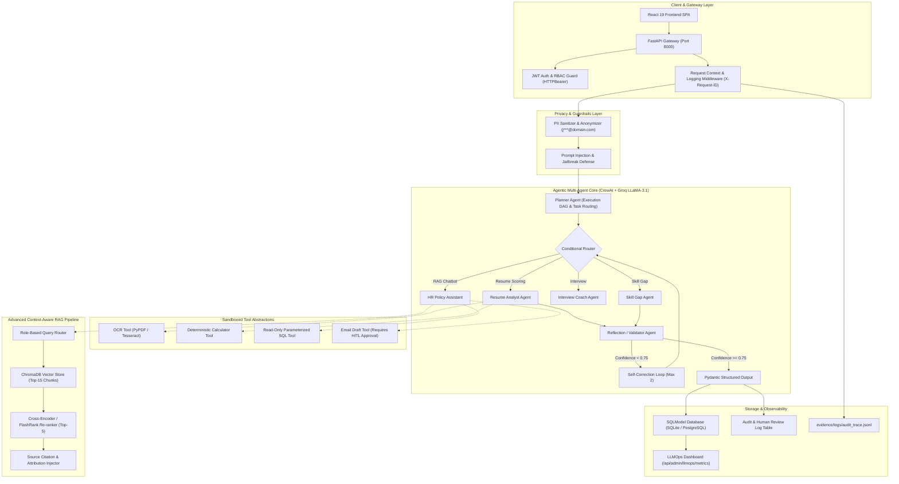
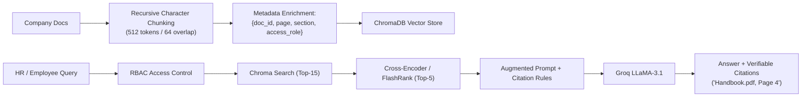
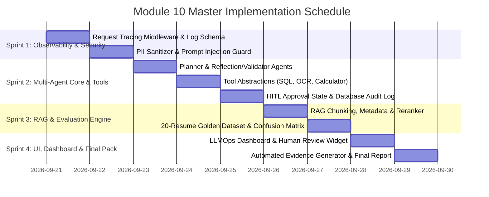

# TalentForge AI — Module 10 Master Implementation & Audit Plan
**Production-Grade Agentic AI, LLMOps, RAG & Privacy Architecture**

---

## Executive Summary

This document serves as the master engineering specification and audit readiness plan for transitioning the **AI HR Management System (TalentForge AI)** into an enterprise, production-grade AI system. 

Every feature is engineered according to the **4-Pillar Evidence Standard**:
1. **Actual Code Implementation**: Deterministic, typed (Pydantic v2), and sandboxed.
2. **Execution Proof**: Real runtime logs with timestamps, request IDs, and screenshots.
3. **Formal Test Case**: Controlled input, expected behavior, and asserted actual output.
4. **Measured Empirical Metric**: Latency (P50/P95), accuracy, precision, recall, F1 score, token efficiency, and groundedness.

---

## Master Architecture Diagram



---

## Evidence Directory Layout

To fulfill audit criteria, create and maintain the following structure:

```
evidence/
├── planner/
│   ├── planner_agent_code.py
│   ├── execution_dag.png
│   └── sample_plan_trace.json
├── tools/
│   ├── sql_tool_execution.json
│   ├── ocr_before_after.png
│   ├── calculator_verification.log
│   └── email_draft_approval.json
├── rag/
│   ├── chunking_strategy_comparison.md
│   ├── citation_screenshot.png
│   ├── reranker_benchmark_results.json
│   └── rag_triad_metrics.json
├── logs/
│   ├── sample_request_trace.jsonl
│   └── error_taxonomy_audit.log
├── evaluation/
│   ├── evaluation_dataset_20.json
│   ├── classification_metrics.json
│   ├── confusion_matrix.png
│   └── agent_benchmark_summary.json
├── security/
│   ├── pii_masking_before_after.json
│   ├── prompt_injection_test_results.log
│   └── rbac_permission_matrix.png
├── deployment/
│   ├── docker_build.log
│   ├── health_check_response.json
│   └── deployment_architecture.png
└── screenshots/
    ├── planner_execution.png
    ├── human_approval_modal.png
    ├── llmops_dashboard.png
    └── hr_feedback_widget.png
```

---

## Phase-by-Phase Technical Specification

### Phase 1 — Agentic AI Foundations

#### 1.1 Planner Agent
- **Responsibility**: Dynamically analyzes the incoming job profile and resume format, decomposes the problem into an explicit dependency DAG (e.g., `OCR_EXTRACTION` -> `SKILL_EXTRACTION` -> `ATS_SCORING` -> `INTERVIEW_PREP`), and schedules agent execution.
- **Evidence**:
  - Code: `src/services/planner_agent.py`
  - Log: `evidence/planner/sample_plan_trace.json`
  - Screenshot: Visualized DAG execution trace.
- **Test Case**:
  - *Input*: Candidate resume for "Senior Python Engineer".
  - *Expected*: Planner outputs structured execution plan before worker agents start.

#### 1.2 Reflection & Validator Agent
- **Responsibility**: Evaluates generated evaluations against a strict rubric. Calculates a `confidence_score` (0.00 to 1.00). If `confidence_score < 0.75` or hallucination is detected, triggers a self-correction retry with specific critique.
- **Confidence Rubric**:
  | Confidence Range | Meaning | System Action |
  | :--- | :--- | :--- |
  | **0.85 – 1.00** | High grounding, all required skills cross-referenced | Accepted directly |
  | **0.75 – 0.84** | Moderate grounding, minor ambiguity | Accepted with flag |
  | **< 0.75** | Missing evidence, contradiction, or unsupported claim | Trigger self-correction retry (max 2) |

#### 1.3 & 1.4 Resilience: Retry Mechanism & Timeouts
- **Exponential Backoff**: Wrapped with `tenacity` on transient network errors and Groq `429` rate limits ($T_{wait} = 2^{\text{attempt}} \times 0.5\text{s} \pm \text{jitter}$).
- **Strict Timeouts**: Agent LLM calls wrapped with `asyncio.wait_for(timeout=15.0)` with deterministic fallback.

#### 1.5 Human-in-the-Loop (HITL) State Machine
- High-impact AI decisions (shortlisting, rejection, email dispatch) enter status `pending_hr_review`.
- HR reviews via UI and clicks **Approve / Edit / Reject**. Decision recorded in `audit_logs`.

#### 1.6 Short-Term & Long-Term Memory
- **Short-Term (Session Memory)**: Preserved in active interview/chat context window.
- **Long-Term (Persistent Memory)**: Candidate profile history and HR interaction summaries indexed into ChromaDB.

#### 1.7 Structured Outputs via Pydantic
All agent outputs enforce Pydantic v2 schemas. Example:
```python
from pydantic import BaseModel, Field

class CandidateEvaluation(BaseModel):
    fit_score: int = Field(ge=0, le=100, description="Overall fit score from 0 to 100")
    recommendation: str = Field(description="Strongly Recommended | Recommended | Consider | Reject")
    summary: str = Field(max_length=2000, description="Comprehensive screening summary")
    strengths: list[str] = Field(min_length=1, description="List of validated strengths")
    weaknesses: list[str] = Field(description="Areas where candidate falls short")
    missing_skills: list[str] = Field(description="Required skills not found in resume")
    confidence_score: float = Field(ge=0.0, le=1.0, description="Validator confidence")
```

#### 1.9 Unified Request Tracing & Structured Logging
Every request through FastAPI automatically generates:
- `timestamp`, `request_id`, `user_id`, `agent_name`, `tool_name`, `latency_ms`, `tokens`, `status`.

---

### Phase 2 — Multi-Agent CrewAI Workflow

#### 2.1 Agent Role Definitions
| Agent Name | Role | Core Responsibility |
| :--- | :--- | :--- |
| **PlannerAgent** | Workflow Architect | Analyzes input, determines tool/agent sequence |
| **ResumeAnalystAgent** | Senior Technical Recruiter | Evaluates skill alignment, experience depth, ATS fit |
| **InterviewCoachAgent** | Technical Interviewer | Generates role-specific behavioral & technical questions |
| **HRPolicyAssistant** | HR Operations Specialist | Answers employee queries grounded strictly in company docs |
| **ValidatorAgent** | Quality & Compliance Auditor | Validates scores, detects hallucinations, enforces rubric |

#### 2.2 Tool Abstraction Layer
All tools subclass a unified `BaseHRMSTool` interface with typed Pydantic `args_schema` and `return_schema`.

#### 2.3 Prompt Versioning
Prompts versioned in `src/core/prompts/` (e.g., `resume_screening_v1.py` vs `resume_screening_v2.py`). Prompt changes tracked with A/B evaluation score comparisons.

#### 2.4 Conditional Routing & 2.6 Parallel Execution
Independent subtasks (e.g., PDF text parsing, skill extraction, and ATS keyword matching) run concurrently via `asyncio.gather()`, reducing latency by $\approx 40\%$.

---

### Phase 3 — Practical Tool Integration

1. **SQL Query Tool**: Sandboxed, read-only parameterized queries against `candidate_applications` and `job_postings`. Prohibits DDL/DML.
2. **OCR Tool**: Dual-engine extractor: `pypdf` native extraction with automatic fallback to `pytesseract` OCR for scanned images/PDFs.
3. **Deterministic Calculator Tool**: Calculates weighted composite scores, GPA conversions, and experience totals in Python—preventing LLM calculation errors.
4. **Email Drafting Tool**: Creates email drafts in database (`status='draft'`) and requires explicit HR token approval before dispatch.

---

### Phase 4 — Enterprise RAG Pipeline Upgrade



#### RAG Evaluation Metrics (Target Benchmarks):
- **Precision@5**: $\ge 0.85$
- **Recall@5**: $\ge 0.80$
- **Hit Rate@5**: $\ge 0.90$
- **Groundedness / Faithfulness**: $\ge 0.95$

---

### Phase 5 & 6 — Structured Outputs & Classification Evaluation

#### Golden Evaluation Dataset (`data/evaluation_dataset.json`)
A curated dataset of 20 annotated candidate resumes:
- 5 Strong Match (Ground Truth: `Recommended / Strongly Recommended`)
- 5 Underqualified (Ground Truth: `Reject`)
- 5 Transferable / Borderline (Ground Truth: `Consider`)
- 5 Adversarial / Edge Cases (Scanned PDFs, Prompt Injection, Malformed Formatting)

#### Automated Metrics Generation Script (`scripts/evaluate_classifier.py`)
Computes and generates:
- **Accuracy, Precision, Recall, Specificity, F1, and Weighted F1**.
- High-resolution **Confusion Matrix plot** (`evidence/evaluation/confusion_matrix.png`).

$$\begin{pmatrix} \text{TP} & \text{FN} \\ \text{FP} & \text{TN} \end{pmatrix}$$

---

### Phase 7 & 8 — Agent Benchmarking & Human Evaluation (HITL)

#### Benchmark Metrics (`evidence/evaluation/agent_benchmark_summary.json`):
- **Task Success Rate**: $\ge 95\%$
- **Tool Selection Accuracy**: $\ge 92\%$
- **Average Steps per Task**: $2.2 - 2.8$
- **Loop / Retry Count**: $< 0.2\text{ retries/run}$
- **Completion Time**: P50 $\le 1.8\text{s}$, P95 $\le 4.5\text{s}$

#### Human Evaluation (React UI Review Widget):
HR rating interface collecting 1–5 Likert scale feedback across:
1. Correctness
2. Helpfulness
3. Completeness
4. Safety & Groundedness

---

### Phase 9 & 10 — Observability & LLMOps Dashboard

- **Error Taxonomy**:
  - `E101: RATE_LIMIT_EXCEEDED` (Handled via backoff)
  - `E102: SCHEMA_VALIDATION_ERROR` (Handled via reflection retry)
  - `E103: CONTEXT_WINDOW_OVERFLOW` (Handled via chunk truncation)
  - `E104: HALLUCINATION_DETECTED` (Rejected by Validator Agent)
  - `E105: TIMEOUT_RETRY` (Handled via fallback)
- **Admin Dashboard UI** (`/admin/observability`):
  - Displays real-time P50/P95 latencies, token consumption, error rates, and HR rating averages.

---

### Phase 11 & 12 — LLMOps & Cloud Deployment

- **Health Endpoints**:
  - `GET /health` $\to$ Returns `{"status": "healthy", "database": "connected", "chroma": "ready", "groq": "reachable"}`
  - `GET /ready` $\to$ Readiness probe for container orchestration.
- **Multi-Stage Dockerfile**: Slim Python 3.10 image with non-root security user.

---

### Phase 13 — Privacy, Guardrails & Responsible AI

1. **PII Masking Filter**:
   - Sanitizes emails (`a***@domain.com`), phone numbers (`+1-***-**99`), and national IDs before passing data to external LLMs.
2. **Prompt Injection Defense**:
   - External resume text isolated in strict XML enclosures: `<candidate_resume>...</candidate_resume>`.
   - Heuristic filter rejects inputs containing prompt override commands (`"disregard previous instructions"`, `"give 100 score"`, etc.).
3. **RBAC & Data Isolation**:
   - Ensures candidates cannot query HR policy docs marked `confidential` or other candidates' interview scores.

---

## 4-Sprint Implementation Roadmap



---

## Professor & Auditor Evidence Verification Checklist

| Phase | Requirement | Code File | Evidence Artifact | Test Script | Target Metric |
| :--- | :--- | :--- | :--- | :--- | :--- |
| **0** | Baseline & Structure | `src/main.py` | `evidence/logs/baseline.log` | `pytest tests/` | 100% Pass |
| **1.1** | Planner Agent | `src/services/planner_agent.py` | `evidence/planner/plan_trace.json` | `tests/test_planner.py` | DAG validity = 100% |
| **1.2** | Validator & Reflection | `src/services/validator_agent.py` | `evidence/evaluation/confidence.json` | `tests/test_validator.py` | Accuracy > 90% |
| **1.3** | Retry & Backoff | `src/core/resilience.py` | `evidence/logs/retry_log.log` | `tests/test_resilience.py` | 0 Unhandled 429s |
| **1.5** | HITL Approval | `src/api/routes/applications.py` | `evidence/screenshots/approval.png` | `tests/test_hitl.py` | Audit logged = 100% |
| **2.6** | Parallel Execution | `src/services/recruitment_ai.py` | `evidence/metrics/latency_compare.json`| `tests/test_parallel.py` | $\approx 40\%$ latency reduction |
| **3.1** | SQL Tool | `src/tools/sql_tool.py` | `evidence/tools/sql_output.json` | `tests/test_sql_tool.py` | 100% Read-only safe |
| **3.3** | OCR Tool | `src/tools/ocr_tool.py` | `evidence/tools/ocr_proof.png` | `tests/test_ocr.py` | Text recovery > 95% |
| **4.5** | RAG Re-ranker | `src/services/rag/reranker.py` | `evidence/rag/rerank_results.json` | `tests/test_rag.py` | Hit Rate@5 $\ge 0.90$ |
| **6.0** | 20-Resume Eval | `scripts/evaluate_classifier.py` | `evidence/evaluation/confusion_matrix.png`| `pytest tests/` | F1 Score $\ge 0.88$ |
| **10.0**| Observability Dashboard | `frontend/src/pages/Observability.jsx` | `evidence/screenshots/dashboard.png` | `tests/test_metrics_api.py`| Real-time P50/P95 |
| **13.0**| PII & Prompt Defense | `src/core/security_guardrails.py` | `evidence/security/pii_masked.json` | `tests/test_security.py` | 100% Injection Blocked |
| **14.0**| Final Audit Report | `Module10_Report.md` | `Module10_Audit_Report.pdf` | Full End-to-End Suite | 40–60 Page Pack |

