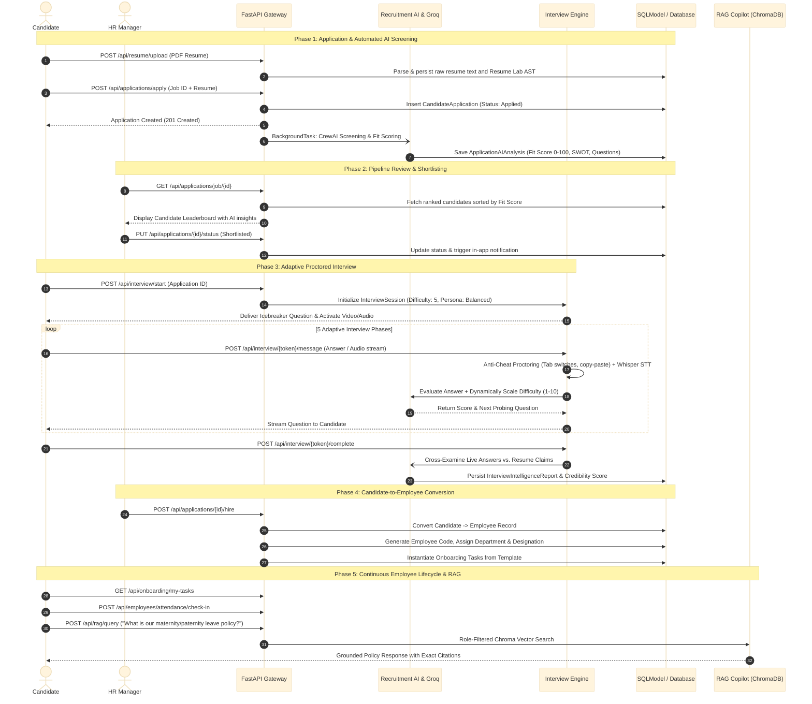
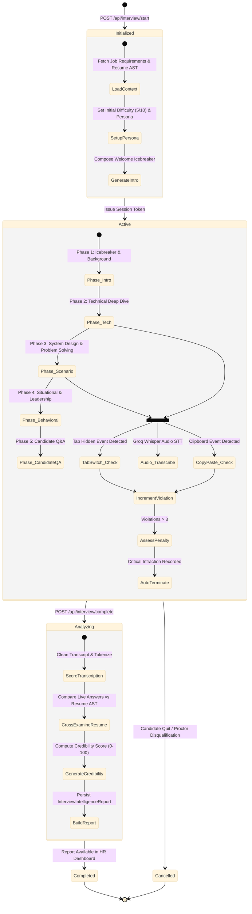
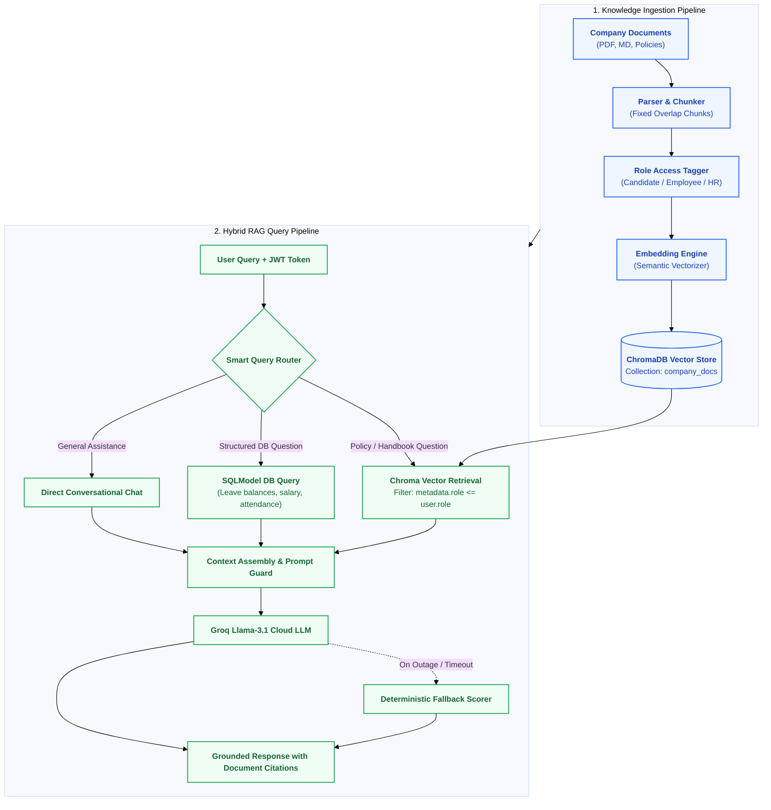
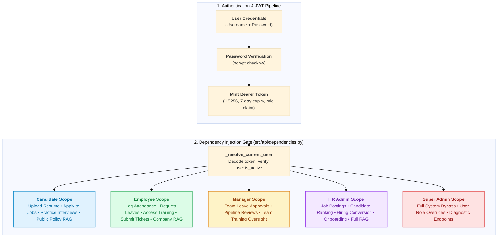
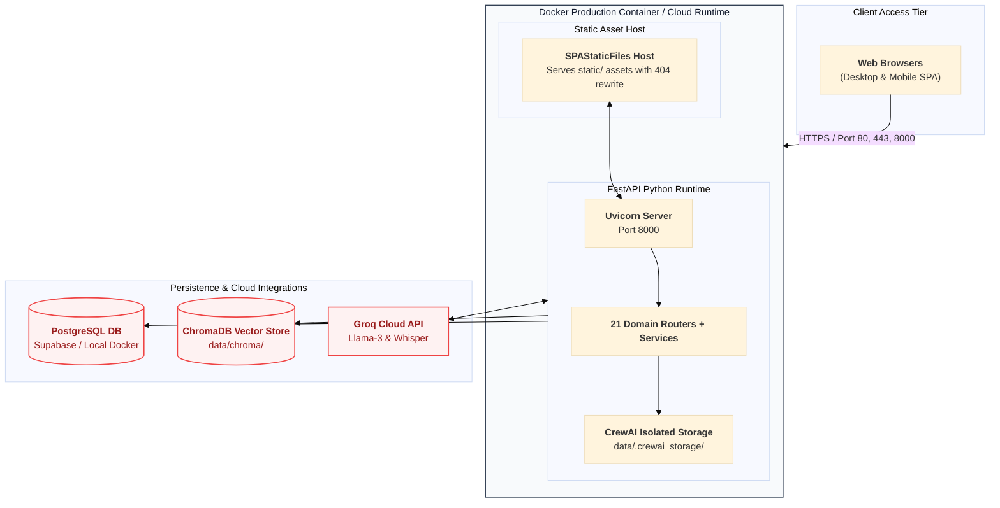

# TalentForge AI — Complete System Architecture Specification

> **An enterprise-grade, AI-powered talent lifecycle operating system that unifies recruitment, resume intelligence, adaptive proctored interviews, hiring intelligence, employee operations, onboarding, training, and policy RAG into an autonomous closed-loop platform.**

---

## Table of Contents
1. [Executive Summary & Architectural Invariants](#1-executive-summary--architectural-invariants)
2. [Master System Architecture Diagram](#2-master-system-architecture-diagram)
3. [End-to-End Talent Lifecycle Workflow](#3-end-to-end-talent-lifecycle-workflow)
4. [Layer-by-Layer Technical Specification](#4-layer-by-layer-technical-specification)
   - [4.1 Presentation Layer (React 19 SPA)](#41-presentation-layer-react-19-spa)
   - [4.2 API Gateway & Security (FastAPI ASGI)](#42-api-gateway--security-fastapi-asgi)
   - [4.3 Domain Router Catalog (21 API Routers)](#43-domain-router-catalog-21-api-routers)
   - [4.4 AI Orchestration & Intelligent Services](#44-ai-orchestration--intelligent-services)
   - [4.5 Persistence & Data Layer (SQLModel & ChromaDB)](#45-persistence--data-layer-sqlmodel--chromadb)
5. [Adaptive Proctored Interview Engine](#5-adaptive-proctored-interview-engine)
6. [Enterprise Policy RAG Subsystem](#6-enterprise-policy-rag-subsystem)
7. [Database Schema & Entity-Relationship Diagram (ERD)](#7-database-schema--entity-relationship-diagram-erd)
8. [Role-Based Access Control (RBAC) & Security Architecture](#8-role-based-access-control-rbac--security-architecture)
9. [Deployment & Infrastructure Topology](#9-deployment--infrastructure-topology)

---

## 1. Executive Summary & Architectural Invariants

TalentForge AI replaces disjointed HR point-tools with an integrated, intelligent lifecycle system. Unlike traditional HR software that merely stores static records, TalentForge actively analyzes data across every stage of the workforce journey:

$$\text{Resume Ingestion} \longrightarrow \text{CrewAI Screening} \longrightarrow \text{Adaptive Proctor Interview} \longrightarrow \text{Credibility Analysis} \longrightarrow \text{Employee Conversion} \longrightarrow \text{Policy RAG}$$

### Core Architectural Invariants

1. **Dual-Tier Resilient Intelligence:** 
   - *Primary Tier:* Cloud LLMs (Groq Llama-3.1-8b / 70b and Whisper STT) for conversational interviews, deep candidate SWOT analysis, and semantic RAG.
   - *Secondary Tier:* Zero-dependency deterministic fallback scoring algorithms that execute automatically if cloud APIs rate-limit or fail, guaranteeing $100\%$ uptime.
2. **Asynchronous Non-Blocking IO:** 
   - Heavy AI workloads (CrewAI multi-agent runs, live audio transcription, resume cross-examination) execute via FastAPI `BackgroundTasks`, keeping API response latencies below $1000\text{ms}$.
3. **Role-Isolated Multi-Portal Experience:** 
   - A single React 19 SPA serving five distinct user roles (`candidate`, `employee`, `hr`, `manager`, `admin`) with strict frontend route guards and backend JWT dependency injection.
4. **Idempotent Self-Migrating Schema:** 
   - SQLModel ORM with automated `_ensure_*` startup migrations that apply dynamic schema alterations without losing historical data.

---

## 2. Master System Architecture Diagram

```mermaid
%%{init: {'theme': 'base', 'themeVariables': { 'fontSize': '14px', 'fontFamily': 'Inter, system-ui, sans-serif'}}}%%
flowchart TD
    %% ── 1. PRESENTATION LAYER ──
    subgraph S1 ["1. Client & Presentation Layer (React 19 SPA)"]
        direction TB
        C1["<b>Candidate Portal</b><br/>Resume Lab • Job Applications • Interview Room"]
        C2["<b>Employee Portal</b><br/>Daily Attendance • Leave Requests • Training Hub"]
        C3["<b>HR Operations Hub</b><br/>Job Postings • Candidate Ranking • Onboarding Plans"]
        C4["<b>Manager & Admin Console</b><br/>Team Approvals • User Role Control • Diagnostics"]
    end

    %% ── 2. API GATEWAY & SECURITY ──
    subgraph S2 ["2. API Gateway & Security Gate (FastAPI ASGI)"]
        direction TB
        GW_SEC["<b>JWT Auth & RBAC Guard</b><br/>HS256 Bearer Token • Role Verification • Superadmin Bypass"]
        GW_MW["<b>FastAPI Middleware Stack</b><br/>GZip (≥512B) • CORS Origins • Static SPA Fallback Router"]
        GW_SEC --> GW_MW
    end

    %% ── 3. DOMAIN ROUTERS ──
    subgraph S3 ["3. Domain API Routers (/api/*)"]
        direction LR
        R_ACQ["<b>Talent Acquisition</b><br/>/api/jobs<br/>/api/applications<br/>/api/resume"]
        R_INT["<b>Interview Suite</b><br/>/api/interview<br/>/api/mock_interview<br/>/api/dashboard"]
        R_EMP["<b>Employee & Org</b><br/>/api/employees<br/>/api/departments<br/>/api/lifecycle"]
        R_OPS["<b>HR Operations</b><br/>/api/onboarding<br/>/api/training<br/>/api/salary<br/>/api/rag"]
    end

    %% ── 4. AI & BUSINESS SERVICES ──
    subgraph S4 ["4. AI & Business Logic Layer"]
        direction TB
        AI_REC["<b>Recruitment AI Engine</b><br/>CrewAI Multi-Agent • 0-100 Fit Score • SWOT Matrix"]
        AI_INT["<b>Adaptive Interview Engine</b><br/>Dynamic 1-10 Difficulty • Anti-Cheat Proctor • Whisper STT"]
        AI_CRED["<b>Hiring Intelligence & Credibility</b><br/>Resume Claims vs Live Audio Cross-Examination"]
        AI_RAG["<b>Enterprise Policy RAG</b><br/>Smart Query Router • Role-Filtered Knowledge Base"]
        AI_FALL["<b>Deterministic Fallback Engine</b><br/>Zero-Downtime Rule Scoring if External LLM is Offline"]
        
        AI_REC -.-> AI_FALL
        AI_INT -.-> AI_FALL
        AI_CRED -.-> AI_FALL
        AI_RAG -.-> AI_FALL
    end

    %% ── 5. PERSISTENCE & STORAGE ──
    subgraph S5 ["5. Persistence & Storage Tier"]
        direction LR
        DB_SQL[("<b>Relational Database (SQLModel)</b><br/>PostgreSQL (Prod) / SQLite (Dev)<br/>30+ Relational Tables")]
        DB_VEC[("<b>Vector Database (ChromaDB)</b><br/>data/chroma/<br/>Company Knowledge Chunks")]
        FS_DATA["<b>Persistent Storage</b><br/>data/uploads (Resumes & Docs)<br/>data/.crewai_storage (Sandbox)"]
    end

    %% ── 6. EXTERNAL CLOUD PROVIDERS ──
    subgraph S6 ["6. External Cloud Services"]
        direction LR
        EXT_GROQ["<b>Groq Cloud API</b><br/>Llama-3.1-8b-instant • Whisper STT"]
        EXT_JOBS["<b>External Job Aggregators</b><br/>Jooble • JSearch / RapidAPI"]
    end

    %% ── CONNECTIONS & DATA FLOW ──
    C1 & C2 & C3 & C4 -->|"HTTPS / REST API / Bearer JWT"| GW_SEC
    GW_MW --> R_ACQ & R_INT & R_EMP & R_OPS
    
    R_ACQ --> AI_REC
    R_INT --> AI_INT
    R_INT --> AI_CRED
    R_OPS --> AI_RAG
    
    R_ACQ & R_EMP & R_OPS --> DB_SQL
    R_ACQ --> FS_DATA
    R_ACQ <--> EXT_JOBS
    
    AI_REC & AI_INT & AI_CRED & AI_RAG <--> EXT_GROQ
    AI_REC & AI_INT & AI_CRED --> DB_SQL
    AI_RAG --> DB_VEC

    %% ── STYLES ──
    classDef clientStyle fill:#e0f2fe,stroke:#0284c7,stroke-width:1.5px,color:#0369a1;
    classDef gatewayStyle fill:#fef3c7,stroke:#d97706,stroke-width:1.5px,color:#92400e;
    classDef routerStyle fill:#f3e8ff,stroke:#9333ea,stroke-width:1.5px,color:#6b21a8;
    classDef aiStyle fill:#dcfce7,stroke:#16a34a,stroke-width:1.5px,color:#15803d;
    classDef dbStyle fill:#fee2e2,stroke:#dc2626,stroke-width:1.5px,color:#991b1b;
    classDef extStyle fill:#f1f5f9,stroke:#475569,stroke-width:1.5px,color:#334155;

    class C1,C2,C3,C4 clientStyle;
    class GW_SEC,GW_MW gatewayStyle;
    class R_ACQ,R_INT,R_EMP,R_OPS routerStyle;
    class AI_REC,AI_INT,AI_CRED,AI_RAG,AI_FALL aiStyle;
    class DB_SQL,DB_VEC,FS_DATA dbStyle;
    class EXT_GROQ,EXT_JOBS extStyle;
```

---

## 3. End-to-End Talent Lifecycle Workflow

The sequence below traces a user from initial candidate resume upload to verified employee operations:

---

## 4. Layer-by-Layer Technical Specification

### 4.1 Presentation Layer (React 19 SPA)
- **Tech Stack:** React 19, Vite 6, Tailwind CSS 4, Framer Motion, Lucide React, Recharts.
- **Client Routing (`frontend/src/App.jsx`):** Role-guarded route trees for `candidate`, `employee`, `hr`, `manager`, and `admin`.
- **State Stores (Zustand):**
  - `useAuthStore`: JWT token persistence in `localStorage`, user metadata, role status, and auto-logout.
  - `useInterviewStore` & `useMockInterviewStore`: Real-time session state machine, question queues, media streams, and proctoring violation logs.
- **Networking (`frontend/src/api/axios.js`):**
  - Bearer token injection on every outgoing request.
  - **30-second GET cache** for static read endpoints to minimize server load.
  - **60-second request timeout** for long-running AI generation calls.
  - Global `401 Unauthorized` interceptor that flushes auth state and redirects to `/login`.

### 4.2 API Gateway & Security (FastAPI ASGI)
- **Framework:** FastAPI running on Uvicorn ASGI server (`src.main:app`).
- **GZip Middleware:** Compresses all responses $\ge 512$ bytes (JSON, HTML, JS).
- **CORS Protection:** Configurable origin whitelisting via `settings.ALLOWED_ORIGINS`.
- **SPA Static Hosting (`SPAStaticFiles`):** Serves compiled frontend assets from `static/` with client-side 404 rewrite fallback to `index.html`.
- **Security & RBAC (`src/api/dependencies.py`):**
  - Sub-millisecond JWT decoding (`python-jose` HS256, 7-day expiration).
  - Role-based dependency guards: `candidate_required`, `management_required` (HR/Manager/Admin), `hr_admin_required` (HR/Admin), and `require_roles(...)`.
  - Admin superuser bypass across all system endpoints.

### 4.3 Domain Router Catalog (21 API Routers)

| Router Path | Source File | Core Responsibilities |
|:---|:---|:---|
| `/api/auth` | `src/api/routes/auth.py` | Registration, login, JWT token issuance, bcrypt verification |
| `/api/resume` | `src/api/routes/resume.py` | PDF resume upload, text extraction, AST section parsing, Resume Lab |
| `/api/jobs` | `src/api/routes/jobs.py` | Job postings CRUD, status filtering, Jooble/JSearch API aggregator |
| `/api/applications` | `src/api/routes/applications.py` | Job applications, asynchronous CrewAI screening, applicant ranking |
| `/api/candidates` | `src/api/routes/candidates.py` | Candidate profiles lookup, candidate-specific application views |
| `/api/employees` | `src/api/routes/employees.py` | Employee profiles, directory, daily attendance check-in, leave requests |
| `/api/dashboard` | `src/api/routes/dashboard.py` | Aggregated metrics, pipeline statistics, and actionable tasks per role |
| `/api/interview` | `src/api/routes/interview.py` | Official proctored interview room, dynamic difficulty, STT, anti-cheat |
| `/api/mock_interview` | `src/api/routes/mock_interview.py` | Independent practice interview sessions, candidate roadmaps |
| `/api/departments` | `src/api/routes/departments.py` | Organization department structure, department heads, headcount |
| `/api/designations` | `src/api/routes/designations.py` | Job titles, hierarchy levels, department associations |
| `/api/lifecycle` | `src/api/routes/lifecycle.py` | Employee lifecycle milestones, transfers, promotions, status updates |
| `/api/tickets` | `src/api/routes/tickets.py` | Employee grievance ticketing system, priority queues, resolutions |
| `/api/salary` | `src/api/routes/salary.py` | Compensation tracking, increment history, salary revision approvals |
| `/api/promotions` | `src/api/routes/promotions.py` | Designation promotions, promotion requests, management approvals |
| `/api/notifications` | `src/api/routes/notifications.py` | In-app notification center, unread badges, event-driven alerts |
| `/api/onboarding` | `src/api/routes/onboarding.py` | Onboarding templates, per-employee task assignments, progress tracking |
| `/api/training` | `src/api/routes/training.py` | Training courses catalog, employee assignments, skill gap alignments |
| `/api/profile` | `src/api/routes/profile.py` | Multi-step candidate & employee profile wizard and metadata |
| `/api/rag` | `src/api/routes/rag.py` | Company document search, role-partitioned policy QA, RAG copilot |
| `/api/admin` | `src/api/routes/admin.py` | Superuser role management, system health checks, database diagnostics |

### 4.4 AI Orchestration & Intelligent Services
- **Recruitment AI (`src/services/recruitment_ai.py`):**
  - CrewAI multi-agent crew: `recruitment_analyst`, `skill_matcher`, `job_finder`, and `resume_optimizer`.
  - Calculates candidate match fit scores ($0-100$), generates SWOT matrices, identifies missing skills, and creates targeted interview probing questions.
- **Adaptive Interview Engine (`src/services/interview_core.py`, `transcription_service.py`):**
  - Multi-phase structured interview state machine.
  - Dynamic adaptive difficulty adjustment ($1-10$) based on answer quality.
  - Speech-to-text voice transcription powered by Groq Whisper.
  - Real-time proctoring monitoring for tab visibility changes, copy-pasting, and unnatural pauses.
- **Hiring Intelligence & Credibility Cross-Examination (`src/services/hiring_intelligence.py`):**
  - Cross-references live interview transcripts against claims in the candidate's resume.
  - Computes a candidate Credibility Index ($0-100$) to identify exaggerations or fraudulent claims.
- **Enterprise Policy RAG (`src/services/rag/`):**
  - ChromaDB vector retrieval with cosine similarity.
  - Role-based document partition ensuring strict confidentiality.
  - Smart Query Router that decides between semantic vector search, relational SQL lookups, and direct conversational chat.
- **Deterministic Fallback Engine:**
  - Zero-dependency rule-based engine that automatically executes whenever cloud APIs timeout, rate-limit, or encounter network errors.

### 4.5 Persistence & Data Layer (SQLModel & ChromaDB)
- **Relational Storage:** SQLModel (combines Pydantic schemas with SQLAlchemy ORM). Runs on SQLite for zero-config local testing and PostgreSQL / Supabase for production.
- **Vector Storage:** ChromaDB embedded store persisting document chunk embeddings in `data/chroma/`.
- **File System Storage:** Local persistent disk storage under `data/uploads/` for candidate resumes and identity documents, with isolated storage in `data/.crewai_storage/`.

---

## 5. Adaptive Proctored Interview Engine

---

## 6. Enterprise Policy RAG Subsystem

---

## 7. Database Schema & Entity-Relationship Diagram (ERD)

```mermaid
%%{init: {'theme': 'base', 'themeVariables': { 'fontSize': '13px'}}}%%
erDiagram
    User ||--o{ Resume : "owns"
    User ||--o{ JobApplication : "tracks"
    User ||--o{ InterviewSession : "participates"
    User ||--o{ MockInterviewSession : "practices"
    User ||--o| CareerCoachMemory : "maintains"
    User ||--o{ CandidateApplication : "submits"
    User ||--o| CandidateProfile : "has"
    User ||--o| EmployeeProfile : "has"
    User ||--o| Employee : "converts to"
    User ||--o{ CandidateDocument : "uploads"
    User ||--o{ HRNotification : "receives"

    JobPosting ||--o{ CandidateApplication : "receives"
    JobPosting }o--|| User : "created_by"

    CandidateApplication ||--o| ApplicationAIAnalysis : "analyzed_by"
    CandidateApplication ||--o{ InterviewSession : "evaluated_in"
    CandidateApplication ||--o| InterviewIntelligenceReport : "summarized_in"

    InterviewSession ||--o| CandidateCredibilityReport : "generates"
    InterviewSession ||--o| InterviewIntelligenceReport : "produces"

    Department ||--o{ Designation : "contains"
    Department ||--o{ Employee : "assigned_to"
    Designation ||--o{ Employee : "holds"

    Employee ||--o{ AttendanceRecord : "logs"
    Employee ||--o{ LeaveRequest : "requests"
    Employee ||--o{ SkillGapAnalysis : "evaluated_by"
    Employee ||--o{ EmployeeLifecycleEvent : "records"
    Employee ||--o{ EmployeeTicket : "files"
    Employee ||--o{ SalaryHistory : "tracks"
    Employee ||--o{ PromotionHistory : "tracks"
    Employee ||--o{ EmployeeDocument : "submits"
    Employee ||--o{ EmployeeOnboarding : "enrolled_in"
    Employee ||--o{ TrainingAssignment : "assigned_to"

    OnboardingTemplate ||--o{ OnboardingTask : "defines"
    OnboardingTemplate ||--o{ OnboardingRequiredDocument : "requires"
    OnboardingTemplate ||--o{ EmployeeOnboarding : "instantiates"
    EmployeeOnboarding ||--o{ EmployeeOnboardingTask : "executes"

    TrainingProgram ||--o{ TrainingAssignment : "distributed_via"

    User {
        int id PK
        string username UK
        string hashed_password
        string role "candidate|employee|hr|manager|admin"
        string target_role
        string location
        string experience
        boolean is_active
        datetime created_at
    }

    Resume {
        int id PK
        int user_id FK
        text raw_text
        text parsed_resume
        text last_analysis
        text applied_fixes
        datetime created_at
    }

    JobPosting {
        int id PK
        string title
        text description
        string required_skills
        string department
        string salary_range
        string status "OPEN|CLOSED|ARCHIVED"
        int created_by FK
    }

    CandidateApplication {
        int id PK
        int candidate_user_id FK
        int job_id FK
        text resume_text
        string status "Applied|Shortlisted|Selected|Rejected|Hired"
        datetime application_date
    }

    ApplicationAIAnalysis {
        int id PK
        int application_id FK,UK
        int fit_score
        string recommendation "Strong Hire|Hire|Consider|Reject"
        text strengths
        text weaknesses
        text missing_skills
        text technical_questions
        string status
    }

    InterviewSession {
        int id PK
        int user_id FK
        string session_token UK
        string role
        int difficulty
        string training_mode
        string interviewer_persona
        text messages
        float avg_score
        int violations_count
        string status "active|completed|cancelled"
    }

    InterviewIntelligenceReport {
        int id PK
        int application_id FK,UK
        int candidate_id FK
        int session_id FK,UK
        float resume_score
        float technical_score
        float behavioral_score
        float credibility_score
        float overall_score
        string recommendation
        text executive_summary
    }

    Employee {
        int id PK
        int user_id FK,UK
        string employee_code UK
        int department_id FK
        int designation_id FK
        float salary
        date joining_date
        string status "Active|Probation|Terminated"
    }
```

---

## 8. Role-Based Access Control (RBAC) & Security Architecture

### RBAC Permission Matrix

| Feature / Domain Module | Candidate | Employee | Manager | HR Admin | Super Admin |
|:---|:---:|:---:|:---:|:---:|:---:|
| **Public Jobs & Application Submission** | ✅ | ✅ | ✅ | ✅ | ✅ |
| **Resume Lab & AI Enhancements** | ✅ | ✅ | ✅ | ✅ | ✅ |
| **Mock Interview & Real Interview Room** | ✅ | ❌ | ❌ | ❌ | ✅ |
| **Attendance Check-in & Leave Application** | ❌ | ✅ | ✅ | ✅ | ✅ |
| **Grievance Ticket Submission** | ❌ | ✅ | ✅ | ✅ | ✅ |
| **Team Leave Approval & Training Review** | ❌ | ❌ | ✅ | ✅ | ✅ |
| **Job Posting Management (Create/Edit/Close)**| ❌ | ❌ | ❌ | ✅ | ✅ |
| **Candidate Application AI Analysis & Ranking**| ❌ | ❌ | ✅ | ✅ | ✅ |
| **Interview Credibility Reports & Intelligence**| ❌ | ❌ | ✅ | ✅ | ✅ |
| **Candidate-to-Employee Conversion (Hiring)**| ❌ | ❌ | ❌ | ✅ | ✅ |
| **Onboarding Templates & Task Assignments** | ❌ | ❌ | ❌ | ✅ | ✅ |
| **Salary Adjustments & Promotion Workflows**| ❌ | ❌ | ❌ | ✅ | ✅ |
| **RAG Copilot Knowledge Search** | Public | Employee | Employee | Full HR | Full HR |
| **User Role Reassignment & System Metrics** | ❌ | ❌ | ❌ | ❌ | ✅ |

---

## 9. Deployment & Infrastructure Topology

---

## Summary of Core Architecture Deliverables

| Specification Aspect | Implementation Location | Architectural Role |
|:---|:---|:---|
| **System Entrypoint** | [`src/main.py`](file:///c:/Users/ADVAITH%20G/Documents/HRMS/src/main.py) | Application lifecycle, 21 router inclusions, static SPA mount, proxy sanitation |
| **Data Models** | [`src/models/__init__.py`](file:///c:/Users/ADVAITH%20G/Documents/HRMS/src/models/__init__.py) | 30+ unified SQLModel definitions for users, applications, interviews, employees |
| **Auth & Security** | [`src/api/dependencies.py`](file:///c:/Users/ADVAITH%20G/Documents/HRMS/src/api/dependencies.py) | JWT decoding, RBAC role guard dependencies, superadmin authorization |
| **Recruitment AI** | [`src/services/recruitment_ai.py`](file:///c:/Users/ADVAITH%20G/Documents/HRMS/src/services/recruitment_ai.py) | CrewAI multi-agent crew with deterministic scoring fallback |
| **Adaptive Interview** | [`src/services/interview_core.py`](file:///c:/Users/ADVAITH%20G/Documents/HRMS/src/services/interview_core.py) | Real-time adaptive questioning, difficulty modulation, anti-cheat proctoring |
| **Hiring Intelligence** | [`src/services/hiring_intelligence.py`](file:///c:/Users/ADVAITH%20G/Documents/HRMS/src/services/hiring_intelligence.py) | Live interview vs resume claims cross-examination & credibility scoring |
| **Policy RAG** | [`src/services/rag/`](file:///c:/Users/ADVAITH%20G/Documents/HRMS/src/services/rag/) | Role-filtered semantic document search with smart query routing |
