# TalentForge AI - Project Documentation

## Cover Page

| Field | Value |
| --- | --- |
| Project Name | TalentForge AI |
| Documentation Title | Repository Discovery and Documentation Foundation |
| Repository Name | HRMS |
| Documentation Version | v1.0 - Final Verified Specification |
| Generation Date | 2026-07-06 |
| Last Updated | 2026-07-07 |
| Documentation Scope | Repository-verified technical specification covering structure, API surface, frontend, database, AI/CrewAI, RAG, workflows, deployment, security audit, code quality audit, and certification. |

### Repository Summary

TalentForge AI is a full-stack HRMS and talent lifecycle application. The repository contains a FastAPI backend, SQLModel data layer, React/Vite frontend, built static frontend assets, CrewAI/Groq-based AI modules, Chroma-backed RAG services, tests, scripts, and deployment assets. The current source tree is active and broad, with a few legacy, generated, empty, and partially implemented areas documented in the health check.

---

## Table of Contents

1. [Cover Page](#cover-page)
2. [Executive Summary](#executive-summary)
3. [Technology Stack](#technology-stack)
4. [Repository Structure](#repository-structure)
5. [Folder Documentation](#folder-documentation)
6. [Complete File Inventory](#complete-file-inventory)
7. [Dependency Overview](#dependency-overview)
8. [Configuration Documentation](#configuration-documentation)
9. [Environment Variables](#environment-variables)
10. [Build and Deployment Assets](#build-and-deployment-assets)
11. [Initial Project Statistics](#initial-project-statistics)
12. [Repository Health Check](#repository-health-check)
13. [Future Phase Placeholders](#future-phase-placeholders)

---

## Executive Summary

TalentForge AI is an HRMS and talent lifecycle platform with separate backend and frontend applications in one repository. The backend is a FastAPI application exposed from `src.main:app`, using SQLModel for persistence, JWT role-based authentication, CrewAI/Groq AI orchestration, and Chroma-based RAG services. The frontend is a React 19 + Vite single-page application under `frontend/`, with built assets emitted into `static/` for FastAPI hosting.

Intended users visible from repository structure include candidates, employees, HR users, managers, and admins. This phase does not document detailed workflows or endpoint behavior. At a structural level, the system consists of:

- React/Vite SPA source in `frontend/src`.
- FastAPI application, routers, services, models, database setup, and security code in `src`.
- CrewAI agent/task definitions in `agents` and `tasks`.
- Utility modules in `utils`.
- Operational scripts in `scripts`.
- Backend tests in `tests` and frontend e2e tests in `frontend/tests`.
- Deployment assets for Docker, Render, Vercel, and local PostgreSQL.

---

## Technology Stack

### Frontend

| Technology | Role |
| --- | --- |
| React 19 | SPA UI framework used by `frontend/src`. |
| Vite | Frontend dev server and production build tool. |
| React Router DOM | Client-side routing and role-based page routing. |
| Zustand | Frontend state stores under `frontend/src/store`. |
| Axios | HTTP client wrappers under `frontend/src/api`. |
| Tailwind CSS 4 | Styling system via Vite plugin and CSS files. |
| Framer Motion | UI animation library used across pages and components. |
| Lucide React | Icon library used in frontend controls and panels. |
| Recharts | Chart rendering for dashboard/chart components. |
| React Dropzone | File upload/drop interactions. |
| React Hot Toast | Toast notifications. |

### Backend

| Technology | Role |
| --- | --- |
| Python | Backend language. |
| FastAPI | HTTP API framework and static SPA serving. |
| Uvicorn | ASGI server. |
| SQLModel | ORM/model layer. |
| Pydantic / Pydantic Settings | Request/config validation. |
| python-jose | JWT encoding and decoding. |
| bcrypt | Password hashing. |
| python-multipart | File upload support. |

### Database and Storage

| Technology | Role |
| --- | --- |
| SQLite | Local/test-compatible database target when configured. |
| PostgreSQL | Production and local Docker database target. |
| Supabase PostgreSQL | Deployment-oriented database referenced in env examples and migration scripts. |
| ChromaDB | Vector database used by RAG services. |
| Local filesystem `data/` | Runtime storage for uploads, CrewAI isolation, and local persisted artifacts. Ignored as generated/runtime data. |

### AI, CrewAI, LLMs, and RAG

| Technology | Role |
| --- | --- |
| CrewAI | Agent/task orchestration in `agents`, `tasks`, `crew.py`, and recruitment/interview services. |
| Groq | LLM provider used by settings and AI services. |
| LiteLLM | LLM access dependency used by hiring intelligence tests/services. |
| OpenAI package | AI client dependency present in requirements. |
| ChromaDB | Vector store for retrieval. |
| Hash embeddings | Deterministic embedding provider present in RAG services/tests. |

### Build, Package, Test, and Deployment

| Technology | Role |
| --- | --- |
| pip / requirements.txt | Python dependency management. |
| npm / package-lock.json | Frontend dependency management. |
| Pytest | Backend test runner. |
| Playwright | Frontend e2e test runner. |
| ESLint | Frontend linting. |
| Docker | Backend/static production container. |
| Docker Compose | Local PostgreSQL service. |
| Render | Web service deployment config. |
| Vercel | Frontend-oriented rewrite config present in repository. |

### External APIs and Third-party Services

| Service | Role |
| --- | --- |
| Groq API | LLM and transcription-related integration. |
| Supabase | PostgreSQL service references and credentials. |
| Jooble API | Job search utility support. |
| JSearch / RapidAPI | Job search utility support. |
| NVIDIA NIM | Environment example references; no direct source usage found in this phase. |

---

## Repository Structure

Generated/runtime folders ignored for source analysis: `.git/`, `.venv/`, `node_modules/`, `dist/`, `build/`, `__pycache__/`, `.pytest_cache/`, `data/`, and `graphify-out/`.

```text
HRMS/
  agents/                  CrewAI agent factory modules.
  frontend/                React/Vite source application and frontend tests.
    public/                Frontend public icons.
    src/                   Editable React source.
      api/                 Axios instance and API wrapper modules.
      assets/              Frontend source image/SVG assets.
      components/          Shared UI, layout, modal, drawer, chart, interview components.
      context/             React context providers.
      hooks/               Browser media/recording hooks.
      pages/               Route-level pages.
      store/               Zustand stores.
    tests/e2e/             Playwright specs.
  scripts/                 Operational, database, seed, and ingestion scripts.
  src/                     FastAPI backend source.
    api/                   API dependencies and route modules.
    core/                  Security and exception helpers.
    database/              SQLModel engine and startup migrations.
    models/                SQLModel table definitions.
    services/              AI, interview, RAG, transcription, and employee services.
  static/                  Built frontend output and preview images served by FastAPI.
  tasks/                   CrewAI task factory modules.
  tests/                   Pytest test suite.
  utils/                   Legacy/general helper utilities.
  app.py                   Uvicorn launcher wrapper for `src.main:app`.
  crew.py                  Legacy CrewAI orchestration module.
  Dockerfile               Production backend/static container.
  docker-compose.yml       Local PostgreSQL container.
  render.yaml              Render deployment service.
  vercel.json              Vercel rewrite config.
```

### Major Folder Status

| Folder | Purpose | Contents | Dependencies | Status |
| --- | --- | --- | --- | --- |
| `src/` | Backend application source. | Main app, config, routers, dependencies, models, services, database. | FastAPI, SQLModel, Pydantic, CrewAI, Chroma, Groq. | Active |
| `frontend/` | Editable SPA source. | React pages, components, API clients, stores, hooks, e2e tests. | React, Vite, Axios, Zustand, Tailwind, Playwright. | Active |
| `agents/` | CrewAI agent factories. | Job, resume, interview, recruitment agent creators. | CrewAI, dotenv, LLM router. | Active with one empty stub |
| `tasks/` | CrewAI task factories. | Job, resume, interview, recruitment tasks. | CrewAI. | Active with one empty stub |
| `utils/` | General helper modules. | Skill scoring, PDF resume parsing, job search API wrappers. | pypdf, requests, resume lab. | Active / legacy mixed |
| `scripts/` | Operational scripts. | Bootstrap, DB init/migration, RAG ingestion, simulation, seed data. | Backend modules and SQLModel. | Active |
| `tests/` | Backend test suite. | API, RAG, interview, lifecycle, proctoring, ticket, resume tests. | Pytest, FastAPI TestClient, SQLModel. | Active |
| `static/` | Built frontend and screenshots/images. | `index.html`, built JS/CSS assets, preview images. | Generated by frontend build; served by FastAPI. | Generated / active runtime asset |
| `graphify-out/` | Knowledge graph output. | Graphify generated graph/report files. | Graphify CLI. | Generated, ignored for source docs |
| `data/` | Runtime persisted data. | Local DB/uploads/Chroma/CrewAI storage. | Runtime services. | Generated/runtime |

---

## Folder Documentation

### Root

Root contains repository documentation, Python entrypoints, dependency manifests, deployment files, and project-level configs. `app.py` imports the FastAPI app from `src.main` and starts uvicorn when executed directly. `crew.py` is present and large but marked legacy by AGENTS guidance.

Known issues:

- `crew.py` is legacy and should not be the primary reference for new architecture.
- `.env` exists locally and must not be copied into documentation or committed.
- AGENTS states 20 routers, while current `src/main.py` includes 21 route modules including `admin`.

### `src/`

Backend source. `src/main.py` creates the FastAPI app, configures CORS/static serving, prepares CrewAI storage isolation, creates database tables during lifespan, and includes routers. `src/config.py` owns settings. `src/resume_lab.py` contains standalone resume parsing/validation support.

Status: Active.

### `src/api/`

Contains dependency guards and route modules. `src/api/dependencies.py` implements JWT user loading and role guards. `src/api/routes/` contains 21 active routers:

`admin`, `applications`, `auth`, `candidates`, `dashboard`, `departments`, `designations`, `employees`, `interview`, `jobs`, `lifecycle`, `mock_interview`, `notifications`, `onboarding`, `profile`, `promotions`, `rag`, `resume`, `salary`, `tickets`, `training`.

Status: Active.

### `src/core/`

Security and exception helpers. `security.py` hashes/verifies passwords and encodes/decodes JWTs. `exceptions.py` centralizes app-level exception helpers.

Status: Active.

### `src/database/`

Database connection and schema bootstrap. `connection.py` creates the SQLModel engine, normalizes database URL settings, exposes sessions, creates tables, and applies idempotent startup migration helpers.

Status: Active.

### `src/models/`

Single `__init__.py` module containing 34 SQLModel table classes. This module is central to routers, services, and tests.

Status: Active.

### `src/services/`

Backend service layer for AI, interviews, RAG, transcription, and employee support. RAG services are nested under `src/services/rag`.

Status: Active.

### `frontend/`

React/Vite source application. `frontend/src/App.jsx` defines top-level routing and role guards. `frontend/src/api` wraps API calls. `frontend/src/pages` contains route-level pages. `frontend/src/components` contains reusable UI surfaces.

Status: Active.

Known issues:

- `static/` is the built output; `frontend/src` is the source of truth for frontend edits.

### `agents/`

CrewAI agent factory modules. Most files create configured agents. `agents/skill_matcher.py` is empty and should be treated as a stub.

Status: Active / Stub.

### `tasks/`

CrewAI task factory modules. Most files create configured task definitions. `tasks/match_task.py` is empty and should be treated as a stub.

Status: Active / Stub.

### `utils/`

General helper functions for scoring, resume text extraction, and job search API normalization. These utilities are imported by backend services and legacy orchestration.

Status: Active / legacy mixed.

### `scripts/`

Command-line helpers for database initialization, migration, user bootstrap, RAG ingestion, simulation, and demo seed data.

Status: Active.

### `tests/`

Pytest suite covering core backend behavior, RAG, interview stabilization, lifecycle flows, profile/onboarding/training, tickets, proctoring, and recruitment AI fixes.

Status: Active.

### `static/`

Built frontend assets and images. `static/index.html` and `static/assets/*` are generated build output. `static/Images/*` contains project screenshots/preview media referenced by documentation/readme.

Status: Generated / runtime active.

---

## Complete File Inventory

Status meanings:

- Active: currently used source/config/test/documentation file.
- Partially Implemented: present and functional in part, or surrounding code indicates incomplete maturity.
- Deprecated: explicitly legacy or superseded.
- Stub: empty or near-empty placeholder.
- Dead Code: appears disconnected from current app based on this structural pass.
- Unused: no clear reference found in this phase.
- Generated: build/runtime output, not hand-authored source.

### Root Files

| File | Purpose | Type | Main Classes | Main Functions / Exports | Imports / Dependencies | Referenced By | Status |
| --- | --- | --- | --- | --- | --- | --- | --- |
| `.dockerignore` | Docker build ignore list. | Config | None | None | Docker | Docker build | Active |
| `.env.example` | Example environment settings. | Config | None | None | Settings names | Developers/deployments | Active |
| `.env.postgres` | Local PostgreSQL env sample. | Config | None | None | DATABASE_URL | Local setup | Active |
| `.gitignore` | Git ignore rules. | Config | None | None | Git | Git | Active |
| `AGENTS.md` | Agent/developer project instructions. | Documentation | None | None | None | Developer workflow | Active |
| `README.md` | Product and setup documentation. | Documentation | None | None | Static images | Users/developers | Active |
| `LICENSE.txt` | License text. | Documentation | None | None | None | Repository metadata | Active |
| `app.py` | Thin uvicorn entrypoint importing `src.main:app`. | Python | None | direct uvicorn launch under `__main__` | `src.main.app`, `uvicorn`, env `HOST`, `PORT` | Local run/deployment | Active |
| `crew.py` | Legacy CrewAI orchestration helpers. | Python | None | job/resume/interview crew runners and fallback helpers | CrewAI modules, agents/tasks, utils | Legacy imports and older flows | Deprecated |
| `requirements.txt` | Backend dependency list. | Config | None | None | pip | Docker/local install | Active |
| `pytest.ini` | Pytest config. | Config | None | None | pytest | Test runner | Active |
| `Dockerfile` | Production Python container build. | Deployment | None | None | requirements, src, static | Docker/Render | Active |
| `docker-compose.yml` | Local PostgreSQL service. | Deployment | None | None | postgres:16 | Local DB setup | Active |
| `render.yaml` | Render web service deployment config. | Deployment | None | None | Dockerfile, env vars | Render | Active |
| `vercel.json` | SPA rewrite config. | Deployment | None | None | Vercel | Vercel | Active / Partial |

### Backend Source Files

| File | Purpose | Type | Main Classes | Main Functions / Exports | Imports / Dependencies | Referenced By | Status |
| --- | --- | --- | --- | --- | --- | --- | --- |
| `src/__init__.py` | Package marker. | Python | None | None | None | Python imports | Stub |
| `src/main.py` | FastAPI app setup, lifespan, middleware, router registration, static serving. | Python | `SPAStaticFiles` | `_configure_console_encoding`, `_disable_broken_local_proxies`, `_prepare_crewai_storage`, `lifespan`, `health_check` | FastAPI, appdirs, routers, database | `app.py`, tests, uvicorn | Active |
| `src/config.py` | Pydantic settings model. | Python | `Settings` | validators | pydantic-settings | Most backend modules | Active |
| `src/resume_lab.py` | Pure resume text repair, parsing, analysis validation, and fix utilities. | Python | `ResumeBreakdown`, `ResumeIssue`, `ResumeSectionAnalysis`, `SummaryFeedback`, `ResumeAnalysisResult` | `clean_resume_text`, `repair_resume_text_spacing`, `parse_resume`, `validate_resume_analysis`, fix helpers | Pydantic, regex, hashing | Resume routes/tests/utils | Active |
| `src/api/__init__.py` | API package marker. | Python | None | None | None | Python imports | Stub |
| `src/api/dependencies.py` | Auth and RBAC dependencies. | Python | None | `get_current_user`, role guard dependencies, `require_roles` | FastAPI security, SQLModel, JWT security | Routers | Active |
| `src/api/routes/__init__.py` | Routes package marker. | Python | None | None | None | Python imports | Stub |
| `src/api/routes/admin.py` | Admin route module. | Python | Pydantic request models | Admin document/user handlers | FastAPI, models, RAG services | `src.main` | Active |
| `src/api/routes/applications.py` | Applications route module. | Python | Request models | Application handlers and payload helpers | FastAPI, SQLModel, recruitment AI, RAG sync | `src.main` | Active |
| `src/api/routes/auth.py` | Authentication route module. | Python | Auth request models | register/login helpers | FastAPI, security, models | `src.main` | Active |
| `src/api/routes/candidates.py` | Candidate route module. | Python | None | Candidate listing/detail handlers | FastAPI, SQLModel, models | `src.main` | Active |
| `src/api/routes/dashboard.py` | Dashboard data route module. | Python | None | Dashboard summary handlers | FastAPI, SQLModel, models | `src.main` | Active |
| `src/api/routes/departments.py` | Department management routes. | Python | Request models | Department CRUD-like handlers | FastAPI, SQLModel, models | `src.main` | Active |
| `src/api/routes/designations.py` | Designation management routes. | Python | Request models | Designation CRUD-like handlers | FastAPI, SQLModel, models | `src.main` | Active |
| `src/api/routes/employees.py` | Employee and employee self-service routes. | Python | Request models | Employee directory/profile/lifecycle handlers | FastAPI, SQLModel, employee AI, models | `src.main` | Active |
| `src/api/routes/interview.py` | Official interview route module. | Python | Request models | Session start/answer/proctoring/report handlers | FastAPI, models, interview services, CrewAI | `src.main`, tests | Active |
| `src/api/routes/jobs.py` | Job route module. | Python | Request models | Job handlers | FastAPI, SQLModel, models, RAG sync | `src.main` | Active |
| `src/api/routes/lifecycle.py` | Employee lifecycle route module. | Python | Request models | Lifecycle event handlers | FastAPI, SQLModel, models | `src.main` | Active |
| `src/api/routes/mock_interview.py` | Mock interview route module. | Python | Request models | Mock session handlers | FastAPI, models, summary service | `src.main` | Active |
| `src/api/routes/notifications.py` | Notification route module. | Python | None | Notification handlers | FastAPI, SQLModel, models | `src.main` | Active |
| `src/api/routes/onboarding.py` | Onboarding route module. | Python | Request models | Template/task/assignment handlers | FastAPI, SQLModel, models | `src.main` | Active |
| `src/api/routes/profile.py` | Profile/document route module. | Python | Request models | Profile and document handlers | FastAPI, SQLModel, models | `src.main` | Active |
| `src/api/routes/promotions.py` | Promotion route module. | Python | Request models | Promotion handlers | FastAPI, SQLModel, models | `src.main` | Active |
| `src/api/routes/rag.py` | RAG chat route module. | Python | `RAGChatRequest`, `RAGSource`, `RAGChatResponse` | service dependency providers and chat handler | FastAPI, RAG services | `src.main` | Active |
| `src/api/routes/resume.py` | Resume and Resume Lab routes. | Python | Request models | Upload/analyze/fix handlers | FastAPI, resume lab, pypdf | `src.main` | Active |
| `src/api/routes/salary.py` | Salary route module. | Python | Request models | Salary handlers | FastAPI, SQLModel, models | `src.main` | Active |
| `src/api/routes/tickets.py` | Ticket route module. | Python | `TicketCreate`, `TicketAssign`, `TicketStatusUpdate` | Ticket handlers | FastAPI, SQLModel, models | `src.main` | Active |
| `src/api/routes/training.py` | Training route module. | Python | Training request models | Training program/assignment handlers | FastAPI, SQLModel, models | `src.main` | Active |
| `src/core/__init__.py` | Core package marker. | Python | None | None | None | Python imports | Stub |
| `src/core/exceptions.py` | Exception helpers. | Python | Custom exception types/helpers | error helper functions | FastAPI/typing | Backend modules | Active |
| `src/core/security.py` | Password and JWT utilities. | Python | None | `hash_password`, `verify_password`, `create_access_token`, `decode_token` | bcrypt, jose, settings | Auth/dependencies/scripts | Active |
| `src/database/__init__.py` | Database package marker. | Python | None | None | None | Python imports | Stub |
| `src/database/connection.py` | DB engine/session and startup schema migrations. | Python | None | `create_db_and_tables`, `get_session`, `_ensure_*` migration helpers | SQLModel, SQLAlchemy, settings | App, routes, scripts, tests | Active |
| `src/models/__init__.py` | SQLModel table definitions and role constants. | Python | 34 SQLModel table classes | model declarations | SQLModel, datetime | Routers/services/tests | Active |
| `src/services/__init__.py` | Services package marker. | Python | None | None | None | Python imports | Stub |
| `src/services/employee_ai.py` | Employee skill/HR AI service helpers. | Python | None | `analyze_skill_gap`, `answer_hr_question`, fallback helpers | CrewAI/Groq indirectly, models | Employee routes | Active |
| `src/services/hiring_intelligence.py` | Hiring intelligence compilation and fallback generation. | Python | None | `compile_hiring_intelligence`, summary/fallback helpers | litellm, models, regex | Interview routes/tests | Active |
| `src/services/interview_consistency.py` | Interview consistency and credibility helpers. | Python | None | consistency scoring helpers | typing/re/json | Interview services/routes | Active |
| `src/services/interview_core.py` | Interview state, turn, visibility, and sanitization helpers. | Python | None | phase/state/message helpers | datetime/json/typing | Interview routes/tests/frontend expectations | Active |
| `src/services/interview_status.py` | Interview status/progress helpers. | Python | None | phase completion/status helpers | constants/typing | Interview routes/tests | Active |
| `src/services/llm_router.py` | LLM client routing helper. | Python | None | `get_llm` | CrewAI/Groq/settings | Agents/services | Active |
| `src/services/mock_interview_summary.py` | Mock interview summary helpers. | Python | None | summary generation helpers | json/statistics | Mock interview routes | Active |
| `src/services/recruitment_ai.py` | Recruitment AI analysis and fallback service. | Python | None | `analyze_application`, ranking/payload/fallback helpers | CrewAI agents/tasks, models | Applications routes/tests | Active |
| `src/services/transcription_service.py` | Audio transcription service. | Python | None | `transcribe_audio_metadata`, `transcribe_audio` | Groq, logging, os | Interview routes | Active |

### RAG Service Files

| File | Purpose | Type | Main Classes | Main Functions / Exports | Imports / Dependencies | Referenced By | Status |
| --- | --- | --- | --- | --- | --- | --- | --- |
| `src/services/rag/__init__.py` | RAG package marker. | Python | None | None | None | Python imports | Active |
| `src/services/rag/access_control.py` | RAG role/collection access planning. | Python | `RAGAccessControl` | access plan helpers | models/typing | RAG route/tests | Active |
| `src/services/rag/chat_service.py` | RAG chat orchestration. | Python | `RAGChatService` | chat/answer helpers | retrieval, query router, llm router | RAG route/tests | Active |
| `src/services/rag/chroma_service.py` | Chroma persistence wrapper. | Python | `ChromaService` | collection/upsert/delete/query helpers | chromadb, settings/env | RAG services/tests | Active |
| `src/services/rag/company_docs_ingestion.py` | Company document ingestion coordinator. | Python | `CompanyDocsIngestionService` | ingestion routing helpers | ingestion/retrieval/chroma | Scripts/tests/admin | Active |
| `src/services/rag/embedding_service.py` | Embedding provider abstraction. | Python | `EmbeddingService`, `HashEmbeddingProvider` | embedding helpers | hashlib/math | RAG services/tests | Active |
| `src/services/rag/ingestion_service.py` | Document ingestion/chunking service. | Python | `IngestionService` | chunking/upsert helpers | chroma/embedding | RAG services/tests | Active |
| `src/services/rag/query_router.py` | RAG/database/hybrid query routing. | Python | Query router classes/helpers | route/classify/answer helpers | retrieval, SQLModel, models | Chat service/tests | Active |
| `src/services/rag/retrieval_service.py` | Retrieval interface over Chroma. | Python | `RetrievalService` | retrieval helpers | Chroma service | Chat/ingestion/tests | Active |
| `src/services/rag/sync_service.py` | Database-to-RAG synchronization. | Python | `RAGSyncService` | `upsert_entity`, `delete_entity`, format helpers | models, chroma, embedding | Routes/tests | Active |

### CrewAI Agents and Tasks

| File | Purpose | Type | Main Classes | Main Functions / Exports | Imports / Dependencies | Referenced By | Status |
| --- | --- | --- | --- | --- | --- | --- |
| `agents/job_finder.py` | Job finder agent factory. | Python | None | `create_job_finder` | CrewAI, dotenv, LLM router | `crew.py`, task flows | Active |
| `agents/interview_coach.py` | Interview-related agent factories. | Python | None | `create_interviewer`, `create_evaluator`, `create_followup_coach`, `create_interview_coach` | CrewAI, LLM router | `crew.py` | Active |
| `agents/recruitment_analyst.py` | Recruitment analyst agent factory. | Python | None | `create_recruitment_analyst` | CrewAI, settings, LLM router | `recruitment_ai.py` | Active |
| `agents/resume_optimizer.py` | Resume optimizer/rewriter agent factories. | Python | None | `create_resume_optimizer`, `create_resume_rewriter` | CrewAI, LLM router | `crew.py` | Active |
| `agents/skill_matcher.py` | Empty placeholder. | Python | None | None | None | None found | Stub |
| `tasks/interview_task.py` | Interview task factories. | Python | None | `create_interview_task`, `create_interview_start_task`, `create_evaluator_task`, `create_followup_task` | CrewAI | `crew.py` | Active |
| `tasks/job_task.py` | Job role/ranking task factories. | Python | None | `create_role_inference_task`, `create_job_ranking_task` | CrewAI | `crew.py` | Active |
| `tasks/match_task.py` | Empty placeholder. | Python | None | None | None | None found | Stub |
| `tasks/recruitment_task.py` | Application analysis task factory. | Python | None | `create_application_analysis_task` | CrewAI | `recruitment_ai.py` | Active |
| `tasks/resume_task.py` | Resume task factories. | Python | None | `create_resume_task`, `create_resume_analysis_task`, `create_bullet_rewriting_task` | CrewAI | `crew.py` | Active |

### Utility and Script Files

| File | Purpose | Type | Main Classes | Main Functions / Exports | Imports / Dependencies | Referenced By | Status |
| --- | --- | --- | --- | --- | --- | --- | --- |
| `utils/job_search.py` | Job API fetch/normalization helpers. | Python | None | fetch helpers and normalization helpers | requests, dotenv | `crew.py` | Active |
| `utils/resume_parser.py` | PDF resume text extraction helpers. | Python | None | `extract_text_from_pdf`, `clean_text`, `validate_resume_text` | pypdf, resume lab | Resume flows | Active |
| `utils/skill_scorer.py` | Keyword/skill match scoring helper. | Python | None | `extract_keywords`, `compute_match_score`, `get_priority`, `generate_action_plan` | regex, Counter | Legacy/utility flows | Active |
| `scripts/__init__.py` | Scripts package marker. | Python | None | None | None | Python imports | Stub |
| `scripts/bootstrap_user.py` | Privileged user bootstrap script. | Python | None | `parse_args` plus script body | SQLModel, security, models | CLI | Active |
| `scripts/ingest_company_docs.py` | Company docs ingestion CLI. | Python | None | `main` | RAG company ingestion | CLI | Active |
| `scripts/init_database.py` | Database table initialization script. | Python | None | direct call | database connection | CLI | Active |
| `scripts/migrate_sqlite_to_postgres.py` | SQLite-to-Postgres migration helper. | Python | None | `parse_args`, `quote_identifier` | SQLAlchemy, SQLModel | CLI | Active |
| `scripts/seed_star_candidate.py` | Demo/star candidate seed script. | Python | None | `_avg`, `seed` | SQLModel, models | CLI/demo setup | Active |
| `scripts/simulate_interview.py` | TestClient interview simulation script. | Python | None | `_register`, `run_simulation` | FastAPI TestClient | CLI/dev validation | Active |

### Frontend Source Files

| File | Purpose | Type | Main Classes | Main Functions / Exports | Imports / Dependencies | Referenced By | Status |
| --- | --- | --- | --- | --- | --- | --- | --- |
| `frontend/index.html` | Vite HTML entry. | HTML | None | Root div/module script | Vite | Vite dev/build | Active |
| `frontend/package.json` | Frontend scripts/dependencies. | Config | None | npm scripts | npm | Frontend setup | Active |
| `frontend/package-lock.json` | Locked frontend dependency graph. | Config | None | None | npm | npm install | Active |
| `frontend/vite.config.js` | Vite config. | JS | None | config export | Vite, React plugin, Tailwind plugin | Vite | Active |
| `frontend/eslint.config.js` | ESLint config. | JS | None | config export | ESLint plugins | npm lint | Active |
| `frontend/playwright.config.js` | Playwright config. | JS | None | config export | Playwright | npm e2e | Active |
| `frontend/README.md` | Vite-generated frontend readme. | Documentation | None | None | None | Developers | Partial |
| `frontend/src/main.jsx` | React app bootstrap. | JSX | None | render root | React, App | Vite entry | Active |
| `frontend/src/App.jsx` | App routing, lazy pages, role guards. | JSX | None | `App`, `RootRedirect`, `RoleGuard` | React Router, auth store, layout | `main.jsx` | Active |
| `frontend/src/App.css` | App-level CSS. | CSS | None | None | CSS | App import/source styles | Active |
| `frontend/src/index.css` | Global Tailwind/theme CSS. | CSS | None | None | Tailwind/CSS | `main.jsx` | Active |
| `frontend/src/api/*.js` | Frontend API clients. | JS | None | Endpoint wrapper exports | Axios instance | Pages/components | Active |
| `frontend/src/assets/*` | Source assets. | SVG/PNG | None | None | Vite asset pipeline | Frontend components | Active |
| `frontend/src/context/ThemeContext.jsx` | Theme context/provider. | JSX | None | `ThemeProvider`, `useTheme` | React | Layout/topbar | Active |
| `frontend/src/store/authStore.js` | Auth state store. | JS | None | Zustand store export | Zustand, jwt utils | App/pages/layout | Active |
| `frontend/src/store/layoutStore.js` | Layout state store. | JS | None | Zustand store export | Zustand | Layout/sidebar | Active |
| `frontend/src/utils/jwt.js` | JWT parsing helpers. | JS | None | JWT helpers | browser APIs | Auth store/API | Active |
| `frontend/src/hooks/useInterviewMedia.js` | Browser interview media hook. | JS | None | `useInterviewMedia` | browser media APIs | Interview shell | Active |
| `frontend/src/hooks/useRecorder.js` | Recording hook. | JS | None | `useRecorder` | MediaRecorder APIs | Interview shell | Active |
| `frontend/src/pages/*.jsx` | Top-level role dashboards and login. | JSX | None | Page component exports | React, API clients, components | App routes | Active |
| `frontend/src/pages/assistant/AssistantPage.jsx` | Assistant page. | JSX | None | `AssistantPage` | RAG API, auth store | App route | Active |
| `frontend/src/pages/hr/*.jsx` | HR sub-pages. | JSX | None | HR page component exports | API clients, shared components | HR dashboard/routes | Active |
| `frontend/src/pages/interview/*.jsx` | Interview and mock interview pages. | JSX | None | Page component exports | Interview APIs/components | App routes | Active |
| `frontend/src/components/*.jsx` | Shared feature components. | JSX | None | Component exports | React, API clients, UI helpers | Pages | Active |
| `frontend/src/components/ui/*.jsx` | Reusable UI primitives. | JSX | None | Component exports | React, lucide/recharts as needed | Pages/components | Active |
| `frontend/src/components/layout/*.jsx` | App layout, sidebar, top bar. | JSX | None | `Layout`, `Sidebar`, `TopBar` | Router, stores, motion | App routes | Active |
| `frontend/src/components/drawers/*.jsx` | Drawer UI components. | JSX | None | Drawer component exports | React, motion, APIs | Pages/components | Active |
| `frontend/src/components/modals/*.jsx` | Modal UI components. | JSX | None | Modal component exports | React, APIs, toast | Pages/components | Active |
| `frontend/src/components/charts/*.jsx` | Chart components. | JSX | None | Chart component exports | Recharts/React | Dashboards | Active |
| `frontend/src/components/interview/*.jsx` | Interview workspace, summaries, credibility/status cards. | JSX | None | Interview component exports | Hooks, APIs, React | Interview pages | Active |
| `frontend/tests/e2e/interview-browser-validation.spec.js` | Playwright browser validation spec. | JS Test | None | Playwright tests | Playwright | npm e2e | Active |

### Backend Test Files

| File | Purpose | Type | Main Classes | Main Functions / Exports | Imports / Dependencies | Referenced By | Status |
| --- | --- | --- | --- | --- | --- | --- | --- |
| `tests/conftest.py` | Test session setup and markers. | Python Test | None | pytest hooks | psycopg2, pytest | Pytest | Active |
| `tests/test_api.py` | Broad API/RBAC/application/interview tests. | Python Test | None | API tests | TestClient, SQLModel, monkeypatches | Pytest | Active |
| `tests/test_hiring_intelligence.py` | Hiring intelligence tests. | Python Test | Mock response classes | Hiring intelligence tests | litellm, TestClient | Pytest | Active |
| `tests/test_interview_stabilization.py` | Interview state and candidate-safe output tests. | Python Test | `_FakeRecord` | Interview helper tests | interview services/routes | Pytest | Active |
| `tests/test_job_lifecycle.py` | Job lifecycle route tests. | Python Test | None | Job status/delete tests | TestClient, SQLModel | Pytest | Active |
| `tests/test_phase2a.py` | Onboarding/training/profile tests. | Python Test | None | Phase 2A tests | TestClient, SQLModel | Pytest | Active |
| `tests/test_proctoring.py` | Proctoring and interview completion tests. | Python Test | None | Proctoring tests | TestClient, monkeypatches | Pytest | Active |
| `tests/test_rag_access_control.py` | RAG access control tests. | Python Test | None | Access filtering tests | RAG services, TestClient | Pytest | Active |
| `tests/test_rag_automatic_sync.py` | Automatic DB-to-RAG sync tests. | Python Test | None | Sync tests | RAG services, TestClient | Pytest | Active |
| `tests/test_rag_company_docs.py` | Company docs ingestion tests. | Python Test | None | Ingestion idempotency/routing tests | RAG services | Pytest | Active |
| `tests/test_rag_foundation.py` | RAG ingestion/retrieval/chat tests. | Python Test | None | RAG foundation tests | RAG services, TestClient | Pytest | Active |
| `tests/test_rag_query_router.py` | RAG query routing tests. | Python Test | `BrokenRetrieval` | Query routing tests | RAG chat/query services | Pytest | Active |
| `tests/test_rag_sync_service.py` | RAG sync service unit tests. | Python Test | None | Sync service tests | RAG services, models | Pytest | Active |
| `tests/test_recruitment_ai_fixes.py` | Recruitment AI normalization/skill matching tests. | Python Test | None | Recruitment helper tests | recruitment AI, models | Pytest | Active |
| `tests/test_resume_lab.py` | Resume Lab parser/repair/validation tests. | Python Test | None | Resume lab tests | resume_lab | Pytest | Active |
| `tests/test_tickets.py` | Ticket flow tests. | Python Test | None | Ticket tests | TestClient, SQLModel | Pytest | Active |

### Static and Asset Files

| Path | Purpose | Type | Status |
| --- | --- | --- | --- |
| `static/index.html` | Built SPA shell served by FastAPI. | HTML | Generated |
| `static/assets/*.js` | Built/minified frontend JS chunks. | JS | Generated |
| `static/assets/*.css` | Built frontend CSS bundle. | CSS | Generated |
| `static/assets/*.png` | Built frontend image assets. | PNG | Generated |
| `static/favicon.svg`, `static/icons.svg` | Static icons. | SVG | Active asset |
| `static/Images/*` | Screenshots/preview media referenced by README/product docs. | PNG/JPEG | Active asset |
| `frontend/public/favicon.svg`, `frontend/public/icons.svg` | Frontend public icon assets. | SVG | Active asset |

---

## Dependency Overview

At a structural level, the frontend talks to FastAPI through Axios clients. FastAPI routers depend on auth dependencies, SQLModel sessions, models, and service modules. Services depend on external AI/vector/database clients where required. The database layer depends on settings. Deployment assets package the backend and built frontend together.

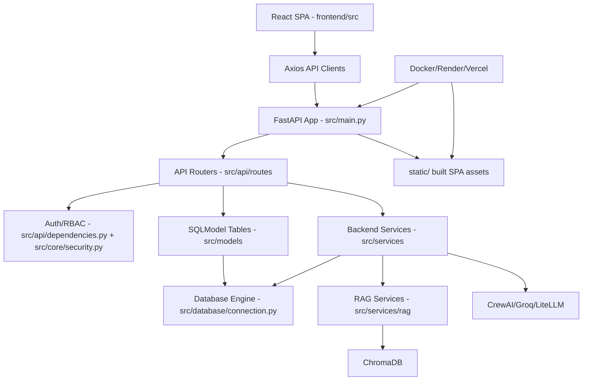
```mermaid
flowchart TD
    Browser[React SPA - frontend/src]
    Axios[Axios API Clients]
    FastAPI[FastAPI App - src/main.py]
    Routers[API Routers - src/api/routes]
    Auth[Auth/RBAC - src/api/dependencies.py + src/core/security.py]
    Models[SQLModel Tables - src/models]
    DB[Database Engine - src/database/connection.py]
    Services[Backend Services - src/services]
    RAG[RAG Services - src/services/rag]
    Chroma[ChromaDB]
    AI[CrewAI/Groq/LiteLLM]
    Static[static/ built SPA assets]
    Deploy[Docker/Render/Vercel]

    Browser --> Axios --> FastAPI
    FastAPI --> Routers
    FastAPI --> Static
    Routers --> Auth
    Routers --> Models
    Routers --> Services
    Models --> DB
    Services --> DB
    Services --> AI
    Services --> RAG
    RAG --> Chroma
    Deploy --> FastAPI
    Deploy --> Static
```

### Dependency Relationships

| Area | Structural Dependencies |
| --- | --- |
| Frontend | `frontend/src/api` depends on Axios; pages/components depend on API clients, stores, hooks, and UI components. |
| Backend | `src/main.py` depends on config, database setup, routers, middleware, and static serving. |
| Database | `src/database/connection.py` depends on settings and SQLModel models. |
| AI | `src/services/*`, `agents/*`, `tasks/*`, and `crew.py` depend on CrewAI/Groq/LiteLLM abstractions. |
| RAG | `src/services/rag/*` depends on Chroma, embedding service, retrieval service, and selected SQLModel records. |
| Authentication | `src/core/security.py` and `src/api/dependencies.py` depend on JWT settings and `User` records. |
| Deployment | Docker copies backend source, CrewAI modules, utilities, scripts, and built `static/` assets into the runtime image. |

---

## Configuration Documentation

| File | Purpose | Where Used | Dependencies | Notes |
| --- | --- | --- | --- | --- |
| `src/config.py` | Central Pydantic settings with `.env` loading and production secret validation. | Backend modules. | pydantic-settings. | Allows extra env vars. |
| `.env.example` | Template for required deployment/local env variables. | Developers/deployments. | Settings names. | Contains placeholders only. |
| `.env.postgres` | Local PostgreSQL sample. | Local DB setup. | Docker Compose database. | Contains non-secret local sample password. |
| `.env` | Local secrets/config. | Runtime via settings. | pydantic-settings. | Values intentionally not documented. |
| `requirements.txt` | Backend Python dependency list. | pip/Docker. | pip. | Active. |
| `frontend/package.json` | Frontend package metadata, scripts, dependencies. | npm. | npm. | Active. |
| `frontend/vite.config.js` | Vite/React/Tailwind config. | Vite. | Vite plugins. | Active. |
| `frontend/eslint.config.js` | Frontend lint config. | npm lint. | ESLint plugins. | Active. |
| `frontend/playwright.config.js` | E2E test config. | npm e2e. | Playwright. | Active. |
| `pytest.ini` | Pytest options. | pytest. | pytest. | Active. |
| `Dockerfile` | Production container build. | Docker/Render. | requirements, source tree. | Active. |
| `docker-compose.yml` | Local PostgreSQL. | Docker Compose. | postgres image. | Active. |
| `render.yaml` | Render web service/env config. | Render. | Dockerfile. | Active. |
| `vercel.json` | SPA rewrite config. | Vercel. | static frontend route handling. | Active / Partial. |

---

## Environment Variables

Secret values are not exposed. Defaults are listed only when defined in source/config examples.

| Variable | Required / Optional | Purpose | Referenced In | Default Value | Security Notes |
| --- | --- | --- | --- | --- | --- |
| `APP_NAME` | Optional | Application display/name setting. | `src/config.py` | `TalentForge AI` | Non-secret. |
| `DEBUG` | Optional | Debug/prod behavior flag. | `src/config.py`, `.env.example`, `render.yaml` | `False` | Non-secret. |
| `GROQ_API_KEY` | Optional for fallback, required for Groq AI features | Primary Groq API key. | `src/config.py`, `.env.example`, `render.yaml`, AI services | empty string | Secret. |
| `GROQ_API_KEY_1` | Optional | Secondary Groq key placeholder. | `.env.example` | placeholder | Secret. |
| `GROQ_API_KEY_2` | Optional | Tertiary Groq key placeholder. | `.env.example` | placeholder | Secret. |
| `MODEL_NAME` | Optional | LLM model name. | `src/config.py`, `.env.example`, `render.yaml` | `llama-3.1-8b-instant` | Non-secret. |
| `DATABASE_URL` | Required for non-test backend startup | SQLModel database URL. | `src/config.py`, `src/database/connection.py`, scripts, tests, deployment files | empty string in settings | Secret because it can contain credentials. |
| `SUPABASE_URL` | Optional | Supabase project URL. | `src/config.py`, `.env.example`, `render.yaml` | empty string | Non-secret by itself, but environment-specific. |
| `SUPABASE_ANON_KEY` | Optional | Supabase anon key. | `src/config.py`, `.env.example`, `render.yaml` | empty string | Treat as secret/config-sensitive. |
| `SUPABASE_SERVICE_ROLE_KEY` | Optional | Supabase service role key. | `src/config.py`, `.env.example`, `render.yaml` | empty string | Secret. |
| `PGSSLMODE` | Optional | PostgreSQL SSL mode. | `src/config.py`, `.env.example`, tests, render | `require` | Non-secret. |
| `DATABASE_CONNECT_TIMEOUT` | Optional | DB connection timeout. | `src/config.py`, `.env.example`, render | `10` | Non-secret. |
| `AUTO_CREATE_DB_SCHEMA` | Optional | Whether startup creates/updates schema. | `src/config.py`, tests, render | `True` | Operationally sensitive. |
| `SECRET_KEY` | Required outside explicit test/sqlite modes | JWT signing secret. | `src/config.py`, `src/core/security.py`, tests, render | weak dev default in code | Secret; production validator rejects weak values. |
| `ALGORITHM` | Optional | JWT algorithm. | `src/config.py`, `src/core/security.py` | `HS256` | Non-secret. |
| `ACCESS_TOKEN_EXPIRE_MINUTES` | Optional | JWT expiry duration. | `src/config.py`, security | `10080` | Non-secret. |
| `ALLOWED_ORIGINS` | Optional | CORS allow-list. | `src/config.py`, `src/main.py` | localhost/127.0.0.1 port 8000 | Non-secret. |
| `DB_POOL_SIZE` | Optional | DB pool sizing. | `src/config.py`, database connection | `5` | Non-secret. |
| `DB_MAX_OVERFLOW` | Optional | DB pool overflow. | `src/config.py`, database connection | `5` | Non-secret. |
| `DB_POOL_TIMEOUT` | Optional | DB pool timeout. | `src/config.py`, database connection | `15` | Non-secret. |
| `HOST` | Optional | `app.py` local uvicorn host. | `app.py` | `127.0.0.1` | Non-secret. |
| `PORT` | Optional / platform-provided | Server port. | `app.py`, Dockerfile CMD | `8000` fallback | Non-secret. |
| `WEB_CONCURRENCY` | Optional | Uvicorn worker count in Docker CMD. | `Dockerfile` | `2` fallback | Non-secret. |
| `CREWAI_STORAGE_DIR` | Optional | CrewAI storage isolation. | `src/main.py` | `talentforge_local` | Non-secret. |
| `CREWAI_DISABLE_TELEMETRY` | Optional | CrewAI telemetry disable flag. | `src/main.py` | `true` | Non-secret. |
| `CREWAI_DISABLE_TRACKING` | Optional | CrewAI tracking disable flag. | `src/main.py` | `true` | Non-secret. |
| `INTERVIEW_USE_LLM_ANSWER_EVAL` | Optional | Enables LLM-based answer evaluation path. | `crew.py` | `0` | Operationally sensitive. |
| `RAG_CHROMA_PATH` | Optional | Chroma persistence path override. | RAG tests/services | test-specific values | Local path, not secret. |
| `NVIDIA_NIM_API_KEY` | Optional placeholder | NVIDIA NIM key placeholder. | `.env.example` | empty | Secret if populated. |
| `NVIDIA_NIM_BASE_URL` | Optional placeholder | NVIDIA NIM base URL. | `.env.example` | `https://integrate.api.nvidia.com/v1` | Non-secret. |
| `POSTGRES_DB` | Required for compose service | Local Postgres DB name. | `docker-compose.yml` | `talentforge` | Non-secret local default. |
| `POSTGRES_USER` | Required for compose service | Local Postgres user. | `docker-compose.yml` | `talentforge` | Local credential. |
| `POSTGRES_PASSWORD` | Required for compose service | Local Postgres password. | `docker-compose.yml` | local sample | Secret in real environments. |
| `JOOBLE_API_KEY` | Optional | Jooble job API key. | `utils/job_search.py` | none detected | Secret. |
| `JSEARCH_API_KEY` / RapidAPI key variables | Optional | JSearch/RapidAPI job API access. | `utils/job_search.py` | none detected | Secret. |

---

## Build and Deployment Assets

| Asset | Purpose | Current Status |
| --- | --- | --- |
| `requirements.txt` | Installs backend dependencies including FastAPI, SQLModel, CrewAI, Groq, ChromaDB, pytest, LiteLLM. | Active |
| `frontend/package.json` | Defines frontend dev/build/lint/e2e scripts and dependencies. | Active |
| `frontend/package-lock.json` | Locks frontend dependency versions. | Active |
| `Dockerfile` | Multi-stage Python image. Installs backend dependencies, copies backend/CrewAI/util/script/static files, runs uvicorn. | Active |
| `.dockerignore` | Keeps build context smaller and avoids local/runtime files. | Active |
| `docker-compose.yml` | Provides local PostgreSQL 16 service with healthcheck and volume. | Active |
| `render.yaml` | Render Docker web service, health check, and environment variable declarations. | Active |
| `vercel.json` | Defines catch-all rewrite to `/index.html`. | Active / Partial because backend is FastAPI/Docker-oriented. |
| `scripts/init_database.py` | Initializes DB schema using app DB connection. | Active |
| `scripts/migrate_sqlite_to_postgres.py` | Migration helper from SQLite to configured PostgreSQL. | Active |
| `scripts/bootstrap_user.py` | Creates privileged users from CLI arguments. | Active |
| `scripts/ingest_company_docs.py` | RAG ingestion CLI for company documents. | Active |
| GitHub Actions | No `.github/workflows` files detected in this phase. | Not present |
| Supabase config directory | No `supabase/` config folder detected in this phase. | Not present |

---

## Initial Project Statistics

These counts exclude `.git/`, `.venv/`, `node_modules/`, `dist/`, `build/`, `__pycache__/`, `.pytest_cache/`, `data/`, and `graphify-out/`.

| Metric | Count / Observation |
| --- | --- |
| Total non-generated files scanned | 276 |
| Root-level files | 16 |
| Backend source files under `src/` | 54 |
| Frontend files under `frontend/` | 104 |
| Static files under `static/` | 72 |
| Test files under `tests/` | 16 |
| Script files under `scripts/` | 7 |
| Agent files under `agents/` | 5 |
| Task files under `tasks/` | 5 |
| Utility files under `utils/` | 3 |
| FastAPI routers currently included | 21 |
| React route/page files | 19 |
| SQLModel database table classes | 34 |
| RAG service modules | 10 including package marker |
| CrewAI agent factory files | 4 active, 1 stub |
| CrewAI task factory files | 4 active, 1 stub |
| Backend test runner | Pytest |
| Frontend test runner | Playwright |

### Largest Text/Source Modules Observed

| File | Approximate Lines |
| --- | ---: |
| `frontend/package-lock.json` | 3758 |
| `src/api/routes/interview.py` | 1661 |
| `frontend/src/pages/EmployeeDashboard.jsx` | 1335 |
| `frontend/src/pages/hr/InterviewReports.jsx` | 1066 |
| `frontend/src/pages/HRDashboard.jsx` | 1021 |
| `src/resume_lab.py` | 1019 |
| `frontend/src/components/interview/InterviewWorkspaceShell.jsx` | 931 |
| `crew.py` | 791 |
| `src/api/routes/employees.py` | 783 |
| `src/services/interview_core.py` | 726 |
| `src/database/connection.py` | 677 |
| `src/services/hiring_intelligence.py` | 669 |
| `frontend/src/pages/hr/OnboardingHub.jsx` | 623 |
| `frontend/src/components/drawers/EmployeeProfileDrawer.jsx` | 613 |
| `frontend/src/components/interview/InterviewSummary.jsx` | 609 |
| `frontend/src/components/drawers/AnalysisDrawer.jsx` | 607 |
| `frontend/src/pages/AdminDashboard.jsx` | 592 |
| `README.md` | 573 |
| `src/api/routes/onboarding.py` | 562 |
| `frontend/src/pages/CandidateDashboard.jsx` | 533 |

### Smallest Modules Observed

| File | Lines | Status |
| --- | ---: | --- |
| `src/__init__.py` | 0 | Stub/package marker |
| `src/api/__init__.py` | 0 | Stub/package marker |
| `src/api/routes/__init__.py` | 0 | Stub/package marker |
| `src/core/__init__.py` | 0 | Stub/package marker |
| `src/database/__init__.py` | 0 | Stub/package marker |
| `src/services/__init__.py` | 0 | Stub/package marker |
| `agents/skill_matcher.py` | 0 | Stub |
| `tasks/match_task.py` | 0 | Stub |
| `scripts/__init__.py` | 1 | Package marker |
| `scripts/init_database.py` | 5 | Active script |

---

## Repository Health Check

This section records observations only. It does not recommend or perform cleanup.

### Unused or Empty Folders

| Path | Observation | Status |
| --- | --- | --- |
| `graphify-out/` | Generated graphify output. Not source documentation input except for orientation. | Generated |
| `data/` | Runtime/local data storage. | Generated/runtime |
| `.pytest_cache/` | Pytest cache. | Generated |
| `__pycache__/` | Python bytecode cache. | Generated |

### Stub Files

| File | Observation | Status |
| --- | --- | --- |
| `agents/skill_matcher.py` | Empty file. | Stub |
| `tasks/match_task.py` | Empty file. | Stub |
| Package `__init__.py` files | Empty package markers in several packages. | Stub / Active package marker |

### Deprecated or Legacy Content

| File | Observation | Status |
| --- | --- | --- |
| `crew.py` | AGENTS marks this as legacy and says not to reference it as current architecture. File still contains substantial orchestration code. | Deprecated / legacy |

### Duplicate or Generated Content

| Path | Observation | Status |
| --- | --- | --- |
| `static/assets/*` | Built Vite output duplicates compiled versions of `frontend/src` logic. | Generated |
| `static/index.html` | Built SPA shell. | Generated |
| `frontend/src/assets` and `static/assets` | Source assets and generated build assets coexist. | Expected |

### Partially Implemented or Ambiguous Areas

| Area | Observation | Status |
| --- | --- | --- |
| `vercel.json` | Present, but the main production shape appears Docker/FastAPI/Render-oriented. | Partial |
| `frontend/README.md` | Vite template-style documentation, not project-specific. | Partial |
| `NVIDIA_NIM_*` env examples | Present in `.env.example`, but direct source usage was not found in this phase. | Unused / placeholder |
| AGENTS router count | AGENTS says 20 routers; current `src/main.py` includes 21 routers. | Documentation drift |

### Potential Cleanup Opportunities

Recorded only, no changes made:

- Confirm whether `agents/skill_matcher.py` and `tasks/match_task.py` are intentional placeholders.
- Confirm whether `crew.py` should remain as legacy compatibility code.
- Keep `static/assets/*` treated as generated build output and avoid editing it directly.
- Update AGENTS router count in a later documentation-maintenance task if desired.
- Confirm whether Vercel deployment remains supported alongside Docker/Render.

---

## Future Phase Placeholders

The following sections are intentionally left as placeholders for later documentation phases.

## Phase 2 - Business Logic and Workflow Documentation

## Backend, Database and API Documentation

Phase 2 documents the backend implementation that exists in this repository as of 2026-07-06. It extends Phase 1 and does not replace it. All inventories below were re-extracted from `src/`, `src/api/`, `src/database/`, `src/models/`, `src/services/`, `scripts/`, `tests/`, and `frontend/src/api`.

### Backend Architecture

The backend is a FastAPI application exported from `src.main:app`. Startup is handled by an async lifespan function that calls `create_db_and_tables()`. The app registers GZip and CORS middleware, global HTTP/validation exception handlers, 21 router modules, a hidden `/api/health` endpoint, and a final SPA static mount from `static/`.

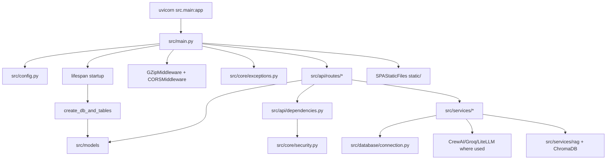
```mermaid
flowchart TD
    Runtime[uvicorn src.main:app] --> Main[src/main.py]
    Main --> Settings[src/config.py]
    Main --> Lifespan[lifespan startup] --> DBCreate[create_db_and_tables] --> Models[src/models]
    Main --> Middleware[GZipMiddleware + CORSMiddleware]
    Main --> Exceptions[src/core/exceptions.py]
    Main --> Routers[src/api/routes/*]
    Main --> Static[SPAStaticFiles static/]
    Routers --> Dependencies[src/api/dependencies.py] --> Security[src/core/security.py]
    Routers --> Services[src/services/*]
    Routers --> Models
    Services --> Database[src/database/connection.py]
    Services --> AI[CrewAI/Groq/LiteLLM where used]
    Services --> RAG[src/services/rag + ChromaDB]
```

| Area | Implementation |
| --- | --- |
| Application structure | `src/main.py` creates `FastAPI(title=settings.APP_NAME, version="2.0.0", docs_url="/api/docs", redoc_url="/api/redoc", lifespan=lifespan)`. The exported object is `app`. |
| Application startup | `lifespan()` logs startup and calls `create_db_and_tables()`. It logs shutdown after `yield`. |
| Dependency injection | FastAPI `Depends(...)` is used for SQLModel sessions, current user resolution, role guards, and RAG service factories. |
| Middleware | `GZipMiddleware(minimum_size=512)` and `CORSMiddleware` with `settings.ALLOWED_ORIGINS`, credentials, all methods, all headers. |
| Router registration | `src/main.py` includes 21 routers: admin, applications, auth, candidates, dashboard, departments, designations, employees, interview, jobs, lifecycle, mock_interview, notifications, onboarding, profile, promotions, rag, resume, salary, tickets, training. |
| Request lifecycle | Middleware runs first; FastAPI resolves route dependencies; `get_session()` yields a SQLModel session; handlers call models/services; write handlers commit explicitly; response is JSON/file/static. |
| Exception handling | `src/core/exceptions.py` returns structured JSON for Starlette HTTP exceptions and request validation errors. |
| Logging | `logging.basicConfig` is configured in `src/main.py`; services and database migrations use module loggers. |
| Validation | Pydantic route schemas, FastAPI validation, SQLModel fields, and explicit `HTTPException` guards. |
| Configuration loading | `Settings` loads `.env`, allows extra keys, parses DEBUG, and rejects weak production `SECRET_KEY` outside sqlite/test modes. |
| Static serving | `SPAStaticFiles` returns `index.html` for non-API 404s and is mounted last at `/`. |
| Service layer | AI, RAG, transcription, interview, recruitment, and employee services live under `src/services`. |
| Utility layer | `utils/` and `scripts/` provide helper and operational code; they are not a separate data-access abstraction. |

### Router Documentation

| Router | File | Prefix | Tags | Purpose | Dependencies | Auth / Roles | Related Services | Related Models | Status |
| --- | --- | --- | --- | --- | --- | --- | --- | --- | --- |
| `admin` | `src/api/routes/admin.py` | `/api/admin` | `admin` | 12 endpoint(s) for the `admin` backend surface. | `get_session`; `get_current_user` / `require_roles` where declared; route-local request schemas. | Admin only. | RAG company docs ingestion, filesystem docs | User; filesystem docs | Active |
| `applications` | `src/api/routes/applications.py` | `/api/applications` | `applications` | 7 endpoint(s) for the `applications` backend surface. | `get_session`; `get_current_user` / `require_roles` where declared; route-local request schemas. | Protected or mixed; see endpoint table. | recruitment_ai, RAG sync, interview_consistency | CandidateApplication, ApplicationAIAnalysis, JobPosting, User, Employee, HRNotification | Active |
| `auth` | `src/api/routes/auth.py` | `/api/auth` | `auth` | 2 endpoint(s) for the `auth` backend surface. | `get_session`; `get_current_user` / `require_roles` where declared; route-local request schemas. | Public register/login. | none direct beyond SQLModel/session helpers | User | Active |
| `candidates` | `src/api/routes/candidates.py` | `/api/candidates` | `candidates` | 2 endpoint(s) for the `candidates` backend surface. | `get_session`; `get_current_user` / `require_roles` where declared; route-local request schemas. | Protected or mixed; see endpoint table. | none direct beyond SQLModel/session helpers | User, Resume, CandidateApplication, ApplicationAIAnalysis | Active |
| `dashboard` | `src/api/routes/dashboard.py` | `/api/dashboard` | `dashboard` | 3 endpoint(s) for the `dashboard` backend surface. | `get_session`; `get_current_user` / `require_roles` where declared; route-local request schemas. | Protected or mixed; see endpoint table. | none direct beyond SQLModel/session helpers | JobPosting, CandidateApplication, ApplicationAIAnalysis, Employee, InterviewSession | Active |
| `departments` | `src/api/routes/departments.py` | `/api/departments` | `departments` | 4 endpoint(s) for the `departments` backend surface. | `get_session`; `get_current_user` / `require_roles` where declared; route-local request schemas. | Protected or mixed; see endpoint table. | none direct beyond SQLModel/session helpers | Department, User | Active |
| `designations` | `src/api/routes/designations.py` | `/api/designations` | `designations` | 4 endpoint(s) for the `designations` backend surface. | `get_session`; `get_current_user` / `require_roles` where declared; route-local request schemas. | Protected or mixed; see endpoint table. | none direct beyond SQLModel/session helpers | Designation, Department | Active |
| `employees` | `src/api/routes/employees.py` | `/api/employees` | `employees` | 17 endpoint(s) for the `employees` backend surface. | `get_session`; `get_current_user` / `require_roles` where declared; route-local request schemas. | Protected or mixed; see endpoint table. | employee_ai, RAG chat/access control | Employee, AttendanceRecord, LeaveRequest, SkillGapAnalysis, EmployeeProfile, HRNotification | Active |
| `interview` | `src/api/routes/interview.py` | `/api/interview` | `interview` | 22 endpoint(s) for the `interview` backend surface. | `get_session`; `get_current_user` / `require_roles` where declared; route-local request schemas. | Protected or mixed; see endpoint table. | interview_core, interview_status, interview_consistency, hiring_intelligence, transcription_service, RAG sync, crew.py | InterviewSession, CareerCoachMemory, CandidateCredibilityReport, InterviewIntelligenceReport, CandidateApplication, Resume, User | Active |
| `jobs` | `src/api/routes/jobs.py` | `/api/jobs` | `jobs` | 7 endpoint(s) for the `jobs` backend surface. | `get_session`; `get_current_user` / `require_roles` where declared; route-local request schemas. | Protected or mixed; see endpoint table. | RAG sync | JobPosting, CandidateApplication | Active |
| `lifecycle` | `src/api/routes/lifecycle.py` | `/api/lifecycle` | `lifecycle` | 2 endpoint(s) for the `lifecycle` backend surface. | `get_session`; `get_current_user` / `require_roles` where declared; route-local request schemas. | Protected or mixed; see endpoint table. | none direct beyond SQLModel/session helpers | Employee, EmployeeLifecycleEvent | Active |
| `mock_interview` | `src/api/routes/mock_interview.py` | `/api/mock-interview` | `mock-interview` | 4 endpoint(s) for the `mock_interview` backend surface. | `get_session`; `get_current_user` / `require_roles` where declared; route-local request schemas. | Protected or mixed; see endpoint table. | mock_interview_summary, crew.py | MockInterviewSession, Resume, CareerCoachMemory | Active |
| `notifications` | `src/api/routes/notifications.py` | `/api/notifications` | `notifications` | 3 endpoint(s) for the `notifications` backend surface. | `get_session`; `get_current_user` / `require_roles` where declared; route-local request schemas. | Protected or mixed; see endpoint table. | none direct beyond SQLModel/session helpers | HRNotification | Active |
| `onboarding` | `src/api/routes/onboarding.py` | `/api/onboarding` | `onboarding` | 14 endpoint(s) for the `onboarding` backend surface. | `get_session`; `get_current_user` / `require_roles` where declared; route-local request schemas. | Protected or mixed; see endpoint table. | none direct beyond SQLModel/session helpers | OnboardingTemplate, OnboardingTask, EmployeeOnboarding, EmployeeOnboardingTask, Training/Employee notification models | Active |
| `profile` | `src/api/routes/profile.py` | `/api/profile` | `profile` | 8 endpoint(s) for the `profile` backend surface. | `get_session`; `get_current_user` / `require_roles` where declared; route-local request schemas. | Protected or mixed; see endpoint table. | none direct beyond SQLModel/session helpers | CandidateProfile, EmployeeProfile, CandidateDocument, EmployeeDocument, Employee | Active |
| `promotions` | `src/api/routes/promotions.py` | `/api/promotions` | `promotions` | 3 endpoint(s) for the `promotions` backend surface. | `get_session`; `get_current_user` / `require_roles` where declared; route-local request schemas. | Protected or mixed; see endpoint table. | none direct beyond SQLModel/session helpers | PromotionHistory, Employee, HRNotification | Active |
| `rag` | `src/api/routes/rag.py` | `/api/rag` | `rag` | 1 endpoint(s) for the `rag` backend surface. | `get_session`; `get_current_user` / `require_roles` where declared; route-local request schemas. | Protected or mixed; see endpoint table. | RAGChatService, RAGAccessControl | User plus Chroma-backed collections | Active |
| `resume` | `src/api/routes/resume.py` | `/api/resume` | `resume` | 2 endpoint(s) for the `resume` backend surface. | `get_session`; `get_current_user` / `require_roles` where declared; route-local request schemas. | Protected or mixed; see endpoint table. | resume_lab, pypdf | Resume | Active |
| `salary` | `src/api/routes/salary.py` | `/api/salary` | `salary` | 2 endpoint(s) for the `salary` backend surface. | `get_session`; `get_current_user` / `require_roles` where declared; route-local request schemas. | Protected or mixed; see endpoint table. | none direct beyond SQLModel/session helpers | SalaryHistory, Employee | Active |
| `tickets` | `src/api/routes/tickets.py` | `/api/tickets` | `tickets` | 6 endpoint(s) for the `tickets` backend surface. | `get_session`; `get_current_user` / `require_roles` where declared; route-local request schemas. | Protected or mixed; see endpoint table. | none direct beyond SQLModel/session helpers | EmployeeTicket, Employee, User, HRNotification | Active |
| `training` | `src/api/routes/training.py` | `/api/training` | `training` | 9 endpoint(s) for the `training` backend surface. | `get_session`; `get_current_user` / `require_roles` where declared; route-local request schemas. | Protected or mixed; see endpoint table. | none direct beyond SQLModel/session helpers | TrainingProgram, TrainingAssignment, Employee, HRNotification | Active |

### Complete API Documentation

All protected endpoints expect `Authorization: Bearer <jwt>`. JSON endpoints use `Content-Type: application/json`; upload endpoints use `multipart/form-data`. Common error responses are 401 for missing/invalid/stale tokens, 403 for role or ownership failures, 404 for missing records/files, 409 for conflicts, 413 for oversized documents, 422 for validation errors, and route-specific 400/500 responses. Success responses are JSON unless the endpoint returns a file download.

#### Endpoint Information Matrix

| Method | Route | Purpose | Router Function | Auth / Required Roles | Request Parameters / Body | Success | Error Responses | Backend Flow / Tables / Services | Side Effects | Frontend Consumers |
| --- | --- | --- | --- | --- | --- | --- | --- | --- | --- | --- |
| GET | `/api/health` | Health probe. | `health_check` | Public | None | `{"status":"ok"}` | None declared. | App-level handler. | None | Render health check / manual probes |
| GET | `/api/admin/users` | Read/query backend resource. | `list_users` | admin_required | none | 200 JSON response | 401/403 via dependencies when protected; 422 validation; route-specific HTTPException guards. | `src/api/routes/admin.py:64`; models: User; filesystem docs; services: RAG company docs ingestion, filesystem docs | Read-only unless method is POST/PUT/DELETE or route name indicates state change. | frontend/src/api/admin.js |
| PUT | `/api/admin/users/{user_id}` | Update backend resource state. | `update_user` | admin_required | path: user_id; json: req: UserUpdate | 200 JSON response | 401/403 via dependencies when protected; 422 validation; route-specific HTTPException guards. | `src/api/routes/admin.py:82`; models: User; filesystem docs; services: RAG company docs ingestion, filesystem docs | May write database/file/RAG state as implemented in router/service. | frontend/src/api/admin.js |
| GET | `/api/admin/policies` | Read/query backend resource. | `list_policies` | admin_required | none | 200 JSON response | 401/403 via dependencies when protected; 422 validation; route-specific HTTPException guards. | `src/api/routes/admin.py:118`; models: User; filesystem docs; services: RAG company docs ingestion, filesystem docs | Read-only unless method is POST/PUT/DELETE or route name indicates state change. | frontend/src/api/admin.js |
| POST | `/api/admin/policies` | Create/start backend resource or process. | `create_policy` | admin_required | json: req: PolicyCreate | 201 | 401/403 via dependencies when protected; 422 validation; route-specific HTTPException guards. | `src/api/routes/admin.py:132`; models: User; filesystem docs; services: RAG company docs ingestion, filesystem docs | May write database/file/RAG state as implemented in router/service. | frontend/src/api/admin.js |
| PUT | `/api/admin/policies/{filename}` | Update backend resource state. | `update_policy` | admin_required | path: filename; json: req: PolicyCreate | 200 JSON response | 401/403 via dependencies when protected; 422 validation; route-specific HTTPException guards. | `src/api/routes/admin.py:161`; models: User; filesystem docs; services: RAG company docs ingestion, filesystem docs | May write database/file/RAG state as implemented in router/service. | frontend/src/api/admin.js |
| DELETE | `/api/admin/policies/{filename}` | Delete/deactivate backend resource. | `delete_policy` | admin_required | path: filename | 200 JSON response | 401/403 via dependencies when protected; 422 validation; route-specific HTTPException guards. | `src/api/routes/admin.py:188`; models: User; filesystem docs; services: RAG company docs ingestion, filesystem docs | May write database/file/RAG state as implemented in router/service. | frontend/src/api/admin.js |
| POST | `/api/admin/policies/{filename}/reindex` | Backend handler implemented in router source. | `reindex_policy` | admin_required | path: filename | 200 JSON response | 401/403 via dependencies when protected; 422 validation; route-specific HTTPException guards. | `src/api/routes/admin.py:205`; models: User; filesystem docs; services: RAG company docs ingestion, filesystem docs | May write database/file/RAG state as implemented in router/service. | frontend/src/api/admin.js |
| GET | `/api/admin/knowledge` | Read/query backend resource. | `list_knowledge` | admin_required | none | 200 JSON response | 401/403 via dependencies when protected; 422 validation; route-specific HTTPException guards. | `src/api/routes/admin.py:230`; models: User; filesystem docs; services: RAG company docs ingestion, filesystem docs | Read-only unless method is POST/PUT/DELETE or route name indicates state change. | frontend/src/api/admin.js |
| POST | `/api/admin/knowledge` | Create/start backend resource or process. | `create_knowledge` | admin_required | json: req: KnowledgeCreate | 201 | 401/403 via dependencies when protected; 422 validation; route-specific HTTPException guards. | `src/api/routes/admin.py:246`; models: User; filesystem docs; services: RAG company docs ingestion, filesystem docs | May write database/file/RAG state as implemented in router/service. | frontend/src/api/admin.js |
| PUT | `/api/admin/knowledge/{category}/{filename}` | Update backend resource state. | `update_knowledge` | admin_required | path: category, filename; json: req: PolicyCreate | 200 JSON response | 401/403 via dependencies when protected; 422 validation; route-specific HTTPException guards. | `src/api/routes/admin.py:279`; models: User; filesystem docs; services: RAG company docs ingestion, filesystem docs | May write database/file/RAG state as implemented in router/service. | frontend/src/api/admin.js |
| DELETE | `/api/admin/knowledge/{category}/{filename}` | Delete/deactivate backend resource. | `delete_knowledge` | admin_required | path: category, filename | 200 JSON response | 401/403 via dependencies when protected; 422 validation; route-specific HTTPException guards. | `src/api/routes/admin.py:309`; models: User; filesystem docs; services: RAG company docs ingestion, filesystem docs | May write database/file/RAG state as implemented in router/service. | frontend/src/api/admin.js |
| POST | `/api/admin/knowledge/{category}/{filename}/reindex` | Backend handler implemented in router source. | `reindex_knowledge` | admin_required | path: category, filename | 200 JSON response | 401/403 via dependencies when protected; 422 validation; route-specific HTTPException guards. | `src/api/routes/admin.py:329`; models: User; filesystem docs; services: RAG company docs ingestion, filesystem docs | May write database/file/RAG state as implemented in router/service. | frontend/src/api/admin.js |
| POST | `/api/applications/apply` | Create/start backend resource or process. | `apply_to_job` | get_session; require_roles('candidate' | query/form: job_id; multipart: job_id: Form(...), file: File(...) | 201 | 401/403 via dependencies when protected; 422 validation; route-specific HTTPException guards. | `src/api/routes/applications.py:58`; models: CandidateApplication, ApplicationAIAnalysis, JobPosting, User, Employee, HRNotification; services: recruitment_ai, RAG sync, interview_consistency | May write database/file/RAG state as implemented in router/service. | frontend/src/api/applications.js |
| GET | `/api/applications/me` | Backend handler implemented in router source. | `my_applications` | get_session; require_roles('candidate' | none | 200 JSON response | 401/403 via dependencies when protected; 422 validation; route-specific HTTPException guards. | `src/api/routes/applications.py:122`; models: CandidateApplication, ApplicationAIAnalysis, JobPosting, User, Employee, HRNotification; services: recruitment_ai, RAG sync, interview_consistency | Read-only unless method is POST/PUT/DELETE or route name indicates state change. | frontend/src/api/applications.js |
| GET | `/api/applications` | Read/query backend resource. | `list_applications` | get_session; require_roles('hr', 'manager' | none | 200 JSON response | 401/403 via dependencies when protected; 422 validation; route-specific HTTPException guards. | `src/api/routes/applications.py:135`; models: CandidateApplication, ApplicationAIAnalysis, JobPosting, User, Employee, HRNotification; services: recruitment_ai, RAG sync, interview_consistency | Read-only unless method is POST/PUT/DELETE or route name indicates state change. | frontend/src/api/applications.js |
| POST | `/api/applications/{application_id}/analyze` | Backend handler implemented in router source. | `reanalyze_application` | get_session; require_roles('hr', 'manager' | path: application_id | 200 JSON response | 401/403 via dependencies when protected; 422 validation; route-specific HTTPException guards. | `src/api/routes/applications.py:146`; models: CandidateApplication, ApplicationAIAnalysis, JobPosting, User, Employee, HRNotification; services: recruitment_ai, RAG sync, interview_consistency | May write database/file/RAG state as implemented in router/service. | frontend/src/api/applications.js |
| POST | `/api/applications/{application_id}/hire` | Backend handler implemented in router source. | `hire_application` | get_session; require_roles('hr' | path: application_id; json: req: HireApplicationReq | 201 | 401/403 via dependencies when protected; 422 validation; route-specific HTTPException guards. | `src/api/routes/applications.py:159`; models: CandidateApplication, ApplicationAIAnalysis, JobPosting, User, Employee, HRNotification; services: recruitment_ai, RAG sync, interview_consistency | May write database/file/RAG state as implemented in router/service. | frontend/src/api/applications.js |
| GET | `/api/applications/rankings/{job_id}` | Read/query backend resource. | `get_job_rankings` | get_session; require_roles('hr', 'manager' | path: job_id | 200 JSON response | 401/403 via dependencies when protected; 422 validation; route-specific HTTPException guards. | `src/api/routes/applications.py:373`; models: CandidateApplication, ApplicationAIAnalysis, JobPosting, User, Employee, HRNotification; services: recruitment_ai, RAG sync, interview_consistency | Read-only unless method is POST/PUT/DELETE or route name indicates state change. | frontend/src/api/applications.js |
| GET | `/api/applications/{application_id}/credibility` | Read/query backend resource. | `get_application_credibility` | get_session; require_roles('hr', 'admin' | path: application_id; query/form: force | 200 JSON response | 401/403 via dependencies when protected; 422 validation; route-specific HTTPException guards. | `src/api/routes/applications.py:434`; models: CandidateApplication, ApplicationAIAnalysis, JobPosting, User, Employee, HRNotification; services: recruitment_ai, RAG sync, interview_consistency | Read-only unless method is POST/PUT/DELETE or route name indicates state change. | frontend/src/api/applications.js |
| POST | `/api/auth/register` | Public candidate account registration. | `register` | Public | json: req: RegisterReq | 201 | 409 duplicate username; 422 validation. | `src/api/routes/auth.py:39`; models: User; services: password hashing and SQLModel session helpers | Creates candidate user and returns JWT. | frontend/src/api/auth.js |
| POST | `/api/auth/login` | Public username/password login. | `login` | Public | json: req: LoginReq | 200 JSON response | 401 incorrect username/password; 422 validation. | `src/api/routes/auth.py:54`; models: User and Resume; services: password verification and JWT creation | Returns JWT, user metadata, role, and has_resume. | frontend/src/api/auth.js |
| GET | `/api/candidates` | Read/query backend resource. | `list_candidates` | get_session; require_roles('hr', 'manager' | none | 200 JSON response | 401/403 via dependencies when protected; 422 validation; route-specific HTTPException guards. | `src/api/routes/candidates.py:15`; models: User, Resume, CandidateApplication, ApplicationAIAnalysis; services: none direct beyond SQLModel/session helpers | Read-only unless method is POST/PUT/DELETE or route name indicates state change. | frontend/src/api/candidates.js |
| GET | `/api/candidates/{candidate_id}` | Read/query backend resource. | `get_candidate` | get_session; require_roles('hr', 'manager' | path: candidate_id | 200 JSON response | 401/403 via dependencies when protected; 422 validation; route-specific HTTPException guards. | `src/api/routes/candidates.py:26`; models: User, Resume, CandidateApplication, ApplicationAIAnalysis; services: none direct beyond SQLModel/session helpers | Read-only unless method is POST/PUT/DELETE or route name indicates state change. | frontend/src/api/candidates.js |
| GET | `/api/dashboard/hr` | Backend handler implemented in router source. | `hr_dashboard` | get_session; require_roles('hr', 'manager' | none | 200 JSON response | 401/403 via dependencies when protected; 422 validation; route-specific HTTPException guards. | `src/api/routes/dashboard.py:43`; models: JobPosting, CandidateApplication, ApplicationAIAnalysis, Employee, InterviewSession; services: none direct beyond SQLModel/session helpers | Read-only unless method is POST/PUT/DELETE or route name indicates state change. | frontend/src/api/dashboard.js |
| GET | `/api/dashboard/candidate` | Backend handler implemented in router source. | `candidate_dashboard` | get_session; require_roles('candidate' | none | 200 JSON response | 401/403 via dependencies when protected; 422 validation; route-specific HTTPException guards. | `src/api/routes/dashboard.py:167`; models: JobPosting, CandidateApplication, ApplicationAIAnalysis, Employee, InterviewSession; services: none direct beyond SQLModel/session helpers | Read-only unless method is POST/PUT/DELETE or route name indicates state change. | frontend/src/api/dashboard.js |
| GET | `/api/dashboard/hr/reviews` | Read/query backend resource. | `get_hr_reviews` | get_session; require_roles('hr', 'manager' | none | 200 JSON response | 401/403 via dependencies when protected; 422 validation; route-specific HTTPException guards. | `src/api/routes/dashboard.py:252`; models: JobPosting, CandidateApplication, ApplicationAIAnalysis, Employee, InterviewSession; services: none direct beyond SQLModel/session helpers | Read-only unless method is POST/PUT/DELETE or route name indicates state change. | frontend/src/api/dashboard.js |
| GET | `/api/departments` | Read/query backend resource. | `list_departments` | authenticated user | none | 200 JSON response | 401/403 via dependencies when protected; 422 validation; route-specific HTTPException guards. | `src/api/routes/departments.py:43`; models: Department, User; services: none direct beyond SQLModel/session helpers | Read-only unless method is POST/PUT/DELETE or route name indicates state change. | frontend/src/api/departments.js |
| POST | `/api/departments` | Create/start backend resource or process. | `create_department` | get_session; require_roles('hr' | json: body: DepartmentCreate | 201 | 401/403 via dependencies when protected; 422 validation; route-specific HTTPException guards. | `src/api/routes/departments.py:48`; models: Department, User; services: none direct beyond SQLModel/session helpers | May write database/file/RAG state as implemented in router/service. | frontend/src/api/departments.js |
| PUT | `/api/departments/{dept_id}` | Update backend resource state. | `update_department` | get_session; require_roles('hr' | path: dept_id; json: body: DepartmentUpdate | 200 JSON response | 401/403 via dependencies when protected; 422 validation; route-specific HTTPException guards. | `src/api/routes/departments.py:59`; models: Department, User; services: none direct beyond SQLModel/session helpers | May write database/file/RAG state as implemented in router/service. | frontend/src/api/departments.js |
| DELETE | `/api/departments/{dept_id}` | Delete/deactivate backend resource. | `deactivate_department` | get_session; require_roles('hr' | path: dept_id | 200 JSON response | 401/403 via dependencies when protected; 422 validation; route-specific HTTPException guards. | `src/api/routes/departments.py:72`; models: Department, User; services: none direct beyond SQLModel/session helpers | May write database/file/RAG state as implemented in router/service. | frontend/src/api/departments.js |
| GET | `/api/designations` | Read/query backend resource. | `list_designations` | authenticated user | query/form: department_id | 200 JSON response | 401/403 via dependencies when protected; 422 validation; route-specific HTTPException guards. | `src/api/routes/designations.py:42`; models: Designation, Department; services: none direct beyond SQLModel/session helpers | Read-only unless method is POST/PUT/DELETE or route name indicates state change. | frontend/src/api/designations.js |
| POST | `/api/designations` | Create/start backend resource or process. | `create_designation` | get_session; require_roles('hr' | json: body: DesignationCreate | 201 | 401/403 via dependencies when protected; 422 validation; route-specific HTTPException guards. | `src/api/routes/designations.py:54`; models: Designation, Department; services: none direct beyond SQLModel/session helpers | May write database/file/RAG state as implemented in router/service. | frontend/src/api/designations.js |
| PUT | `/api/designations/{desig_id}` | Update backend resource state. | `update_designation` | get_session; require_roles('hr' | path: desig_id; json: body: DesignationUpdate | 200 JSON response | 401/403 via dependencies when protected; 422 validation; route-specific HTTPException guards. | `src/api/routes/designations.py:66`; models: Designation, Department; services: none direct beyond SQLModel/session helpers | May write database/file/RAG state as implemented in router/service. | frontend/src/api/designations.js |
| DELETE | `/api/designations/{desig_id}` | Update backend resource state. | `archive_designation` | get_session; require_roles('hr' | path: desig_id | 200 JSON response | 401/403 via dependencies when protected; 422 validation; route-specific HTTPException guards. | `src/api/routes/designations.py:84`; models: Designation, Department; services: none direct beyond SQLModel/session helpers | May write database/file/RAG state as implemented in router/service. | frontend/src/api/designations.js |
| GET | `/api/employees` | Read/query backend resource. | `list_employees` | get_session; require_roles('hr' | none | 200 JSON response | 401/403 via dependencies when protected; 422 validation; route-specific HTTPException guards. | `src/api/routes/employees.py:55`; models: Employee, AttendanceRecord, LeaveRequest, SkillGapAnalysis, EmployeeProfile, HRNotification; services: employee_ai, RAG chat/access control | Read-only unless method is POST/PUT/DELETE or route name indicates state change. | frontend/src/api/employees.js |
| GET | `/api/employees/me` | Backend handler implemented in router source. | `my_employee_profile` | get_session; require_roles('employee' | none | 200 JSON response | 401/403 via dependencies when protected; 422 validation; route-specific HTTPException guards. | `src/api/routes/employees.py:83`; models: Employee, AttendanceRecord, LeaveRequest, SkillGapAnalysis, EmployeeProfile, HRNotification; services: employee_ai, RAG chat/access control | Read-only unless method is POST/PUT/DELETE or route name indicates state change. | frontend/src/api/employees.js |
| GET | `/api/employees/dashboard` | Backend handler implemented in router source. | `employee_dashboard` | get_session; require_roles('employee' | none | 200 JSON response | 401/403 via dependencies when protected; 422 validation; route-specific HTTPException guards. | `src/api/routes/employees.py:178`; models: Employee, AttendanceRecord, LeaveRequest, SkillGapAnalysis, EmployeeProfile, HRNotification; services: employee_ai, RAG chat/access control | Read-only unless method is POST/PUT/DELETE or route name indicates state change. | frontend/src/api/employees.js |
| POST | `/api/employees/attendance/check-in` | Backend handler implemented in router source. | `check_in` | get_session; require_roles('employee' | none | 201 | 401/403 via dependencies when protected; 422 validation; route-specific HTTPException guards. | `src/api/routes/employees.py:271`; models: Employee, AttendanceRecord, LeaveRequest, SkillGapAnalysis, EmployeeProfile, HRNotification; services: employee_ai, RAG chat/access control | May write database/file/RAG state as implemented in router/service. | frontend/src/api/employees.js |
| POST | `/api/employees/attendance/check-out` | Backend handler implemented in router source. | `check_out` | get_session; require_roles('employee' | none | 200 JSON response | 401/403 via dependencies when protected; 422 validation; route-specific HTTPException guards. | `src/api/routes/employees.py:299`; models: Employee, AttendanceRecord, LeaveRequest, SkillGapAnalysis, EmployeeProfile, HRNotification; services: employee_ai, RAG chat/access control | May write database/file/RAG state as implemented in router/service. | frontend/src/api/employees.js |
| GET | `/api/employees/attendance` | Backend handler implemented in router source. | `attendance_history` | get_session; require_roles('employee' | none | 200 JSON response | 401/403 via dependencies when protected; 422 validation; route-specific HTTPException guards. | `src/api/routes/employees.py:320`; models: Employee, AttendanceRecord, LeaveRequest, SkillGapAnalysis, EmployeeProfile, HRNotification; services: employee_ai, RAG chat/access control | Read-only unless method is POST/PUT/DELETE or route name indicates state change. | frontend/src/api/employees.js |
| POST | `/api/employees/leave` | Backend handler implemented in router source. | `submit_leave` | get_session; require_roles('employee' | json: req: LeaveCreateReq | 201 | 401/403 via dependencies when protected; 422 validation; route-specific HTTPException guards. | `src/api/routes/employees.py:334`; models: Employee, AttendanceRecord, LeaveRequest, SkillGapAnalysis, EmployeeProfile, HRNotification; services: employee_ai, RAG chat/access control | May write database/file/RAG state as implemented in router/service. | frontend/src/api/employees.js |
| GET | `/api/employees/leave/me` | Backend handler implemented in router source. | `my_leave_requests` | get_session; require_roles('employee' | none | 200 JSON response | 401/403 via dependencies when protected; 422 validation; route-specific HTTPException guards. | `src/api/routes/employees.py:377`; models: Employee, AttendanceRecord, LeaveRequest, SkillGapAnalysis, EmployeeProfile, HRNotification; services: employee_ai, RAG chat/access control | Read-only unless method is POST/PUT/DELETE or route name indicates state change. | frontend/src/api/employees.js |
| GET | `/api/employees/leave` | Read/query backend resource. | `list_leave_requests` | get_session; require_roles('hr', 'manager' | none | 200 JSON response | 401/403 via dependencies when protected; 422 validation; route-specific HTTPException guards. | `src/api/routes/employees.py:391`; models: Employee, AttendanceRecord, LeaveRequest, SkillGapAnalysis, EmployeeProfile, HRNotification; services: employee_ai, RAG chat/access control | Read-only unless method is POST/PUT/DELETE or route name indicates state change. | frontend/src/api/employees.js |
| POST | `/api/employees/leave/{leave_id}/decision` | Update backend resource state. | `decide_leave_request` | get_session; require_roles('hr', 'manager' | path: leave_id; json: req: LeaveDecisionReq | 200 JSON response | 401/403 via dependencies when protected; 422 validation; route-specific HTTPException guards. | `src/api/routes/employees.py:428`; models: Employee, AttendanceRecord, LeaveRequest, SkillGapAnalysis, EmployeeProfile, HRNotification; services: employee_ai, RAG chat/access control | May write database/file/RAG state as implemented in router/service. | frontend/src/api/employees.js |
| GET | `/api/employees/skill-gap/me` | Backend handler implemented in router source. | `my_skill_gap` | get_session; require_roles('employee' | none | 200 JSON response | 401/403 via dependencies when protected; 422 validation; route-specific HTTPException guards. | `src/api/routes/employees.py:448`; models: Employee, AttendanceRecord, LeaveRequest, SkillGapAnalysis, EmployeeProfile, HRNotification; services: employee_ai, RAG chat/access control | Read-only unless method is POST/PUT/DELETE or route name indicates state change. | frontend/src/api/employees.js |
| POST | `/api/employees/skill-gap/me/analyze` | Backend handler implemented in router source. | `analyze_my_skill_gap` | get_session; require_roles('employee' | json: req: SkillGapReq | 200 JSON response | 401/403 via dependencies when protected; 422 validation; route-specific HTTPException guards. | `src/api/routes/employees.py:464`; models: Employee, AttendanceRecord, LeaveRequest, SkillGapAnalysis, EmployeeProfile, HRNotification; services: employee_ai, RAG chat/access control | May write database/file/RAG state as implemented in router/service. | frontend/src/api/employees.js |
| POST | `/api/employees/assistant` | Backend handler implemented in router source. | `hr_assistant` | require_roles('employee'; get_rag_chat_service; get_rag_access_control | json: req: HRAssistantReq | 200 JSON response | 401/403 via dependencies when protected; 422 validation; route-specific HTTPException guards. | `src/api/routes/employees.py:492`; models: Employee, AttendanceRecord, LeaveRequest, SkillGapAnalysis, EmployeeProfile, HRNotification; services: employee_ai, RAG chat/access control | May write database/file/RAG state as implemented in router/service. | frontend/src/api/employees.js |
| GET | `/api/employees/directory` | Read/query backend resource. | `get_employee_directory` | get_session; require_roles('hr', 'manager' | query/form: search, department, status, sort | 200 JSON response | 401/403 via dependencies when protected; 422 validation; route-specific HTTPException guards. | `src/api/routes/employees.py:507`; models: Employee, AttendanceRecord, LeaveRequest, SkillGapAnalysis, EmployeeProfile, HRNotification; services: employee_ai, RAG chat/access control | Read-only unless method is POST/PUT/DELETE or route name indicates state change. | frontend/src/api/employees.js |
| GET | `/api/employees/{employee_id}` | Read/query backend resource. | `get_employee` | get_session; require_roles('hr' | path: employee_id | 200 JSON response | 401/403 via dependencies when protected; 422 validation; route-specific HTTPException guards. | `src/api/routes/employees.py:584`; models: Employee, AttendanceRecord, LeaveRequest, SkillGapAnalysis, EmployeeProfile, HRNotification; services: employee_ai, RAG chat/access control | Read-only unless method is POST/PUT/DELETE or route name indicates state change. | frontend/src/api/employees.js |
| GET | `/api/employees/{employee_id}/profile` | Read/query backend resource. | `get_employee_profile` | authenticated user | path: employee_id | 200 JSON response | 401/403 via dependencies when protected; 422 validation; route-specific HTTPException guards. | `src/api/routes/employees.py:746`; models: Employee, AttendanceRecord, LeaveRequest, SkillGapAnalysis, EmployeeProfile, HRNotification; services: employee_ai, RAG chat/access control | Read-only unless method is POST/PUT/DELETE or route name indicates state change. | frontend/src/api/employees.js |
| PUT | `/api/employees/{employee_id}/profile` | Update backend resource state. | `update_employee_profile` | authenticated user | path: employee_id; json: body: EmployeeProfileUpdate | 200 JSON response | 401/403 via dependencies when protected; 422 validation; route-specific HTTPException guards. | `src/api/routes/employees.py:810`; models: Employee, AttendanceRecord, LeaveRequest, SkillGapAnalysis, EmployeeProfile, HRNotification; services: employee_ai, RAG chat/access control | May write database/file/RAG state as implemented in router/service. | frontend/src/api/employees.js |
| POST | `/api/interview/start` | Create/start backend resource or process. | `start_interview` | authenticated user | json: req: StartForApplicationReq | 200 JSON response | 401/403 via dependencies when protected; 422 validation; route-specific HTTPException guards. | `src/api/routes/interview.py:403`; models: InterviewSession, CareerCoachMemory, CandidateCredibilityReport, InterviewIntelligenceReport, CandidateApplication, Resume, User; services: interview_core, interview_status, interview_consistency, hiring_intelligence, transcription_service, RAG sync, crew.py | May write database/file/RAG state as implemented in router/service. | frontend/src/api/interview.js |
| POST | `/api/interview/start-for-application` | Create/start backend resource or process. | `start_interview` | authenticated user | json: req: StartForApplicationReq | 200 JSON response | 401/403 via dependencies when protected; 422 validation; route-specific HTTPException guards. | `src/api/routes/interview.py:403`; models: InterviewSession, CareerCoachMemory, CandidateCredibilityReport, InterviewIntelligenceReport, CandidateApplication, Resume, User; services: interview_core, interview_status, interview_consistency, hiring_intelligence, transcription_service, RAG sync, crew.py | May write database/file/RAG state as implemented in router/service. | frontend/src/api/interview.js |
| POST | `/api/interview/start-from-resume` | Create/start backend resource or process. | `start_interview` | authenticated user | json: req: StartForApplicationReq | 200 JSON response | 401/403 via dependencies when protected; 422 validation; route-specific HTTPException guards. | `src/api/routes/interview.py:403`; models: InterviewSession, CareerCoachMemory, CandidateCredibilityReport, InterviewIntelligenceReport, CandidateApplication, Resume, User; services: interview_core, interview_status, interview_consistency, hiring_intelligence, transcription_service, RAG sync, crew.py | May write database/file/RAG state as implemented in router/service. | frontend/src/api/interview.js |
| POST | `/api/interview/{session_id}/violation` | Backend handler implemented in router source. | `record_proctoring_violation` | authenticated user | path: session_id; json: req: ViolationReq | 200 JSON response | 401/403 via dependencies when protected; 422 validation; route-specific HTTPException guards. | `src/api/routes/interview.py:608`; models: InterviewSession, CareerCoachMemory, CandidateCredibilityReport, InterviewIntelligenceReport, CandidateApplication, Resume, User; services: interview_core, interview_status, interview_consistency, hiring_intelligence, transcription_service, RAG sync, crew.py | May write database/file/RAG state as implemented in router/service. | frontend/src/api/interview.js |
| POST | `/api/interview/answer` | Backend handler implemented in router source. | `submit_answer` | authenticated user | json: req: AnswerReq | 200 JSON response | 401/403 via dependencies when protected; 422 validation; route-specific HTTPException guards. | `src/api/routes/interview.py:685`; models: InterviewSession, CareerCoachMemory, CandidateCredibilityReport, InterviewIntelligenceReport, CandidateApplication, Resume, User; services: interview_core, interview_status, interview_consistency, hiring_intelligence, transcription_service, RAG sync, crew.py | May write database/file/RAG state as implemented in router/service. | frontend/src/api/interview.js |
| GET | `/api/interview/coach-memory` | Read/query backend resource. | `get_coach_memory` | authenticated user | none | 200 JSON response | 401/403 via dependencies when protected; 422 validation; route-specific HTTPException guards. | `src/api/routes/interview.py:1098`; models: InterviewSession, CareerCoachMemory, CandidateCredibilityReport, InterviewIntelligenceReport, CandidateApplication, Resume, User; services: interview_core, interview_status, interview_consistency, hiring_intelligence, transcription_service, RAG sync, crew.py | Read-only unless method is POST/PUT/DELETE or route name indicates state change. | frontend/src/api/interview.js |
| GET | `/api/interview/daily-plan` | Read/query backend resource. | `get_daily_plan` | authenticated user | none | 200 JSON response | 401/403 via dependencies when protected; 422 validation; route-specific HTTPException guards. | `src/api/routes/interview.py:1112`; models: InterviewSession, CareerCoachMemory, CandidateCredibilityReport, InterviewIntelligenceReport, CandidateApplication, Resume, User; services: interview_core, interview_status, interview_consistency, hiring_intelligence, transcription_service, RAG sync, crew.py | Read-only unless method is POST/PUT/DELETE or route name indicates state change. | frontend/src/api/interview.js |
| GET | `/api/interview/modes` | Read/query backend resource. | `get_interview_modes` | Public | none | 200 JSON response | 401/403 via dependencies when protected; 422 validation; route-specific HTTPException guards. | `src/api/routes/interview.py:1130`; models: InterviewSession, CareerCoachMemory, CandidateCredibilityReport, InterviewIntelligenceReport, CandidateApplication, Resume, User; services: interview_core, interview_status, interview_consistency, hiring_intelligence, transcription_service, RAG sync, crew.py | Read-only unless method is POST/PUT/DELETE or route name indicates state change. | frontend/src/api/interview.js |
| GET | `/api/interview/sessions` | Read/query backend resource. | `list_sessions` | authenticated user | none | 200 JSON response | 401/403 via dependencies when protected; 422 validation; route-specific HTTPException guards. | `src/api/routes/interview.py:1138`; models: InterviewSession, CareerCoachMemory, CandidateCredibilityReport, InterviewIntelligenceReport, CandidateApplication, Resume, User; services: interview_core, interview_status, interview_consistency, hiring_intelligence, transcription_service, RAG sync, crew.py | Read-only unless method is POST/PUT/DELETE or route name indicates state change. | frontend/src/api/interview.js |
| GET | `/api/interview/sessions/{session_id}` | Read/query backend resource. | `get_session_history` | authenticated user | path: session_id | 200 JSON response | 401/403 via dependencies when protected; 422 validation; route-specific HTTPException guards. | `src/api/routes/interview.py:1171`; models: InterviewSession, CareerCoachMemory, CandidateCredibilityReport, InterviewIntelligenceReport, CandidateApplication, Resume, User; services: interview_core, interview_status, interview_consistency, hiring_intelligence, transcription_service, RAG sync, crew.py | Read-only unless method is POST/PUT/DELETE or route name indicates state change. | frontend/src/api/interview.js |
| DELETE | `/api/interview/sessions/{session_id}` | Delete/deactivate backend resource. | `delete_session` | authenticated user | path: session_id | 200 JSON response | 401/403 via dependencies when protected; 422 validation; route-specific HTTPException guards. | `src/api/routes/interview.py:1217`; models: InterviewSession, CareerCoachMemory, CandidateCredibilityReport, InterviewIntelligenceReport, CandidateApplication, Resume, User; services: interview_core, interview_status, interview_consistency, hiring_intelligence, transcription_service, RAG sync, crew.py | May write database/file/RAG state as implemented in router/service. | frontend/src/api/interview.js |
| POST | `/api/interview/{session_id}/credibility` | Read/query backend resource. | `get_credibility_report` | authenticated user | path: session_id; query/form: force | 200 JSON response | 401/403 via dependencies when protected; 422 validation; route-specific HTTPException guards. | `src/api/routes/interview.py:1237`; models: InterviewSession, CareerCoachMemory, CandidateCredibilityReport, InterviewIntelligenceReport, CandidateApplication, Resume, User; services: interview_core, interview_status, interview_consistency, hiring_intelligence, transcription_service, RAG sync, crew.py | May write database/file/RAG state as implemented in router/service. | frontend/src/api/interview.js |
| GET | `/api/interview/intelligence/leaderboard` | Backend handler implemented in router source. | `intelligence_leaderboard` | authenticated user | none | 200 JSON response | 401/403 via dependencies when protected; 422 validation; route-specific HTTPException guards. | `src/api/routes/interview.py:1278`; models: InterviewSession, CareerCoachMemory, CandidateCredibilityReport, InterviewIntelligenceReport, CandidateApplication, Resume, User; services: interview_core, interview_status, interview_consistency, hiring_intelligence, transcription_service, RAG sync, crew.py | Read-only unless method is POST/PUT/DELETE or route name indicates state change. | frontend/src/api/interview.js |
| GET | `/api/interview/intelligence/report/{candidate_id}` | Backend handler implemented in router source. | `intelligence_candidate_report` | authenticated user | path: candidate_id | 200 JSON response | 401/403 via dependencies when protected; 422 validation; route-specific HTTPException guards. | `src/api/routes/interview.py:1352`; models: InterviewSession, CareerCoachMemory, CandidateCredibilityReport, InterviewIntelligenceReport, CandidateApplication, Resume, User; services: interview_core, interview_status, interview_consistency, hiring_intelligence, transcription_service, RAG sync, crew.py | Read-only unless method is POST/PUT/DELETE or route name indicates state change. | frontend/src/api/interview.js |
| POST | `/api/interview/intelligence/compare` | Backend handler implemented in router source. | `intelligence_compare` | authenticated user | json: req: CompareReq | 200 JSON response | 401/403 via dependencies when protected; 422 validation; route-specific HTTPException guards. | `src/api/routes/interview.py:1504`; models: InterviewSession, CareerCoachMemory, CandidateCredibilityReport, InterviewIntelligenceReport, CandidateApplication, Resume, User; services: interview_core, interview_status, interview_consistency, hiring_intelligence, transcription_service, RAG sync, crew.py | May write database/file/RAG state as implemented in router/service. | frontend/src/api/interview.js |
| POST | `/api/interview/intelligence/{session_id}/advance` | Backend handler implemented in router source. | `intelligence_advance_candidate` | authenticated user | path: session_id | 200 JSON response | 401/403 via dependencies when protected; 422 validation; route-specific HTTPException guards. | `src/api/routes/interview.py:1562`; models: InterviewSession, CareerCoachMemory, CandidateCredibilityReport, InterviewIntelligenceReport, CandidateApplication, Resume, User; services: interview_core, interview_status, interview_consistency, hiring_intelligence, transcription_service, RAG sync, crew.py | May write database/file/RAG state as implemented in router/service. | frontend/src/api/interview.js |
| POST | `/api/interview/intelligence/{session_id}/reject` | Backend handler implemented in router source. | `intelligence_reject_candidate` | authenticated user | path: session_id | 200 JSON response | 401/403 via dependencies when protected; 422 validation; route-specific HTTPException guards. | `src/api/routes/interview.py:1594`; models: InterviewSession, CareerCoachMemory, CandidateCredibilityReport, InterviewIntelligenceReport, CandidateApplication, Resume, User; services: interview_core, interview_status, interview_consistency, hiring_intelligence, transcription_service, RAG sync, crew.py | May write database/file/RAG state as implemented in router/service. | frontend/src/api/interview.js |
| GET | `/api/interview/intelligence/top-candidates` | Backend handler implemented in router source. | `intelligence_top_candidates` | authenticated user | none | 200 JSON response | 401/403 via dependencies when protected; 422 validation; route-specific HTTPException guards. | `src/api/routes/interview.py:1620`; models: InterviewSession, CareerCoachMemory, CandidateCredibilityReport, InterviewIntelligenceReport, CandidateApplication, Resume, User; services: interview_core, interview_status, interview_consistency, hiring_intelligence, transcription_service, RAG sync, crew.py | Read-only unless method is POST/PUT/DELETE or route name indicates state change. | frontend/src/api/interview.js |
| GET | `/api/interview/intelligence/followup-questions/{session_id}` | Backend handler implemented in router source. | `intelligence_followup_questions` | authenticated user | path: session_id | 200 JSON response | 401/403 via dependencies when protected; 422 validation; route-specific HTTPException guards. | `src/api/routes/interview.py:1676`; models: InterviewSession, CareerCoachMemory, CandidateCredibilityReport, InterviewIntelligenceReport, CandidateApplication, Resume, User; services: interview_core, interview_status, interview_consistency, hiring_intelligence, transcription_service, RAG sync, crew.py | Read-only unless method is POST/PUT/DELETE or route name indicates state change. | frontend/src/api/interview.js |
| POST | `/api/interview/transcribe` | Backend handler implemented in router source. | `transcribe_audio` | authenticated user | query/form: duration_seconds, request_id; multipart: audio_file: File(...), duration_seconds: Form(default=None), request_id: Form(default=None) | 200 JSON response | 401/403 via dependencies when protected; 422 validation; route-specific HTTPException guards. | `src/api/routes/interview.py:1712`; models: InterviewSession, CareerCoachMemory, CandidateCredibilityReport, InterviewIntelligenceReport, CandidateApplication, Resume, User; services: interview_core, interview_status, interview_consistency, hiring_intelligence, transcription_service, RAG sync, crew.py | May write database/file/RAG state as implemented in router/service. | frontend/src/api/interview.js |
| POST | `/api/interview/{session_id}/abandon` | Update backend resource state. | `abandon_interview` | authenticated user | path: session_id | 200 JSON response | 401/403 via dependencies when protected; 422 validation; route-specific HTTPException guards. | `src/api/routes/interview.py:1801`; models: InterviewSession, CareerCoachMemory, CandidateCredibilityReport, InterviewIntelligenceReport, CandidateApplication, Resume, User; services: interview_core, interview_status, interview_consistency, hiring_intelligence, transcription_service, RAG sync, crew.py | May write database/file/RAG state as implemented in router/service. | frontend/src/api/interview.js |
| POST | `/api/interview/{session_id}/complete` | Update backend resource state. | `complete_interview` | authenticated user | path: session_id | 200 JSON response | 401/403 via dependencies when protected; 422 validation; route-specific HTTPException guards. | `src/api/routes/interview.py:1824`; models: InterviewSession, CareerCoachMemory, CandidateCredibilityReport, InterviewIntelligenceReport, CandidateApplication, Resume, User; services: interview_core, interview_status, interview_consistency, hiring_intelligence, transcription_service, RAG sync, crew.py | May write database/file/RAG state as implemented in router/service. | frontend/src/api/interview.js |
| GET | `/api/jobs` | Read/query backend resource. | `list_jobs` | get_session; require_roles('candidate', 'hr', 'manager' | none | 200 JSON response | 401/403 via dependencies when protected; 422 validation; route-specific HTTPException guards. | `src/api/routes/jobs.py:42`; models: JobPosting, CandidateApplication; services: RAG sync | Read-only unless method is POST/PUT/DELETE or route name indicates state change. | frontend/src/api/jobs.js |
| GET | `/api/jobs/{job_id}` | Read/query backend resource. | `get_job` | get_session; require_roles('candidate', 'hr', 'manager' | path: job_id | 200 JSON response | 401/403 via dependencies when protected; 422 validation; route-specific HTTPException guards. | `src/api/routes/jobs.py:54`; models: JobPosting, CandidateApplication; services: RAG sync | Read-only unless method is POST/PUT/DELETE or route name indicates state change. | frontend/src/api/jobs.js |
| POST | `/api/jobs` | Create/start backend resource or process. | `create_job` | get_session; require_roles('hr' | json: req: JobCreateReq | 201 | 401/403 via dependencies when protected; 422 validation; route-specific HTTPException guards. | `src/api/routes/jobs.py:68`; models: JobPosting, CandidateApplication; services: RAG sync | May write database/file/RAG state as implemented in router/service. | frontend/src/api/jobs.js |
| PUT | `/api/jobs/{job_id}` | Update backend resource state. | `update_job` | get_session; require_roles('hr' | path: job_id; json: req: JobUpdateReq | 200 JSON response | 401/403 via dependencies when protected; 422 validation; route-specific HTTPException guards. | `src/api/routes/jobs.py:92`; models: JobPosting, CandidateApplication; services: RAG sync | May write database/file/RAG state as implemented in router/service. | frontend/src/api/jobs.js |
| DELETE | `/api/jobs/{job_id}` | Delete/deactivate backend resource. | `delete_job` | get_session; require_roles('hr', 'manager' | path: job_id | 200 JSON response | 401/403 via dependencies when protected; 422 validation; route-specific HTTPException guards. | `src/api/routes/jobs.py:113`; models: JobPosting, CandidateApplication; services: RAG sync | May write database/file/RAG state as implemented in router/service. | frontend/src/api/jobs.js |
| POST | `/api/jobs/{job_id}/close` | Update backend resource state. | `close_job` | get_session; require_roles('hr', 'manager' | path: job_id | 200 JSON response | 401/403 via dependencies when protected; 422 validation; route-specific HTTPException guards. | `src/api/routes/jobs.py:133`; models: JobPosting, CandidateApplication; services: RAG sync | May write database/file/RAG state as implemented in router/service. | frontend/src/api/jobs.js |
| POST | `/api/jobs/{job_id}/archive` | Update backend resource state. | `archive_job` | get_session; require_roles('hr', 'manager' | path: job_id | 200 JSON response | 401/403 via dependencies when protected; 422 validation; route-specific HTTPException guards. | `src/api/routes/jobs.py:152`; models: JobPosting, CandidateApplication; services: RAG sync | May write database/file/RAG state as implemented in router/service. | frontend/src/api/jobs.js |
| GET | `/api/lifecycle/employee/{employee_id}` | Read/query backend resource. | `get_lifecycle_events` | authenticated user | path: employee_id | 200 JSON response | 401/403 via dependencies when protected; 422 validation; route-specific HTTPException guards. | `src/api/routes/lifecycle.py:31`; models: Employee, EmployeeLifecycleEvent; services: none direct beyond SQLModel/session helpers | Read-only unless method is POST/PUT/DELETE or route name indicates state change. | frontend/src/api/lifecycle.js |
| POST | `/api/lifecycle/employee/{employee_id}` | Create/start backend resource or process. | `add_lifecycle_event` | get_session; require_roles('hr' | path: employee_id; json: body: LifecycleEventCreate | 201 | 401/403 via dependencies when protected; 422 validation; route-specific HTTPException guards. | `src/api/routes/lifecycle.py:73`; models: Employee, EmployeeLifecycleEvent; services: none direct beyond SQLModel/session helpers | May write database/file/RAG state as implemented in router/service. | frontend/src/api/lifecycle.js |
| POST | `/api/mock-interview/start` | Create/start backend resource or process. | `start_mock_interview` | authenticated user | json: req: StartMockReq | 200 JSON response | 401/403 via dependencies when protected; 422 validation; route-specific HTTPException guards. | `src/api/routes/mock_interview.py:57`; models: MockInterviewSession, Resume, CareerCoachMemory; services: mock_interview_summary, crew.py | May write database/file/RAG state as implemented in router/service. | frontend/src/api/mock_interview.js |
| POST | `/api/mock-interview/answer` | Backend handler implemented in router source. | `submit_mock_answer` | authenticated user | json: req: AnswerReq | 200 JSON response | 401/403 via dependencies when protected; 422 validation; route-specific HTTPException guards. | `src/api/routes/mock_interview.py:235`; models: MockInterviewSession, Resume, CareerCoachMemory; services: mock_interview_summary, crew.py | May write database/file/RAG state as implemented in router/service. | frontend/src/api/mock_interview.js |
| POST | `/api/mock-interview/{session_id}/complete` | Update backend resource state. | `complete_mock_interview` | authenticated user | path: session_id | 200 JSON response | 401/403 via dependencies when protected; 422 validation; route-specific HTTPException guards. | `src/api/routes/mock_interview.py:458`; models: MockInterviewSession, Resume, CareerCoachMemory; services: mock_interview_summary, crew.py | May write database/file/RAG state as implemented in router/service. | frontend/src/api/mock_interview.js |
| GET | `/api/mock-interview/sessions` | Read/query backend resource. | `list_mock_sessions` | authenticated user | none | 200 JSON response | 401/403 via dependencies when protected; 422 validation; route-specific HTTPException guards. | `src/api/routes/mock_interview.py:516`; models: MockInterviewSession, Resume, CareerCoachMemory; services: mock_interview_summary, crew.py | Read-only unless method is POST/PUT/DELETE or route name indicates state change. | frontend/src/api/mock_interview.js |
| GET | `/api/notifications` | Read/query backend resource. | `list_notifications` | authenticated user | none | 200 JSON response | 401/403 via dependencies when protected; 422 validation; route-specific HTTPException guards. | `src/api/routes/notifications.py:23`; models: HRNotification; services: none direct beyond SQLModel/session helpers | Read-only unless method is POST/PUT/DELETE or route name indicates state change. | frontend/src/api/notifications.js |
| PUT | `/api/notifications/read-all` | Update backend resource state. | `mark_all_read` | authenticated user | none | 200 JSON response | 401/403 via dependencies when protected; 422 validation; route-specific HTTPException guards. | `src/api/routes/notifications.py:42`; models: HRNotification; services: none direct beyond SQLModel/session helpers | May write database/file/RAG state as implemented in router/service. | frontend/src/api/notifications.js |
| PUT | `/api/notifications/{notification_id}/read` | Update backend resource state. | `mark_notification_read` | authenticated user | path: notification_id | 200 JSON response | 401/403 via dependencies when protected; 422 validation; route-specific HTTPException guards. | `src/api/routes/notifications.py:60`; models: HRNotification; services: none direct beyond SQLModel/session helpers | May write database/file/RAG state as implemented in router/service. | frontend/src/api/notifications.js |
| GET | `/api/onboarding/templates` | Read/query backend resource. | `list_templates` | get_session; require_roles('hr', 'manager' | query/form: include_archived | 200 JSON response | 401/403 via dependencies when protected; 422 validation; route-specific HTTPException guards. | `src/api/routes/onboarding.py:230`; models: OnboardingTemplate, OnboardingTask, EmployeeOnboarding, EmployeeOnboardingTask, Training/Employee notification models; services: none direct beyond SQLModel/session helpers | Read-only unless method is POST/PUT/DELETE or route name indicates state change. | frontend/src/api/onboarding.js |
| POST | `/api/onboarding/templates` | Create/start backend resource or process. | `create_template` | get_session; require_roles('hr' | json: body: OnboardingTemplateCreate | 201 | 401/403 via dependencies when protected; 422 validation; route-specific HTTPException guards. | `src/api/routes/onboarding.py:243`; models: OnboardingTemplate, OnboardingTask, EmployeeOnboarding, EmployeeOnboardingTask, Training/Employee notification models; services: none direct beyond SQLModel/session helpers | May write database/file/RAG state as implemented in router/service. | frontend/src/api/onboarding.js |
| PUT | `/api/onboarding/templates/{template_id}` | Update backend resource state. | `update_template` | get_session; require_roles('hr' | path: template_id; json: body: OnboardingTemplateUpdate | 200 JSON response | 401/403 via dependencies when protected; 422 validation; route-specific HTTPException guards. | `src/api/routes/onboarding.py:282`; models: OnboardingTemplate, OnboardingTask, EmployeeOnboarding, EmployeeOnboardingTask, Training/Employee notification models; services: none direct beyond SQLModel/session helpers | May write database/file/RAG state as implemented in router/service. | frontend/src/api/onboarding.js |
| DELETE | `/api/onboarding/templates/{template_id}` | Update backend resource state. | `archive_template` | get_session; require_roles('hr' | path: template_id | 200 JSON response | 401/403 via dependencies when protected; 422 validation; route-specific HTTPException guards. | `src/api/routes/onboarding.py:319`; models: OnboardingTemplate, OnboardingTask, EmployeeOnboarding, EmployeeOnboardingTask, Training/Employee notification models; services: none direct beyond SQLModel/session helpers | May write database/file/RAG state as implemented in router/service. | frontend/src/api/onboarding.js |
| POST | `/api/onboarding/templates/{template_id}/tasks` | Create/start backend resource or process. | `add_template_task` | get_session; require_roles('hr' | path: template_id; json: body: OnboardingTaskCreate | 201 | 401/403 via dependencies when protected; 422 validation; route-specific HTTPException guards. | `src/api/routes/onboarding.py:335`; models: OnboardingTemplate, OnboardingTask, EmployeeOnboarding, EmployeeOnboardingTask, Training/Employee notification models; services: none direct beyond SQLModel/session helpers | May write database/file/RAG state as implemented in router/service. | frontend/src/api/onboarding.js |
| PUT | `/api/onboarding/tasks/{task_id}` | Update backend resource state. | `update_template_task` | get_session; require_roles('hr' | path: task_id; json: body: OnboardingTaskUpdate | 200 JSON response | 401/403 via dependencies when protected; 422 validation; route-specific HTTPException guards. | `src/api/routes/onboarding.py:360`; models: OnboardingTemplate, OnboardingTask, EmployeeOnboarding, EmployeeOnboardingTask, Training/Employee notification models; services: none direct beyond SQLModel/session helpers | May write database/file/RAG state as implemented in router/service. | frontend/src/api/onboarding.js |
| DELETE | `/api/onboarding/tasks/{task_id}` | Delete/deactivate backend resource. | `delete_template_task` | get_session; require_roles('hr' | path: task_id | 200 JSON response | 401/403 via dependencies when protected; 422 validation; route-specific HTTPException guards. | `src/api/routes/onboarding.py:380`; models: OnboardingTemplate, OnboardingTask, EmployeeOnboarding, EmployeeOnboardingTask, Training/Employee notification models; services: none direct beyond SQLModel/session helpers | May write database/file/RAG state as implemented in router/service. | frontend/src/api/onboarding.js |
| POST | `/api/onboarding/assign` | Create/start backend resource or process. | `assign_template` | get_session; require_roles('hr' | json: body: OnboardingAssignReq | 201 | 401/403 via dependencies when protected; 422 validation; route-specific HTTPException guards. | `src/api/routes/onboarding.py:394`; models: OnboardingTemplate, OnboardingTask, EmployeeOnboarding, EmployeeOnboardingTask, Training/Employee notification models; services: none direct beyond SQLModel/session helpers | May write database/file/RAG state as implemented in router/service. | frontend/src/api/onboarding.js |
| GET | `/api/onboarding/employee/{employee_id}` | Read/query backend resource. | `get_employee_onboarding` | authenticated user | path: employee_id | 200 JSON response | 401/403 via dependencies when protected; 422 validation; route-specific HTTPException guards. | `src/api/routes/onboarding.py:471`; models: OnboardingTemplate, OnboardingTask, EmployeeOnboarding, EmployeeOnboardingTask, Training/Employee notification models; services: none direct beyond SQLModel/session helpers | Read-only unless method is POST/PUT/DELETE or route name indicates state change. | frontend/src/api/onboarding.js |
| GET | `/api/onboarding/my` | Read/query backend resource. | `get_my_onboarding` | get_session; require_roles('employee' | none | 200 JSON response | 401/403 via dependencies when protected; 422 validation; route-specific HTTPException guards. | `src/api/routes/onboarding.py:489`; models: OnboardingTemplate, OnboardingTask, EmployeeOnboarding, EmployeeOnboardingTask, Training/Employee notification models; services: none direct beyond SQLModel/session helpers | Read-only unless method is POST/PUT/DELETE or route name indicates state change. | frontend/src/api/onboarding.js |
| PUT | `/api/onboarding/plan/{plan_id}/task/{task_id}` | Update backend resource state. | `update_plan_task` | authenticated user | path: plan_id, task_id; json: body: OnboardingTaskStatusReq | 200 JSON response | 401/403 via dependencies when protected; 422 validation; route-specific HTTPException guards. | `src/api/routes/onboarding.py:503`; models: OnboardingTemplate, OnboardingTask, EmployeeOnboarding, EmployeeOnboardingTask, Training/Employee notification models; services: none direct beyond SQLModel/session helpers | May write database/file/RAG state as implemented in router/service. | frontend/src/api/onboarding.js |
| GET | `/api/onboarding/summary` | Backend handler implemented in router source. | `onboarding_summary` | get_session; require_roles('hr', 'manager' | none | 200 JSON response | 401/403 via dependencies when protected; 422 validation; route-specific HTTPException guards. | `src/api/routes/onboarding.py:568`; models: OnboardingTemplate, OnboardingTask, EmployeeOnboarding, EmployeeOnboardingTask, Training/Employee notification models; services: none direct beyond SQLModel/session helpers | Read-only unless method is POST/PUT/DELETE or route name indicates state change. | frontend/src/api/onboarding.js |
| POST | `/api/onboarding/templates/{template_id}/required-documents` | Create/start backend resource or process. | `add_template_required_document` | get_session; require_roles('hr' | path: template_id; json: body: RequiredDocumentReq | 201 | 401/403 via dependencies when protected; 422 validation; route-specific HTTPException guards. | `src/api/routes/onboarding.py:588`; models: OnboardingTemplate, OnboardingTask, EmployeeOnboarding, EmployeeOnboardingTask, Training/Employee notification models; services: none direct beyond SQLModel/session helpers | May write database/file/RAG state as implemented in router/service. | frontend/src/api/onboarding.js |
| DELETE | `/api/onboarding/templates/{template_id}/required-documents/{document_type}` | Delete/deactivate backend resource. | `remove_template_required_document` | get_session; require_roles('hr' | path: template_id, document_type | 200 JSON response | 401/403 via dependencies when protected; 422 validation; route-specific HTTPException guards. | `src/api/routes/onboarding.py:616`; models: OnboardingTemplate, OnboardingTask, EmployeeOnboarding, EmployeeOnboardingTask, Training/Employee notification models; services: none direct beyond SQLModel/session helpers | May write database/file/RAG state as implemented in router/service. | frontend/src/api/onboarding.js |
| GET | `/api/profile/me` | Read/query backend resource. | `get_my_profile` | authenticated user | none | 200 JSON response | 401/403 via dependencies when protected; 422 validation; route-specific HTTPException guards. | `src/api/routes/profile.py:204`; models: CandidateProfile, EmployeeProfile, CandidateDocument, EmployeeDocument, Employee; services: none direct beyond SQLModel/session helpers | Read-only unless method is POST/PUT/DELETE or route name indicates state change. | frontend/src/api/profile.js |
| PUT | `/api/profile/candidate` | Update backend resource state. | `update_candidate_profile` | get_session; require_roles('candidate' | json: body: CandidateProfileReq | 200 JSON response | 401/403 via dependencies when protected; 422 validation; route-specific HTTPException guards. | `src/api/routes/profile.py:213`; models: CandidateProfile, EmployeeProfile, CandidateDocument, EmployeeDocument, Employee; services: none direct beyond SQLModel/session helpers | May write database/file/RAG state as implemented in router/service. | frontend/src/api/profile.js |
| PUT | `/api/profile/employee` | Update backend resource state. | `update_employee_profile_completion` | get_session; require_roles('employee' | json: body: EmployeeProfileReq | 200 JSON response | 401/403 via dependencies when protected; 422 validation; route-specific HTTPException guards. | `src/api/routes/profile.py:232`; models: CandidateProfile, EmployeeProfile, CandidateDocument, EmployeeDocument, Employee; services: none direct beyond SQLModel/session helpers | May write database/file/RAG state as implemented in router/service. | frontend/src/api/profile.js |
| POST | `/api/profile/documents` | Backend handler implemented in router source. | `upload_document` | get_session; require_roles('candidate', 'employee' | query/form: document_type; multipart: file: File(...) | 201 | 401/403 via dependencies when protected; 422 validation; route-specific HTTPException guards. | `src/api/routes/profile.py:266`; models: CandidateProfile, EmployeeProfile, CandidateDocument, EmployeeDocument, Employee; services: none direct beyond SQLModel/session helpers | May write database/file/RAG state as implemented in router/service. | frontend/src/api/profile.js |
| GET | `/api/profile/documents` | Read/query backend resource. | `list_documents` | authenticated user | none | 200 JSON response | 401/403 via dependencies when protected; 422 validation; route-specific HTTPException guards. | `src/api/routes/profile.py:306`; models: CandidateProfile, EmployeeProfile, CandidateDocument, EmployeeDocument, Employee; services: none direct beyond SQLModel/session helpers | Read-only unless method is POST/PUT/DELETE or route name indicates state change. | frontend/src/api/profile.js |
| GET | `/api/profile/documents/{kind}/{document_id}/download` | Backend handler implemented in router source. | `download_document` | authenticated user | path: kind, document_id | 200 JSON response | 401/403 via dependencies when protected; 422 validation; route-specific HTTPException guards. | `src/api/routes/profile.py:324`; models: CandidateProfile, EmployeeProfile, CandidateDocument, EmployeeDocument, Employee; services: none direct beyond SQLModel/session helpers | Read-only unless method is POST/PUT/DELETE or route name indicates state change. | frontend/src/api/profile.js |
| GET | `/api/profile/documents/review` | Read/query backend resource. | `list_review_documents` | get_session; require_roles('hr' | none | 200 JSON response | 401/403 via dependencies when protected; 422 validation; route-specific HTTPException guards. | `src/api/routes/profile.py:338`; models: CandidateProfile, EmployeeProfile, CandidateDocument, EmployeeDocument, Employee; services: none direct beyond SQLModel/session helpers | Read-only unless method is POST/PUT/DELETE or route name indicates state change. | frontend/src/api/profile.js |
| PUT | `/api/profile/documents/{kind}/{document_id}/decision` | Update backend resource state. | `decide_document` | get_session; require_roles('hr' | path: kind, document_id; json: body: DocumentDecisionReq | 200 JSON response | 401/403 via dependencies when protected; 422 validation; route-specific HTTPException guards. | `src/api/routes/profile.py:354`; models: CandidateProfile, EmployeeProfile, CandidateDocument, EmployeeDocument, Employee; services: none direct beyond SQLModel/session helpers | May write database/file/RAG state as implemented in router/service. | frontend/src/api/profile.js |
| GET | `/api/promotions/recent` | Read/query backend resource. | `list_recent_promotions` | get_session; require_roles('hr' | none | 200 JSON response | 401/403 via dependencies when protected; 422 validation; route-specific HTTPException guards. | `src/api/routes/promotions.py:54`; models: PromotionHistory, Employee, HRNotification; services: none direct beyond SQLModel/session helpers | Read-only unless method is POST/PUT/DELETE or route name indicates state change. | frontend/src/api/promotions.js |
| GET | `/api/promotions/employee/{employee_id}` | Read/query backend resource. | `get_promotion_history` | get_session; require_roles('hr', 'manager' | path: employee_id | 200 JSON response | 401/403 via dependencies when protected; 422 validation; route-specific HTTPException guards. | `src/api/routes/promotions.py:66`; models: PromotionHistory, Employee, HRNotification; services: none direct beyond SQLModel/session helpers | Read-only unless method is POST/PUT/DELETE or route name indicates state change. | frontend/src/api/promotions.js |
| POST | `/api/promotions/employee/{employee_id}` | Create/start backend resource or process. | `add_promotion` | get_session; require_roles('hr' | path: employee_id; json: body: PromotionCreate | 201 | 401/403 via dependencies when protected; 422 validation; route-specific HTTPException guards. | `src/api/routes/promotions.py:87`; models: PromotionHistory, Employee, HRNotification; services: none direct beyond SQLModel/session helpers | May write database/file/RAG state as implemented in router/service. | frontend/src/api/promotions.js |
| POST | `/api/rag/chat` | Backend handler implemented in router source. | `rag_chat` | authenticated user | json: body: RAGChatRequest | 200 JSON response | 401/403 via dependencies when protected; 422 validation; route-specific HTTPException guards. | `src/api/routes/rag.py:47`; models: User plus Chroma-backed collections; services: RAGChatService, RAGAccessControl | May write database/file/RAG state as implemented in router/service. | frontend/src/api/rag.js |
| POST | `/api/resume/upload` | Backend handler implemented in router source. | `upload_resume` | get_session; require_roles('candidate' | multipart: file: File(...) | 200 JSON response | 401/403 via dependencies when protected; 422 validation; route-specific HTTPException guards. | `src/api/routes/resume.py:22`; models: Resume; services: resume_lab, pypdf | May write database/file/RAG state as implemented in router/service. | frontend/src/api/resume.js |
| GET | `/api/resume/me` | Read/query backend resource. | `get_my_resume` | get_session; require_roles('candidate' | none | 200 JSON response | 401/403 via dependencies when protected; 422 validation; route-specific HTTPException guards. | `src/api/routes/resume.py:59`; models: Resume; services: resume_lab, pypdf | Read-only unless method is POST/PUT/DELETE or route name indicates state change. | frontend/src/api/resume.js |
| GET | `/api/salary/employee/{employee_id}` | Read/query backend resource. | `get_salary_history` | get_session; require_roles('hr' | path: employee_id | 200 JSON response | 401/403 via dependencies when protected; 422 validation; route-specific HTTPException guards. | `src/api/routes/salary.py:47`; models: SalaryHistory, Employee; services: none direct beyond SQLModel/session helpers | Read-only unless method is POST/PUT/DELETE or route name indicates state change. | frontend/src/api/salary.js |
| POST | `/api/salary/employee/{employee_id}` | Create/start backend resource or process. | `add_salary_revision` | get_session; require_roles('hr' | path: employee_id; json: body: SalaryRevisionCreate | 201 | 401/403 via dependencies when protected; 422 validation; route-specific HTTPException guards. | `src/api/routes/salary.py:68`; models: SalaryHistory, Employee; services: none direct beyond SQLModel/session helpers | May write database/file/RAG state as implemented in router/service. | frontend/src/api/salary.js |
| POST | `/api/tickets` | Create/start backend resource or process. | `create_ticket` | authenticated user | json: body: TicketCreate | 201 | 401/403 via dependencies when protected; 422 validation; route-specific HTTPException guards. | `src/api/routes/tickets.py:68`; models: EmployeeTicket, Employee, User, HRNotification; services: none direct beyond SQLModel/session helpers | May write database/file/RAG state as implemented in router/service. | frontend/src/api/tickets.js |
| GET | `/api/tickets` | Read/query backend resource. | `list_tickets` | authenticated user | none | 200 JSON response | 401/403 via dependencies when protected; 422 validation; route-specific HTTPException guards. | `src/api/routes/tickets.py:111`; models: EmployeeTicket, Employee, User, HRNotification; services: none direct beyond SQLModel/session helpers | Read-only unless method is POST/PUT/DELETE or route name indicates state change. | frontend/src/api/tickets.js |
| GET | `/api/tickets/resolvers` | Read/query backend resource. | `list_resolvers` | get_session; require_roles('hr', 'manager', 'admin' | none | 200 JSON response | 401/403 via dependencies when protected; 422 validation; route-specific HTTPException guards. | `src/api/routes/tickets.py:127`; models: EmployeeTicket, Employee, User, HRNotification; services: none direct beyond SQLModel/session helpers | Read-only unless method is POST/PUT/DELETE or route name indicates state change. | frontend/src/api/tickets.js |
| GET | `/api/tickets/{ticket_id}` | Read/query backend resource. | `get_ticket` | authenticated user | path: ticket_id | 200 JSON response | 401/403 via dependencies when protected; 422 validation; route-specific HTTPException guards. | `src/api/routes/tickets.py:157`; models: EmployeeTicket, Employee, User, HRNotification; services: none direct beyond SQLModel/session helpers | Read-only unless method is POST/PUT/DELETE or route name indicates state change. | frontend/src/api/tickets.js |
| PUT | `/api/tickets/{ticket_id}/assign` | Create/start backend resource or process. | `assign_ticket` | get_session; require_roles('hr' | path: ticket_id; json: body: TicketAssign | 200 JSON response | 401/403 via dependencies when protected; 422 validation; route-specific HTTPException guards. | `src/api/routes/tickets.py:174`; models: EmployeeTicket, Employee, User, HRNotification; services: none direct beyond SQLModel/session helpers | May write database/file/RAG state as implemented in router/service. | frontend/src/api/tickets.js |
| PUT | `/api/tickets/{ticket_id}/status` | Update backend resource state. | `update_ticket_status` | get_session; require_roles('hr' | path: ticket_id; json: body: TicketStatusUpdate | 200 JSON response | 401/403 via dependencies when protected; 422 validation; route-specific HTTPException guards. | `src/api/routes/tickets.py:210`; models: EmployeeTicket, Employee, User, HRNotification; services: none direct beyond SQLModel/session helpers | May write database/file/RAG state as implemented in router/service. | frontend/src/api/tickets.js |
| GET | `/api/training/programs` | Read/query backend resource. | `list_programs` | authenticated user | query/form: include_archived | 200 JSON response | 401/403 via dependencies when protected; 422 validation; route-specific HTTPException guards. | `src/api/routes/training.py:130`; models: TrainingProgram, TrainingAssignment, Employee, HRNotification; services: none direct beyond SQLModel/session helpers | Read-only unless method is POST/PUT/DELETE or route name indicates state change. | frontend/src/api/training.js |
| POST | `/api/training/programs` | Create/start backend resource or process. | `create_program` | get_session; require_roles('hr' | json: body: TrainingProgramCreate | 201 | 401/403 via dependencies when protected; 422 validation; route-specific HTTPException guards. | `src/api/routes/training.py:142`; models: TrainingProgram, TrainingAssignment, Employee, HRNotification; services: none direct beyond SQLModel/session helpers | May write database/file/RAG state as implemented in router/service. | frontend/src/api/training.js |
| PUT | `/api/training/programs/{program_id}` | Update backend resource state. | `update_program` | get_session; require_roles('hr' | path: program_id; json: body: TrainingProgramUpdate | 200 JSON response | 401/403 via dependencies when protected; 422 validation; route-specific HTTPException guards. | `src/api/routes/training.py:167`; models: TrainingProgram, TrainingAssignment, Employee, HRNotification; services: none direct beyond SQLModel/session helpers | May write database/file/RAG state as implemented in router/service. | frontend/src/api/training.js |
| DELETE | `/api/training/programs/{program_id}` | Update backend resource state. | `archive_program` | get_session; require_roles('hr' | path: program_id | 200 JSON response | 401/403 via dependencies when protected; 422 validation; route-specific HTTPException guards. | `src/api/routes/training.py:186`; models: TrainingProgram, TrainingAssignment, Employee, HRNotification; services: none direct beyond SQLModel/session helpers | May write database/file/RAG state as implemented in router/service. | frontend/src/api/training.js |
| POST | `/api/training/assign` | Create/start backend resource or process. | `assign_training` | get_session; require_roles('hr' | json: body: TrainingAssignReq | 201 | 401/403 via dependencies when protected; 422 validation; route-specific HTTPException guards. | `src/api/routes/training.py:202`; models: TrainingProgram, TrainingAssignment, Employee, HRNotification; services: none direct beyond SQLModel/session helpers | May write database/file/RAG state as implemented in router/service. | frontend/src/api/training.js |
| GET | `/api/training/assignments/my` | Backend handler implemented in router source. | `my_assignments` | get_session; require_roles('employee' | none | 200 JSON response | 401/403 via dependencies when protected; 422 validation; route-specific HTTPException guards. | `src/api/routes/training.py:257`; models: TrainingProgram, TrainingAssignment, Employee, HRNotification; services: none direct beyond SQLModel/session helpers | Read-only unless method is POST/PUT/DELETE or route name indicates state change. | frontend/src/api/training.js |
| GET | `/api/training/assignments` | Read/query backend resource. | `list_assignments` | get_session; require_roles('hr', 'manager' | none | 200 JSON response | 401/403 via dependencies when protected; 422 validation; route-specific HTTPException guards. | `src/api/routes/training.py:271`; models: TrainingProgram, TrainingAssignment, Employee, HRNotification; services: none direct beyond SQLModel/session helpers | Read-only unless method is POST/PUT/DELETE or route name indicates state change. | frontend/src/api/training.js |
| PUT | `/api/training/assignments/{assignment_id}/progress` | Update backend resource state. | `update_progress` | authenticated user | path: assignment_id; json: body: TrainingProgressReq | 200 JSON response | 401/403 via dependencies when protected; 422 validation; route-specific HTTPException guards. | `src/api/routes/training.py:279`; models: TrainingProgram, TrainingAssignment, Employee, HRNotification; services: none direct beyond SQLModel/session helpers | May write database/file/RAG state as implemented in router/service. | frontend/src/api/training.js |
| GET | `/api/training/summary` | Backend handler implemented in router source. | `training_summary` | get_session; require_roles('hr', 'manager' | none | 200 JSON response | 401/403 via dependencies when protected; 422 validation; route-specific HTTPException guards. | `src/api/routes/training.py:345`; models: TrainingProgram, TrainingAssignment, Employee, HRNotification; services: none direct beyond SQLModel/session helpers | Read-only unless method is POST/PUT/DELETE or route name indicates state change. | frontend/src/api/training.js |

#### Example Requests and Responses

```http
POST /api/auth/login
Content-Type: application/json

{"username":"admin","password":"admin123"}
```

```json
{"access_token":"<jwt>","token_type":"bearer","role":"admin","username":"admin"}
```

```http
POST /api/applications/apply
Authorization: Bearer <candidate-token>
Content-Type: multipart/form-data

job_id=1
file=<resume.pdf>
```

Success creates a `CandidateApplication` row, stores/extracts resume text, and can trigger `ApplicationAIAnalysis` plus RAG synchronization.

### Authentication and Authorization

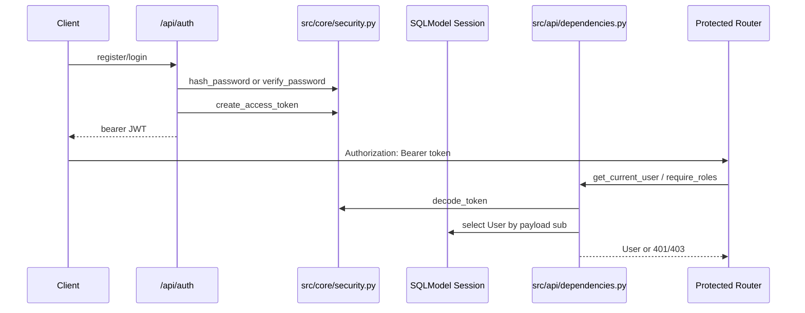
```mermaid
sequenceDiagram
    participant Client
    participant Auth as /api/auth
    participant Sec as src/core/security.py
    participant DB as SQLModel Session
    participant Deps as src/api/dependencies.py
    participant API as Protected Router
    Client->>Auth: register/login
    Auth->>Sec: hash_password or verify_password
    Auth->>Sec: create_access_token
    Auth-->>Client: bearer JWT
    Client->>API: Authorization: Bearer token
    API->>Deps: get_current_user / require_roles
    Deps->>Sec: decode_token
    Deps->>DB: select User by payload sub
    Deps-->>API: User or 401/403
```

| Topic | Implementation |
| --- | --- |
| Registration | `POST /api/auth/register`; public; creates a `User` with role `candidate`; hashes password; returns JWT. |
| Login | `POST /api/auth/login`; public; verifies bcrypt hash and active status; returns JWT. |
| JWT generation | `create_access_token` stores `sub`, `username`, `role`, and `exp`; default expiration is 7 days. |
| JWT validation | `decode_token` returns payload or `None`; `get_current_user` converts failure to 401. |
| Stale role protection | `_resolve_current_user` rejects a token when the token role differs from the current DB role. |
| Password hashing | `bcrypt.hashpw` in `hash_password`. |
| Password verification | `bcrypt.checkpw` in `verify_password`. |
| Role validation | `require_roles` allows matching roles and always allows `admin` as bypass. |
| Permission enforcement | Route dependencies and route-local ownership checks raise `HTTPException`. |
| Limitations | No refresh-token flow is present; role changes require login again; public registration does not accept elevated roles. |

### Database Documentation

| Topic | Implementation |
| --- | --- |
| Connection URL | `src/database/connection.py` normalizes `postgres://` to `postgresql://` and appends `sslmode` for PostgreSQL when missing. |
| Required configuration | Empty `DATABASE_URL` raises `RuntimeError` at import time. |
| Engine configuration | `create_engine` uses DEBUG echo, SQLite/PostgreSQL connect args, pool size/overflow/timeout, `pool_pre_ping=True`, and `pool_recycle=300`. |
| Session lifecycle | `get_session()` yields `Session(engine)` as a FastAPI dependency. |
| Startup schema creation | `create_db_and_tables()` imports `src.models`, conditionally calls `SQLModel.metadata.create_all(engine)`, then runs idempotent `_ensure_*` migrations. |
| Migration strategy | No Alembic package/folder is present; startup functions perform best-effort table/column/index creation for SQLite/PostgreSQL. |
| SQLite compatibility | SQLite uses `check_same_thread=False`, timeout, `PRAGMA table_info`, and `ALTER TABLE` additions. |
| PostgreSQL/Supabase compatibility | PostgreSQL uses connect timeout, SSL mode, pool tuning, and `ALTER TABLE ... IF NOT EXISTS` / `CREATE TABLE IF NOT EXISTS` statements. |
| Transactions | Routes/services call `session.add`, `session.delete`, `session.commit`, and `session.refresh` directly; no repository layer is present. |

#### SQLModel Table Documentation

| Model | Table | Columns | Constraints / Defaults | Relationships | Used By / CRUD Surface |
| --- | --- | --- | --- | --- | --- |
| `User` | `users` | id: Optional[int], username: str, hashed_password: str, role: str, target_role: Optional[str], location: Optional[str], experience: Optional[str], is_active: bool, created_at: datetime | indexes/unique: username, username unique, role; defaults: id, role, target_role, location, experience, is_active, created_at | none declared | See endpoint matrix and router/model mapping; CRUD is direct SQLModel in route/service functions. |
| `Resume` | `resumes` | id: Optional[int], user_id: int, raw_text: str, original_text: Optional[str], current_text: Optional[str], parsed_resume: Optional[str], last_analysis: Optional[str], applied_fixes: str, created_at: datetime, updated_at: datetime | indexes/unique: user_id; defaults: id, applied_fixes, created_at, updated_at | user_id -> users.id | See endpoint matrix and router/model mapping; CRUD is direct SQLModel in route/service functions. |
| `JobApplication` | `job_applications` | id: Optional[int], user_id: int, company_name: Optional[str], job_title: str, job_description_url: Optional[str], status: str, tailored_resume_bullets: Optional[str], created_at: datetime | indexes/unique: user_id; defaults: id, company_name, job_description_url, status, created_at | user_id -> users.id | See endpoint matrix and router/model mapping; CRUD is direct SQLModel in route/service functions. |
| `InterviewSession` | `interview_sessions` | id: Optional[int], user_id: int, session_token: str, role: str, difficulty: int, training_mode: str, interviewer_persona: str, messages: str, personalization_context: str, avg_score: Optional[float], application_id: Optional[int], violations_count: int, violations: str, cancellation_reason: Optional[str], status: str, competency_scores: Optional[str], job_fit_report: Optional[str], communication_metrics: Optional[... | indexes/unique: user_id, session_token, session_token unique, application_id; defaults: id, difficulty, training_mode, interviewer_persona, messages, personalization_context, application_id, violations_count, violations, status, competency_scores, job_fit_report... | user_id -> users.id, application_id -> candidate_applications.id | See endpoint matrix and router/model mapping; CRUD is direct SQLModel in route/service functions. |
| `MockInterviewSession` | `mock_interview_sessions` | id: Optional[int], user_id: int, session_token: str, role: str, difficulty: int, training_mode: str, interviewer_persona: str, interview_type: str, resume_source: str, messages: str, personalization_context: str, avg_score: Optional[float], status: str, ai_summary: Optional[str], strengths: str, weaknesses: str, improvement_recommendations: str, created_at: datetime, updated_at: datetime | indexes/unique: user_id, session_token, session_token unique; defaults: id, difficulty, training_mode, interviewer_persona, interview_type, resume_source, messages, personalization_context, status, strengths, weaknesses, improvement_recommendations... | user_id -> users.id | See endpoint matrix and router/model mapping; CRUD is direct SQLModel in route/service functions. |
| `CareerCoachMemory` | `career_coach_memory` | id: Optional[int], user_id: int, recurring_weak_areas: str, score_trend: str, session_history: str, daily_plan: Optional[str], preferred_persona: str, preferred_training_mode: str, session_count: int, avg_answer_score: Optional[float], created_at: datetime, updated_at: datetime | indexes/unique: user_id, user_id unique; defaults: id, recurring_weak_areas, score_trend, session_history, preferred_persona, preferred_training_mode, session_count, created_at, updated_at | user_id -> users.id | See endpoint matrix and router/model mapping; CRUD is direct SQLModel in route/service functions. |
| `JobPosting` | `job_postings` | id: Optional[int], title: str, description: str, required_skills: str, department: str, salary_range: str, experience_required: str, status: str, created_at: datetime, created_by: int | indexes/unique: status, created_by; defaults: id, required_skills, department, salary_range, experience_required, status, created_at | created_by -> users.id | See endpoint matrix and router/model mapping; CRUD is direct SQLModel in route/service functions. |
| `CandidateApplication` | `candidate_applications` | id: Optional[int], candidate_user_id: int, job_id: int, resume_text: str, application_date: datetime, status: str | indexes/unique: candidate_user_id, job_id, status; defaults: id, application_date, status | candidate_user_id -> users.id, job_id -> job_postings.id | See endpoint matrix and router/model mapping; CRUD is direct SQLModel in route/service functions. |
| `ApplicationAIAnalysis` | `application_ai_analyses` | id: Optional[int], application_id: int, fit_score: int, recommendation: str, summary: str, strengths: str, weaknesses: str, missing_skills: str, observations: str, technical_questions: str, behavioral_questions: str, probing_areas: str, status: str, error_message: Optional[str], source: str, created_at: datetime, updated_at: datetime | indexes/unique: application_id, application_id unique, recommendation, status; defaults: id, fit_score, recommendation, summary, strengths, weaknesses, missing_skills, observations, technical_questions, behavioral_questions, probing_areas, status... | application_id -> candidate_applications.id | See endpoint matrix and router/model mapping; CRUD is direct SQLModel in route/service functions. |
| `Employee` | `employees` | id: Optional[int], user_id: int, employee_code: str, department: str, designation: str, salary: Optional[float], joining_date: Optional[date], skills: str, full_name: Optional[str], email: Optional[str], phone: Optional[str], address: Optional[str], date_of_birth: Optional[date], emergency_contact: Optional[str], status: str, work_location: Optional[str], manager_id: Optional[int], department_id: Optional[int], de... | indexes/unique: user_id, user_id unique, employee_code, employee_code unique; defaults: id, department, designation, skills, full_name, email, phone, address, emergency_contact, status, work_location, manager_id... | user_id -> users.id, manager_id -> users.id, department_id -> departments.id, designation_id -> designations.id | See endpoint matrix and router/model mapping; CRUD is direct SQLModel in route/service functions. |
| `AttendanceRecord` | `attendance_records` | id: Optional[int], employee_id: int, user_id: int, work_date: date, check_in: datetime, check_out: Optional[datetime], status: str, created_at: datetime, updated_at: datetime | indexes/unique: employee_id, user_id, work_date, status; defaults: id, work_date, check_in, status, created_at, updated_at | employee_id -> employees.id, user_id -> users.id | See endpoint matrix and router/model mapping; CRUD is direct SQLModel in route/service functions. |
| `LeaveRequest` | `leave_requests` | id: Optional[int], employee_id: int, user_id: int, leave_type: str, start_date: date, end_date: date, reason: str, status: str, manager_note: Optional[str], decided_by: Optional[int], created_at: datetime, updated_at: datetime | indexes/unique: employee_id, user_id, start_date, end_date, status; defaults: id, leave_type, reason, status, decided_by, created_at, updated_at | employee_id -> employees.id, user_id -> users.id, decided_by -> users.id | See endpoint matrix and router/model mapping; CRUD is direct SQLModel in route/service functions. |
| `SkillGapAnalysis` | `skill_gap_analyses` | id: Optional[int], employee_id: int, user_id: int, role_expectations: str, missing_skills: str, growth_areas: str, learning_suggestions: str, summary: str, source: str, error_message: Optional[str], created_at: datetime, updated_at: datetime | indexes/unique: employee_id, user_id; defaults: id, role_expectations, missing_skills, growth_areas, learning_suggestions, summary, source, created_at, updated_at | employee_id -> employees.id, user_id -> users.id | See endpoint matrix and router/model mapping; CRUD is direct SQLModel in route/service functions. |
| `Department` | `departments` | id: Optional[int], name: str, description: str, head_user_id: Optional[int], is_active: bool, created_at: datetime, updated_at: datetime | indexes/unique: name unique; defaults: id, description, head_user_id, is_active, created_at, updated_at | head_user_id -> users.id | See endpoint matrix and router/model mapping; CRUD is direct SQLModel in route/service functions. |
| `Designation` | `designations` | id: Optional[int], name: str, department_id: Optional[int], level: int, description: str, is_active: bool, created_at: datetime, updated_at: datetime | defaults: id, department_id, level, description, is_active, created_at, updated_at | department_id -> departments.id | See endpoint matrix and router/model mapping; CRUD is direct SQLModel in route/service functions. |
| `EmployeeLifecycleEvent` | `employee_lifecycle_events` | id: Optional[int], employee_id: int, event_type: str, event_date: date, description: str, created_by: int, created_at: datetime | indexes/unique: employee_id; defaults: id, event_date, description, created_at | employee_id -> employees.id, created_by -> users.id | See endpoint matrix and router/model mapping; CRUD is direct SQLModel in route/service functions. |
| `EmployeeTicket` | `employee_tickets` | id: Optional[int], employee_id: int, user_id: int, title: str, description: str, category: str, priority: str, status: str, assigned_to: Optional[int], resolution_note: Optional[str], created_at: datetime, updated_at: datetime | indexes/unique: employee_id, user_id; defaults: id, priority, status, assigned_to, resolution_note, created_at, updated_at | employee_id -> employees.id, user_id -> users.id, assigned_to -> users.id | See endpoint matrix and router/model mapping; CRUD is direct SQLModel in route/service functions. |
| `SalaryHistory` | `salary_history` | id: Optional[int], employee_id: int, previous_salary: Optional[float], new_salary: float, increment_percent: Optional[float], reason: str, approved_by: int, effective_date: date, created_at: datetime | indexes/unique: employee_id; defaults: id, reason, effective_date, created_at | employee_id -> employees.id, approved_by -> users.id | See endpoint matrix and router/model mapping; CRUD is direct SQLModel in route/service functions. |
| `PromotionHistory` | `promotion_history` | id: Optional[int], employee_id: int, old_designation: str, new_designation: str, promotion_date: date, reason: str, approved_by: int, created_at: datetime | indexes/unique: employee_id; defaults: id, promotion_date, reason, created_at | employee_id -> employees.id, approved_by -> users.id | See endpoint matrix and router/model mapping; CRUD is direct SQLModel in route/service functions. |
| `IncrementHistory` | `increment_history` | id: Optional[int], employee_id: int, previous_salary: float, new_salary: float, increment_percent: float, reason: str, effective_date: date, approved_by: int, created_at: datetime | indexes/unique: employee_id; defaults: id, reason, effective_date, created_at | employee_id -> employees.id, approved_by -> users.id | See endpoint matrix and router/model mapping; CRUD is direct SQLModel in route/service functions. |
| `HRNotification` | `hr_notifications` | id: Optional[int], user_id: int, title: str, message: str, event_type: str, related_id: Optional[int], is_read: bool, created_at: datetime | indexes/unique: user_id; defaults: id, is_read, created_at | user_id -> users.id | See endpoint matrix and router/model mapping; CRUD is direct SQLModel in route/service functions. |
| `CandidateProfile` | `candidate_profiles` | id: Optional[int], user_id: int, full_name: str, phone: str, date_of_birth: Optional[date], gender: str, location: str, address: str, linkedin_url: str, portfolio_url: str, current_status: str, current_company: str, current_role: str, years_of_experience: Optional[float], expected_salary: str, notice_period: str, degree: str, institution: str, graduation_year: str, cgpa_percentage: str, technical_skills: str, soft... | indexes/unique: user_id, user_id unique; defaults: id, full_name, phone, gender, location, address, linkedin_url, portfolio_url, current_status, current_company, current_role, expected_salary... | user_id -> users.id | See endpoint matrix and router/model mapping; CRUD is direct SQLModel in route/service functions. |
| `EmployeeProfile` | `employee_profiles` | id: Optional[int], user_id: int, employee_id: Optional[int], phone: str, address: str, emergency_contact: str, blood_group: str, marital_status: str, previous_experience: str, skills: str, certifications: str, career_interests: str, career_goals: str, is_complete: bool, completion_percent: int, verification_status: str, pre_populated: bool, created_at: datetime, updated_at: datetime | indexes/unique: user_id, user_id unique, employee_id; defaults: id, employee_id, phone, address, emergency_contact, blood_group, marital_status, previous_experience, skills, certifications, career_interests, career_goals... | user_id -> users.id, employee_id -> employees.id | See endpoint matrix and router/model mapping; CRUD is direct SQLModel in route/service functions. |
| `CandidateDocument` | `candidate_documents` | id: Optional[int], user_id: int, document_type: str, original_filename: str, stored_path: str, verification_status: str, rejection_comment: str, uploaded_at: datetime, reviewed_at: Optional[datetime], reviewed_by: Optional[int] | indexes/unique: user_id; defaults: id, verification_status, rejection_comment, uploaded_at, reviewed_by | user_id -> users.id, reviewed_by -> users.id | See endpoint matrix and router/model mapping; CRUD is direct SQLModel in route/service functions. |
| `EmployeeDocument` | `employee_documents` | id: Optional[int], user_id: int, employee_id: Optional[int], document_type: str, original_filename: str, stored_path: str, verification_status: str, rejection_comment: str, uploaded_at: datetime, reviewed_at: Optional[datetime], reviewed_by: Optional[int] | indexes/unique: user_id, employee_id; defaults: id, employee_id, verification_status, rejection_comment, uploaded_at, reviewed_by | user_id -> users.id, employee_id -> employees.id, reviewed_by -> users.id | See endpoint matrix and router/model mapping; CRUD is direct SQLModel in route/service functions. |
| `OnboardingTemplate` | `onboarding_templates` | id: Optional[int], name: str, description: str, is_active: bool, created_by: int, created_at: datetime, updated_at: datetime | defaults: id, description, is_active, created_at, updated_at | created_by -> users.id | See endpoint matrix and router/model mapping; CRUD is direct SQLModel in route/service functions. |
| `OnboardingTask` | `onboarding_tasks` | id: Optional[int], template_id: int, title: str, description: str, order_index: int, is_required: bool, created_at: datetime | indexes/unique: template_id; defaults: id, description, order_index, is_required, created_at | template_id -> onboarding_templates.id | See endpoint matrix and router/model mapping; CRUD is direct SQLModel in route/service functions. |
| `EmployeeOnboarding` | `employee_onboarding` | id: Optional[int], employee_id: int, template_id: int, assigned_by: int, status: str, due_date: Optional[date], started_at: Optional[datetime], completed_at: Optional[datetime], created_at: datetime, updated_at: datetime | indexes/unique: employee_id; defaults: id, status, created_at, updated_at | employee_id -> employees.id, template_id -> onboarding_templates.id, assigned_by -> users.id | See endpoint matrix and router/model mapping; CRUD is direct SQLModel in route/service functions. |
| `EmployeeOnboardingTask` | `employee_onboarding_tasks` | id: Optional[int], employee_onboarding_id: int, task_title: str, task_description: str, order_index: int, is_required: bool, status: str, completed_at: Optional[datetime], notes: str, created_at: datetime, updated_at: datetime | indexes/unique: employee_onboarding_id; defaults: id, task_description, order_index, is_required, status, notes, created_at, updated_at | employee_onboarding_id -> employee_onboarding.id | See endpoint matrix and router/model mapping; CRUD is direct SQLModel in route/service functions. |
| `TrainingProgram` | `training_programs` | id: Optional[int], title: str, description: str, category: str, skills_covered: str, duration_hours: int, difficulty: str, status: str, created_by: int, created_at: datetime, updated_at: datetime | defaults: id, description, category, skills_covered, duration_hours, difficulty, status, created_at, updated_at | created_by -> users.id | See endpoint matrix and router/model mapping; CRUD is direct SQLModel in route/service functions. |
| `CandidateCredibilityReport` | `candidate_credibility_reports` | id: Optional[int], candidate_id: int, session_id: int, credibility_score: int, supported_claims: str, weak_claims: str, missing_evidence: str, followup_topics: str, resume_score: int, interview_avg_score: Optional[float], recommendation: str, status: str, error_message: Optional[str], source: str, created_at: datetime, updated_at: datetime | indexes/unique: candidate_id, session_id, session_id unique, status; defaults: id, credibility_score, supported_claims, weak_claims, missing_evidence, followup_topics, resume_score, recommendation, status, source, created_at, updated_at | candidate_id -> users.id, session_id -> interview_sessions.id | See endpoint matrix and router/model mapping; CRUD is direct SQLModel in route/service functions. |
| `InterviewIntelligenceReport` | `interview_intelligence_reports` | id: Optional[int], application_id: int, candidate_id: int, session_id: int, resume_score: float, technical_score: float, behavioral_score: float, credibility_score: float, overall_score: float, recommendation: str, executive_summary: str, strengths: str, weaknesses: str, technical_assessment: str, behavioral_assessment: str, resume_validation: str, source: str, status: str, created_at: datetime, updated_at: datetime | indexes/unique: application_id, application_id unique, candidate_id, session_id, session_id unique, overall_score, recommendation, status; defaults: id, resume_score, technical_score, behavioral_score, credibility_score, overall_score, recommendation, executive_summary, strengths, weaknesses, technical_assessment, behavioral_assessment... | application_id -> candidate_applications.id, candidate_id -> users.id, session_id -> interview_sessions.id | See endpoint matrix and router/model mapping; CRUD is direct SQLModel in route/service functions. |
| `TrainingAssignment` | `training_assignments` | id: Optional[int], program_id: int, employee_id: int, assigned_by: int, status: str, progress_percent: int, started_at: Optional[datetime], completed_at: Optional[datetime], due_date: Optional[date], created_at: datetime, updated_at: datetime | indexes/unique: program_id, employee_id; defaults: id, status, progress_percent, created_at, updated_at | program_id -> training_programs.id, employee_id -> employees.id, assigned_by -> users.id | See endpoint matrix and router/model mapping; CRUD is direct SQLModel in route/service functions. |
| `OnboardingRequiredDocument` | `onboarding_required_documents` | id: Optional[int], template_id: int, document_type: str, created_at: datetime | indexes/unique: template_id; defaults: id, created_at | template_id -> onboarding_templates.id | See endpoint matrix and router/model mapping; CRUD is direct SQLModel in route/service functions. |

#### ER Diagram


```mermaid
erDiagram
    users ||--o{ resumes : owns
    users ||--o{ candidate_applications : applies
    users ||--o| employees : becomes
    users ||--o{ hr_notifications : receives
    users ||--o{ candidate_profiles : has
    users ||--o{ employee_profiles : has
    users ||--o{ candidate_documents : uploads
    users ||--o{ employee_documents : uploads
    users ||--o{ interview_sessions : starts
    users ||--o{ mock_interview_sessions : starts
    users ||--o{ career_coach_memory : has
    users ||--o{ job_postings : creates
    job_postings ||--o{ candidate_applications : receives
    candidate_applications ||--o| application_ai_analyses : analyzed_by
    candidate_applications ||--o| interview_sessions : interview_for
    candidate_applications ||--o| interview_intelligence_reports : reported_by
    interview_sessions ||--o| candidate_credibility_reports : credibility
    interview_sessions ||--o| interview_intelligence_reports : intelligence
    employees ||--o{ attendance_records : has
    employees ||--o{ leave_requests : requests
    employees ||--o{ skill_gap_analyses : has
    employees ||--o{ employee_lifecycle_events : has
    employees ||--o{ employee_tickets : opens
    employees ||--o{ salary_history : salary
    employees ||--o{ promotion_history : promotion
    employees ||--o{ increment_history : increment
    departments ||--o{ designations : contains
    departments ||--o{ employees : groups
    designations ||--o{ employees : titles
    onboarding_templates ||--o{ onboarding_tasks : defines
    onboarding_templates ||--o{ onboarding_required_documents : requires
    onboarding_templates ||--o{ employee_onboarding : assigned_as
    employee_onboarding ||--o{ employee_onboarding_tasks : contains
    employees ||--o{ employee_onboarding : assigned
    training_programs ||--o{ training_assignments : assigned_as
    employees ||--o{ training_assignments : receives
```

### Service Layer Documentation

| Service | Purpose | Public Functions / Classes | Dependencies | Database / AI / External APIs | Related Routers |
| --- | --- | --- | --- | --- | --- |
| `src/services/employee_ai.py` | Employee skill gap and assistant support service. | classes: none; public: analyze_skill_gap, answer_hr_question | import json; import logging; import re; from typing import Any; from src.models import Employee | See imports/functions; uses SQLModel, AI clients, Chroma, or filesystem only where imported. | Referenced by route/service imports; see endpoint matrix. |
| `src/services/hiring_intelligence.py` | Interview/hiring intelligence support service. | classes: none; public: count_filler_words, compile_hiring_intelligence, generate_interview_summary, run_fallback_generation, calculate_benchmarking, save_hiring_intelligence_results | import json; import logging; import re; import os; import time; import src.services.llm_router; from datetime import datetime; from typing import Any, Optional | See imports/functions; uses SQLModel, AI clients, Chroma, or filesystem only where imported. | Referenced by route/service imports; see endpoint matrix. |
| `src/services/interview_consistency.py` | Interview/hiring intelligence support service. | classes: none; public: analyze_credibility, credibility_payload | import json; import logging; import re; from datetime import datetime; from typing import Any; from sqlmodel import Session, select; from src.models import CandidateApplication, CandidateCredibilityReport, InterviewSession, JobPosting, Resume, User | See imports/functions; uses SQLModel, AI clients, Chroma, or filesystem only where imported. | interview |
| `src/services/interview_core.py` | Interview/hiring intelligence support service. | classes: StartReq, StartFromResumeReq, StartForApplicationReq, ViolationReq, AnswerReq, CompareReq; public: class methods / internal helpers | import uuid; import json; import logging; import os; from datetime import datetime; from typing import Any, Optional; from fastapi import APIRouter, Depends, HTTPException, UploadFile, File, BackgroundTasks; from pydantic import BaseModel, Field | See imports/functions; uses SQLModel, AI clients, Chroma, or filesystem only where imported. | interview |
| `src/services/interview_status.py` | Interview/hiring intelligence support service. | classes: none; public: normalize_interview_status, is_successful_interview_status, is_visible_interview_status, phase_turn_requirements, completed_turns_by_phase, has_completed_required_turns, next_phase_for_completed_turn | from __future__ import annotations | See imports/functions; uses SQLModel, AI clients, Chroma, or filesystem only where imported. | interview |
| `src/services/llm_router.py` | Shared LLM/key routing service. | classes: APIKeyManager; public: get_llm | import os; import time; import logging; from threading import Lock; from crewai import LLM; import litellm | See imports/functions; uses SQLModel, AI clients, Chroma, or filesystem only where imported. | Referenced by route/service imports; see endpoint matrix. |
| `src/services/mock_interview_summary.py` | Interview/hiring intelligence support service. | classes: none; public: generate_mock_interview_summary | import json; import logging; import litellm; import src.services.llm_router | See imports/functions; uses SQLModel, AI clients, Chroma, or filesystem only where imported. | interview, mock_interview |
| `src/services/rag/access_control.py` | RAG service module for Chroma, retrieval, access, sync, ingestion, chat, or query routing. | classes: RAGAccessPlan, RAGAccessControl; public: class methods / internal helpers | from dataclasses import dataclass; from src.models import User; from src.services.rag.chroma_service import DEFAULT_COLLECTIONS | See imports/functions; uses SQLModel, AI clients, Chroma, or filesystem only where imported. | rag |
| `src/services/rag/chat_service.py` | RAG service module for Chroma, retrieval, access, sync, ingestion, chat, or query routing. | classes: RAGChatService; public: class methods / internal helpers | import logging; import os; import re; from src.models import User; from src.services.rag.query_router import QueryRouter; from src.services.rag.retrieval_service import RetrievalService | See imports/functions; uses SQLModel, AI clients, Chroma, or filesystem only where imported. | rag |
| `src/services/rag/chroma_service.py` | RAG service module for Chroma, retrieval, access, sync, ingestion, chat, or query routing. | classes: ChromaService; public: class methods / internal helpers | import logging; import os; from pathlib import Path; from typing import Any; import chromadb | See imports/functions; uses SQLModel, AI clients, Chroma, or filesystem only where imported. | rag |
| `src/services/rag/company_docs_ingestion.py` | RAG service module for Chroma, retrieval, access, sync, ingestion, chat, or query routing. | classes: CompanyDocsIngestionSummary, CompanyDocsIngestionService; public: class methods / internal helpers | import logging; from dataclasses import dataclass; from pathlib import Path; from src.services.rag.chroma_service import ChromaService; from src.services.rag.embedding_service import EmbeddingService; from src.services.rag.ingestion_service import IngestionService, IngestionResult | See imports/functions; uses SQLModel, AI clients, Chroma, or filesystem only where imported. | rag |
| `src/services/rag/embedding_service.py` | RAG service module for Chroma, retrieval, access, sync, ingestion, chat, or query routing. | classes: EmbeddingProvider, HashEmbeddingProvider, OpenAIEmbeddingProvider, EmbeddingService; public: build_embedding_provider | import hashlib; import logging; import math; import os; import re; from abc import ABC, abstractmethod; from typing import Iterable | See imports/functions; uses SQLModel, AI clients, Chroma, or filesystem only where imported. | rag |
| `src/services/rag/ingestion_service.py` | RAG service module for Chroma, retrieval, access, sync, ingestion, chat, or query routing. | classes: IngestionResult, IngestionService; public: class methods / internal helpers | import logging; import hashlib; from dataclasses import dataclass; from pathlib import Path; from docx import Document as DocxDocument; from pypdf import PdfReader; from src.services.rag.chroma_service import ChromaService; from src.services.rag.embedding_service import EmbeddingService | See imports/functions; uses SQLModel, AI clients, Chroma, or filesystem only where imported. | rag |
| `src/services/rag/query_router.py` | RAG service module for Chroma, retrieval, access, sync, ingestion, chat, or query routing. | classes: QueryRoute, QueryRouter; public: class methods / internal helpers | import json; import logging; import re; from dataclasses import dataclass, field; from datetime import date; from typing import Any; from sqlmodel import Session, select; from src.database.connection import engine | See imports/functions; uses SQLModel, AI clients, Chroma, or filesystem only where imported. | rag |
| `src/services/rag/retrieval_service.py` | RAG service module for Chroma, retrieval, access, sync, ingestion, chat, or query routing. | classes: RetrievalService; public: class methods / internal helpers | import logging; from typing import Any; from src.services.rag.chroma_service import DEFAULT_COLLECTIONS, ChromaService; from src.services.rag.embedding_service import EmbeddingService | See imports/functions; uses SQLModel, AI clients, Chroma, or filesystem only where imported. | rag |
| `src/services/rag/sync_service.py` | RAG service module for Chroma, retrieval, access, sync, ingestion, chat, or query routing. | classes: RAGSyncService; public: class methods / internal helpers | import json; import logging; from datetime import datetime; from typing import Any; from src.models import ApplicationAIAnalysis, CandidateApplication, InterviewIntelligenceReport, InterviewSession, JobPosting; from src.services.rag.chroma_service import ChromaService; from src.services.rag.embedding_service import EmbeddingService | See imports/functions; uses SQLModel, AI clients, Chroma, or filesystem only where imported. | rag |
| `src/services/recruitment_ai.py` | Recruitment analysis and ranking service. | classes: none; public: analyze_application, get_analysis_for_application, rank_applications_for_job, application_payload, analysis_payload | import json; import logging; import re; from datetime import datetime; from typing import Any; from sqlmodel import Session, select; from src.models import ApplicationAIAnalysis, CandidateApplication, JobPosting, User, InterviewSession; from src.resume_lab import parse_resume | See imports/functions; uses SQLModel, AI clients, Chroma, or filesystem only where imported. | Referenced by route/service imports; see endpoint matrix. |
| `src/services/transcription_service.py` | Audio transcription service. | classes: none; public: transcribe_audio_metadata, transcribe_audio | import logging; import os; import time; import json; from groq import Groq; from src.services.llm_router import key_manager | See imports/functions; uses SQLModel, AI clients, Chroma, or filesystem only where imported. | Referenced by route/service imports; see endpoint matrix. |

### Data Access Layer

TalentForge does not define a repository/DAO layer. Data access is direct SQLModel usage in routers and services. The dominant patterns are `session.exec(select(...))`, `session.add(...)`, `session.delete(...)`, `session.commit()`, and `session.refresh(...)`. Query logic is colocated with route handlers or service functions. Startup DDL is centralized in `src/database/connection.py`; runtime CRUD is distributed across route modules and selected services.

### Backend Dependency Graph

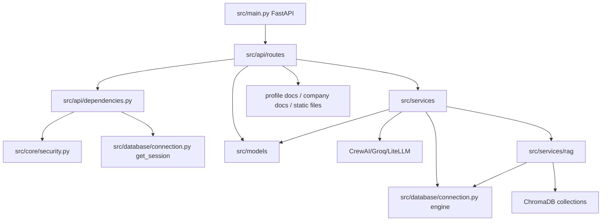
```mermaid
flowchart TD
    FastAPI[src/main.py FastAPI] --> Routers[src/api/routes]
    Routers --> Deps[src/api/dependencies.py]
    Deps --> Security[src/core/security.py]
    Deps --> Sessions[src/database/connection.py get_session]
    Routers --> Services[src/services]
    Routers --> Models[src/models]
    Services --> Models
    Services --> Database[src/database/connection.py engine]
    Services --> AI[CrewAI/Groq/LiteLLM]
    Services --> RAG[src/services/rag]
    RAG --> Chroma[ChromaDB collections]
    RAG --> Database
    Routers --> Files[profile docs / company docs / static files]
```

### Backend Statistics

| Metric | Count / Status |
| --- | ---: |
| Mounted routers | 21 |
| Router endpoints | 134 |
| App-level hidden endpoints | 1 (`/api/health`) |
| Service modules | 18 |
| SQLModel table classes | 34 |
| Database tables declared | 34 |
| Separate schema package | 0 (`src/schemas` not present; schemas are route-local Pydantic classes) |
| Central auth dependency helpers | 4 functions plus named guard aliases |
| Middleware components | 2 |
| Global exception handlers | 2 |

### Cross Verification

| Verification Item | Result |
| --- | --- |
| Router files parsed | All non-`__init__` files in `src/api/routes` parsed and documented. |
| Mounted routers | Current `src/main.py` includes 21 routers; Phase 1 AGENTS-derived count of 20 is superseded by current code. |
| Endpoints | 134 router-decorated endpoints plus `/api/health` documented. |
| Models | 34 SQLModel table classes documented from `src/models/__init__.py`. |
| Services | 18 non-package-marker service modules documented from `src/services`. |
| Frontend consumers | Matched primarily from `frontend/src/api/*.js`; missing wrappers are marked in the endpoint matrix as no direct wrapper found or generic client usage. |
| Assumption control | The endpoint matrix is generated from decorators/signatures; detailed response object shapes are not invented where handlers return dynamic dictionaries. |

## Phase 3 - Frontend, AI and Business Module Documentation

Phase 3 documents the implemented frontend, AI, CrewAI, RAG, and business module surfaces present as of 2026-07-06. It extends previous phases and marks incomplete surfaces explicitly.

### Frontend Architecture
React 19 + Vite SPA. `main.jsx` mounts `App`; `App.jsx` owns providers, lazy routing, `RoleGuard`, `RootRedirect`, and authenticated layout routing. `Layout` composes `Sidebar`, `TopBar`, and routed pages.

| Area | Implementation | Status |
| --- | --- | --- |
| Entry | frontend/src/main.jsx -> App.jsx | Active |
| Routing | React Router routes and dashboard activeTab/query subviews | Active |
| Protected Routes | RoleGuard checks auth/role from authStore | Active |
| Role Navigation | Sidebar role-specific nav arrays | Active |
| Auth Flow | LoginPage + authStore + localStorage JWT | Active |
| Theme | ThemeContext with localStorage talentforge-theme | Active |
| State | Zustand stores plus page-local React state | Active |
| API Layer | axios client with token, 60s timeout, 30s GET cache, 401 logout | Active |
| Lazy Loading | React.lazy top-level pages | Active |

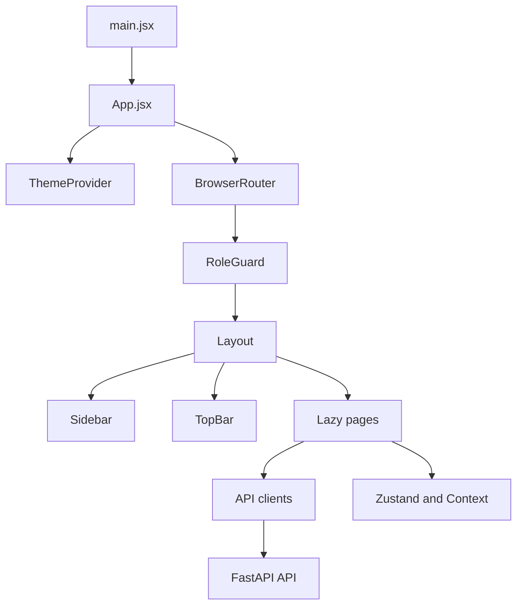
```mermaid
flowchart TD
  main[main.jsx]-->app[App.jsx]
  app-->theme[ThemeProvider]
  app-->router[BrowserRouter]
  router-->guard[RoleGuard]
  guard-->layout[Layout]
  layout-->sidebar[Sidebar]
  layout-->topbar[TopBar]
  layout-->pages[Lazy pages]
  pages-->api[API clients]
  api-->backend[FastAPI API]
  pages-->state[Zustand and Context]
```

### Routing Documentation
| Route Path | Component | Layout | Auth | Allowed Roles | Business Purpose | Status |
| --- | --- | --- | --- | --- | --- | --- |
| /login | LoginPage | None | No | Public | Active route in App.jsx | Active |
| /dashboard/hr | RoleGuard | Layout | Yes | hr, admin | Active route in App.jsx | Active |
| /dashboard/admin | RoleGuard | Layout | Yes | admin | Active route in App.jsx | Active |
| /dashboard/manager | RoleGuard | Layout | Yes | manager | Active route in App.jsx | Active |
| /dashboard/candidate | RoleGuard | Layout | Yes | candidate | Active route in App.jsx | Active |
| /dashboard/employee | RoleGuard | Layout | Yes | employee | Active route in App.jsx | Active |
| /hr/jobs | RoleGuard activeTab=jobs | Layout | Yes | hr, admin | Active route in App.jsx | Active |
| /hr/pipeline | RoleGuard activeTab=pipeline | Layout | Yes | hr, admin, manager | Active route in App.jsx | Active |
| /hr/candidates | RoleGuard activeTab=candidates | Layout | Yes | hr, admin, manager | Active route in App.jsx | Active |
| /hr/leaves | RoleGuard activeTab=leaves | Layout | Yes | hr, admin | Active route in App.jsx | Active |
| /hr/directory | RoleGuard activeTab=directory | Layout | Yes | hr, admin | Active route in App.jsx | Active |
| /hr/departments | RoleGuard activeTab=departments | Layout | Yes | hr, admin | Active route in App.jsx | Active |
| /hr/designations | RoleGuard activeTab=designations | Layout | Yes | hr, admin | Active route in App.jsx | Active |
| /hr/tickets | RoleGuard activeTab=tickets | Layout | Yes | hr, admin | Active route in App.jsx | Active |
| /hr/promotions | RoleGuard activeTab=promotions | Layout | Yes | hr, admin | Active route in App.jsx | Active |
| /hr/intelligence | RoleGuard | Layout | Yes | hr, admin, manager | Active route in App.jsx | Active |
| /hr/copilot | RoleGuard mode=hr | Layout | Yes | hr, admin, manager | Active route in App.jsx | Active |
| /hr/onboarding | RoleGuard activeTab=onboarding | Layout | Yes | hr, admin | Active route in App.jsx | Active |
| /hr/training | RoleGuard activeTab=training | Layout | Yes | hr, admin | Active route in App.jsx | Active |
| /hr/documents | RoleGuard activeTab=documents | Layout | Yes | hr, admin | Active route in App.jsx | Active |
| /manager/leaves | RoleGuard activeTab=leaves | Layout | Yes | manager | Active route in App.jsx | Active |
| /manager/training | RoleGuard activeTab=training | Layout | Yes | manager | Active route in App.jsx | Active |
| /career-assistant | RoleGuard mode=candidate | Layout | Yes | candidate | Active route in App.jsx | Active |
| /jobs | RoleGuard activeTab=jobs | Layout | Yes | candidate | Active route in App.jsx | Active |
| /applications | RoleGuard activeTab=applications | Layout | Yes | candidate | Active route in App.jsx | Active |
| /interview | RoleGuard | Layout | Yes | candidate | Active route in App.jsx | Active |
| /mock-interview | RoleGuard | Layout | Yes | candidate | Active route in App.jsx | Active |
| / | RootRedirect | None | No | Public | Active route in App.jsx | Active |
| * | Navigate | None | No | Public | Active route in App.jsx | Active |
| /dashboard/admin?tab=knowledge | EmployeeDashboard tab state | Layout | Yes | employee | Sidebar query-string tab | Active |
| /dashboard/admin?tab=policies | EmployeeDashboard tab state | Layout | Yes | employee | Sidebar query-string tab | Active |
| /dashboard/admin?tab=users | EmployeeDashboard tab state | Layout | Yes | employee | Sidebar query-string tab | Active |
| /dashboard/employee?tab=onboarding | EmployeeDashboard tab state | Layout | Yes | employee | Sidebar query-string tab | Active |
| /dashboard/employee?tab=overview | EmployeeDashboard tab state | Layout | Yes | employee | Sidebar query-string tab | Active |
| /dashboard/employee?tab=profile | EmployeeDashboard tab state | Layout | Yes | employee | Sidebar query-string tab | Active |
| /dashboard/employee?tab=tickets | EmployeeDashboard tab state | Layout | Yes | employee | Sidebar query-string tab | Active |
| /dashboard/employee?tab=timeline | EmployeeDashboard tab state | Layout | Yes | employee | Sidebar query-string tab | Active |
| /dashboard/employee?tab=training | EmployeeDashboard tab state | Layout | Yes | employee | Sidebar query-string tab | Active |

### Page Documentation
| Page | File | Route | API Calls | Components Used | Drawer/Modal | Charts | Authentication | Dependencies | Status |
| --- | --- | --- | --- | --- | --- | --- | --- | --- | --- |
| AdminDashboard | frontend/src/pages/AdminDashboard.jsx | Nested/no direct route | createAdminKnowledge, createAdminPolicy, deleteAdminKnowledge, deleteAdminPolicy, getAdminKnowledge, getAdminPolicies, getAdminUsers, reindexAdminKnowledge, reindexAdminPolicy, updateAdminKnowledge, updateAdminPolicy, updateAdminUser | None direct | modal/local overlay | No | Protected/composed | framer-motion, toast, lucide-react | Active |
| AssistantPage | frontend/src/pages/assistant/AssistantPage.jsx | Nested/no direct route | sendRagChatMessage | None direct | None | No | Protected/composed | lucide-react | Active |
| CandidateDashboard | frontend/src/pages/CandidateDashboard.jsx | Nested/no direct route | getCandidateDashboardData, getMyProfileCompletion, invalidateCache | JobDetailDrawer, Layout, ProfileCompletionWidget, ProfileSetupWizard, EmptyState, MetricCard, SkeletonCard, StatusPill | drawer | No | Protected/composed | framer-motion, toast, lucide-react | Active |
| EmployeeDashboard | frontend/src/pages/EmployeeDashboard.jsx | /dashboard/admin?tab=knowledge, /dashboard/admin?tab=policies, /dashboard/admin?tab=users, /dashboard/employee?tab=onboarding, /dashboard/employee?tab=overview, /dashboard/employee?tab=profile, /dashboard/employee?tab=tickets, /dashboard/employee?tab=timeline, /dashboard/employee?tab=training | analyzeSkillGap, askHRAssistant, checkIn, checkOut, createTicket, getEmployeeDashboard, getEmployeeProfile, getLifecycle, getMyOnboarding, getMyProfileCompletion, getMyTrainingAssignments, listTickets, submitLeave, updateEmployeeProfile, updateOnboardingTaskStatus, updateTrainingProgress, uploadProfileDocument | SkillGapRadial, EmployeeOnboardingSection, EmployeeProfileSection, EmployeeTrainingSection, CreateTicketModal, ProfileCompletionWidget, ProfileSetupWizard, EmptyState, SkeletonCard, StatusPill | drawer, modal/local overlay | No | Protected/composed | framer-motion, toast, lucide-react | Active |
| DepartmentManagement | frontend/src/pages/hr/DepartmentManagement.jsx | Nested in HRDashboard activeTab | createDepartment, deactivateDepartment, listDepartments, updateDepartment | DepartmentModal, MetricCard | modal/local overlay | No | Protected/composed | framer-motion, toast, lucide-react | Active |
| DesignationManagement | frontend/src/pages/hr/DesignationManagement.jsx | Nested in HRDashboard activeTab | archiveDesignation, createDesignation, listDepartments, listDesignations, updateDesignation | DesignationModal | modal/local overlay | No | Protected/composed | framer-motion, toast, lucide-react | Active |
| DocumentVerification | frontend/src/pages/hr/DocumentVerification.jsx | Nested in HRDashboard activeTab | decideProfileDocument, downloadProfileDocumentUrl, listReviewDocuments | DocumentViewerModal, DocumentDecisionModal, EmptyState, StatusPill | modal/local overlay | No | Protected/composed | toast, lucide-react | Active |
| EmployeeDirectory | frontend/src/pages/hr/EmployeeDirectory.jsx | Nested in HRDashboard activeTab | listDepartments, listEmployeeDirectory | EmployeeProfileDrawer, MetricCard, StatusPill | drawer | No | Protected/composed | framer-motion, lucide-react | Active |
| GrievanceDashboard | frontend/src/pages/hr/GrievanceDashboard.jsx | Nested in HRDashboard activeTab | assignTicket, listResolvers, listTickets, updateTicketStatus | MetricCard, StatusPill | None | No | Protected/composed | framer-motion, toast, lucide-react | Active |
| InterviewReports | frontend/src/pages/hr/InterviewReports.jsx | Nested in HRDashboard activeTab | None direct | None direct | None | Yes | Protected/composed | framer-motion, recharts, lucide-react | Active |
| ManagerTrainingView | frontend/src/pages/hr/ManagerTrainingView.jsx | Nested in HRDashboard activeTab | getTeamTrainingAssignments, getTrainingSummary | EmptyState, MetricCard, StatusPill | None | No | Protected/composed | toast | Active |
| OnboardingHub | frontend/src/pages/hr/OnboardingHub.jsx | Nested in HRDashboard activeTab | addOnboardingTask, assignOnboardingTemplate, createOnboardingTemplate, deleteOnboardingTask, deleteOnboardingTemplate, getOnboardingSummary, listEmployees, listOnboardingTemplates, updateOnboardingTask, updateOnboardingTemplate | EmptyState, MetricCard, StatusPill | modal/local overlay | No | Protected/composed | toast, lucide-react | Active |
| PromotionDashboard | frontend/src/pages/hr/PromotionDashboard.jsx | Nested in HRDashboard activeTab | addPromotion, getRecentPromotions, listEmployees | AddPromotionModal, MetricCard | modal/local overlay | No | Protected/composed | framer-motion, toast, lucide-react | Active |
| TrainingHub | frontend/src/pages/hr/TrainingHub.jsx | Nested in HRDashboard activeTab | archiveTrainingProgram, assignTraining, createTrainingProgram, getTrainingSummary, listEmployees, listTrainingPrograms, updateTrainingProgram | EmptyState, MetricCard, StatusPill | None | No | Protected/composed | toast, lucide-react | Active |
| HRDashboard | frontend/src/pages/HRDashboard.jsx | Nested/no direct route | archiveJob, closeJob, decideLeaveRequest, deleteJob, getHRDashboardData, getHRReviews, listApplications, listLeaveRequests | ApplicationTrend, ScoreDistribution, AnalysisDrawer, HRMetricsPanel, HRReviewQueue, PostJobModal, PendingActionsWidget, EmptyState, MetricCard, SkeletonCard | drawer, modal/local overlay | No | Protected/composed | framer-motion, toast, lucide-react | Active |
| InterviewPage | frontend/src/pages/interview/InterviewPage.jsx | Nested/no direct route | getCandidateDashboardData | InterviewWorkspace | None | No | Protected/composed | toast, lucide-react | Active |
| MockInterviewPage | frontend/src/pages/interview/MockInterviewPage.jsx | Nested/no direct route | None direct | MockInterviewWorkspace | None | No | Protected/composed | toast, lucide-react | Active |
| LoginPage | frontend/src/pages/LoginPage.jsx | /login | None direct | None direct | modal/local overlay | No | Public | framer-motion, toast, lucide-react | Active |
| ManagerDashboard | frontend/src/pages/ManagerDashboard.jsx | Nested/no direct route | decideLeaveRequest, getHRDashboardData, getJobRankings, listLeaveRequests | ApplicationTrend, ScoreDistribution, AnalysisDrawer, EmptyState, MetricCard, SkeletonCard, StatusPill | drawer, modal/local overlay | No | Protected/composed | framer-motion, toast, lucide-react | Active |

### Component Documentation
| Component | File | Category | Purpose | Props | Dependencies | Used By | Status |
| --- | --- | --- | --- | --- | --- | --- | --- |
| ApplicationTrend | frontend/src/components/charts/ApplicationTrend.jsx | Chart | Chart used by frontend workflows | data | recharts | frontend/src/pages/HRDashboard.jsx, frontend/src/pages/ManagerDashboard.jsx | Active |
| ScoreDistribution | frontend/src/components/charts/ScoreDistribution.jsx | Chart | Chart used by frontend workflows | data | recharts | frontend/src/pages/HRDashboard.jsx, frontend/src/pages/ManagerDashboard.jsx | Active |
| SkillGapRadial | frontend/src/components/charts/SkillGapRadial.jsx | Chart | Chart used by frontend workflows | percent  | React | frontend/src/pages/EmployeeDashboard.jsx | Active |
| DocumentViewerModal | frontend/src/components/DocumentViewerModal.jsx | Shared Component | Shared Component used by frontend workflows | isOpen, onClose, url, filename | lucide-react | frontend/src/pages/hr/DocumentVerification.jsx | Active |
| AnalysisDrawer | frontend/src/components/drawers/AnalysisDrawer.jsx | Drawer | Drawer used by frontend workflows | isOpen, onClose, application, onUpdate | framer-motion, lucide-react | frontend/src/pages/HRDashboard.jsx, frontend/src/pages/ManagerDashboard.jsx | Active |
| EmployeeProfileDrawer | frontend/src/components/drawers/EmployeeProfileDrawer.jsx | Drawer | Drawer used by frontend workflows | isOpen, onClose, employeeId | framer-motion, lucide-react | frontend/src/pages/hr/EmployeeDirectory.jsx | Active |
| JobDetailDrawer | frontend/src/components/drawers/JobDetailDrawer.jsx | Drawer | Drawer used by frontend workflows | isOpen, onClose, job, onApplySuccess | framer-motion, lucide-react, react-dropzone | frontend/src/pages/CandidateDashboard.jsx | Active |
| NotificationDrawer | frontend/src/components/drawers/NotificationDrawer.jsx | Drawer | Drawer used by frontend workflows | isOpen, onClose | framer-motion, lucide-react | frontend/src/components/layout/TopBar.jsx | Active |
| EmployeeOnboardingSection | frontend/src/components/EmployeeOnboardingSection.jsx | Shared Component | Shared Component used by frontend workflows | onboardingPlans, loadingOnboarding, handleOnboardingTaskStatus, handleUploadOnboardingDocument | lucide-react | frontend/src/pages/EmployeeDashboard.jsx | Active |
| EmployeeProfileSection | frontend/src/components/EmployeeProfileSection.jsx | Shared Component | Shared Component used by frontend workflows | isEditingProfile, setIsEditingProfile, loadingProfile, profileData, user, editPhone, setEditPhone, editEmergencyContact | React | frontend/src/pages/EmployeeDashboard.jsx | Active |
| EmployeeTrainingSection | frontend/src/components/EmployeeTrainingSection.jsx | Shared Component | Shared Component used by frontend workflows | trainingAssignments, loadingTraining, handleTrainingProgress, onAskAssistant | React | frontend/src/pages/EmployeeDashboard.jsx | Active |
| HRMetricsPanel | frontend/src/components/HRMetricsPanel.jsx | Shared Component | Shared Component used by frontend workflows | openJobsCount, totalAppsCount, pendingReviewCount, hiredCount, avgScore, loading | React | frontend/src/pages/HRDashboard.jsx | Active |
| HRReviewQueue | frontend/src/components/HRReviewQueue.jsx | Shared Component | Shared Component used by frontend workflows | reviewQueue  | lucide-react | frontend/src/pages/HRDashboard.jsx | Active |
| CandidateCredibilityCard | frontend/src/components/interview/CandidateCredibilityCard.jsx | Interview Component | Interview Component used by frontend workflows | const [report, setReport] , setLoading] , false).then(data  | framer-motion, lucide-react | frontend/src/components/interview/InterviewSummary.jsx | Active |
| InterviewStatusCard | frontend/src/components/interview/InterviewStatusCard.jsx | Interview Component | Interview Component used by frontend workflows | questionCount, duration, micStatus, cameraStatus, screenShareStatus | lucide-react | No import usage found | Active |
| InterviewSummary | frontend/src/components/interview/InterviewSummary.jsx | Interview Component | Interview Component used by frontend workflows | const viewerRole , 'admin', 'manager'].includes(viewerRole)<br>  const [session, setSession] , setLoadingIntelligence] , setExpandedTurn]  | framer-motion, recharts, lucide-react | frontend/src/components/interview/InterviewWorkspaceShell.jsx | Active |
| InterviewWorkspace | frontend/src/components/interview/InterviewWorkspace.jsx | Interview Component | Interview Component used by frontend workflows | // We use the wrapper to bind the official API calls<br>  return (<br>    <InterviewWorkspaceShell<br>      session | React | frontend/src/pages/interview/InterviewPage.jsx | Active |
| InterviewWorkspaceShell | frontend/src/components/interview/InterviewWorkspaceShell.jsx | Interview Component | Interview Component used by frontend workflows | session, onEnd, onSubmitAnswer, onTranscribeAudio, onRecordProctoringViolation, onCompleteSession, isMock  | lucide-react | frontend/src/components/interview/InterviewWorkspace.jsx, frontend/src/components/interview/MockInterviewWorkspace.jsx | Active |
| MockInterviewSummary | frontend/src/components/interview/MockInterviewSummary.jsx | Interview Component | Interview Component used by frontend workflows | session, conversation , sessionDuration , onRestart | framer-motion, lucide-react | frontend/src/components/interview/InterviewWorkspaceShell.jsx | Active |
| MockInterviewWorkspace | frontend/src/components/interview/MockInterviewWorkspace.jsx | Interview Component | Interview Component used by frontend workflows | // Mock interviews do not strictly enforce proctoring violations to end the session, // but we can log them or just ignore them for practice.<br>  const handleRecordProctoringViolation , type, detail) , type, detail)<br>    return { success: true | React | frontend/src/pages/interview/MockInterviewPage.jsx | Active |
| Layout | frontend/src/components/layout/Layout.jsx | Layout Component | Layout Component used by frontend workflows | None/implicit | framer-motion | frontend/src/App.jsx, frontend/src/components/EmployeeOnboardingSection.jsx, frontend/src/components/interview/InterviewWorkspaceShell.jsx, frontend/src/pages/CandidateDashboard.jsx | Active |
| Sidebar | frontend/src/components/layout/Sidebar.jsx | Layout Component | Layout Component used by frontend workflows | None/implicit | framer-motion, lucide-react | frontend/src/components/layout/Layout.jsx | Active |
| TopBar | frontend/src/components/layout/TopBar.jsx | Layout Component | Layout Component used by frontend workflows | None/implicit | framer-motion, lucide-react | frontend/src/components/layout/Layout.jsx | Active |
| AddPromotionModal | frontend/src/components/modals/AddPromotionModal.jsx | Modal | Modal used by frontend workflows | isOpen, onClose, onSave, currentDesignation , employeeId | lucide-react | frontend/src/components/drawers/EmployeeProfileDrawer.jsx, frontend/src/pages/hr/PromotionDashboard.jsx | Active |
| AddSalaryModal | frontend/src/components/modals/AddSalaryModal.jsx | Modal | Modal used by frontend workflows | isOpen, onClose, onSave, currentSalary , employeeId | lucide-react | frontend/src/components/drawers/EmployeeProfileDrawer.jsx | Active |
| CreateTicketModal | frontend/src/components/modals/CreateTicketModal.jsx | Modal | Modal used by frontend workflows | isOpen, onClose, onSave | lucide-react | frontend/src/pages/EmployeeDashboard.jsx | Active |
| DepartmentModal | frontend/src/components/modals/DepartmentModal.jsx | Modal | Modal used by frontend workflows | isOpen, onClose, onSave, department  | lucide-react | frontend/src/pages/hr/DepartmentManagement.jsx | Active |
| DesignationModal | frontend/src/components/modals/DesignationModal.jsx | Modal | Modal used by frontend workflows | isOpen, onClose, onSave, designation  | lucide-react | frontend/src/pages/hr/DesignationManagement.jsx | Active |
| DocumentDecisionModal | frontend/src/components/modals/DocumentDecisionModal.jsx | Modal | Modal used by frontend workflows | isOpen, onClose, onConfirm, documentType , initialDecision  | lucide-react | frontend/src/pages/hr/DocumentVerification.jsx | Active |
| PostJobModal | frontend/src/components/modals/PostJobModal.jsx | Modal | Modal used by frontend workflows | isOpen, onClose, jobToEdit, onSaveSuccess | framer-motion, lucide-react | frontend/src/pages/HRDashboard.jsx | Active |
| PendingActionsWidget | frontend/src/components/PendingActionsWidget.jsx | Shared Component | Shared Component used by frontend workflows | reviewQueue  | lucide-react | frontend/src/pages/HRDashboard.jsx | Active |
| ProfileCompletionWidget | frontend/src/components/ProfileCompletionWidget.jsx | Shared Component | Shared Component used by frontend workflows | profileCompletion, onAction | lucide-react | frontend/src/pages/CandidateDashboard.jsx, frontend/src/pages/EmployeeDashboard.jsx | Active |
| ProfileSetupWizard | frontend/src/components/ProfileSetupWizard.jsx | Shared Component | Shared Component used by frontend workflows | role, onComplete | lucide-react | frontend/src/pages/CandidateDashboard.jsx, frontend/src/pages/EmployeeDashboard.jsx | Active |
| AIScoreDonut | frontend/src/components/ui/AIScoreDonut.jsx | UI Component | UI Component used by frontend workflows | score  | React | frontend/src/components/drawers/AnalysisDrawer.jsx | Active |
| EmptyState | frontend/src/components/ui/EmptyState.jsx | UI Component | UI Component used by frontend workflows | iconName , title , description , actionLabel, onAction | lucide-react | frontend/src/components/EmployeeOnboardingSection.jsx, frontend/src/components/EmployeeTrainingSection.jsx, frontend/src/pages/CandidateDashboard.jsx, frontend/src/pages/EmployeeDashboard.jsx, frontend/src/pages/hr/DocumentVerification.jsx | Active |
| MetricCard | frontend/src/components/ui/MetricCard.jsx | UI Component | UI Component used by frontend workflows | iconName, icon: PassedIcon, label, title, value, delta, description, deltaType  | framer-motion, lucide-react | frontend/src/components/HRMetricsPanel.jsx, frontend/src/pages/CandidateDashboard.jsx, frontend/src/pages/hr/DepartmentManagement.jsx, frontend/src/pages/hr/EmployeeDirectory.jsx, frontend/src/pages/hr/GrievanceDashboard.jsx | Active |
| SkeletonCard | frontend/src/components/ui/SkeletonCard.jsx | UI Component | UI Component used by frontend workflows | mode , count  | React | frontend/src/pages/CandidateDashboard.jsx, frontend/src/pages/EmployeeDashboard.jsx, frontend/src/pages/HRDashboard.jsx, frontend/src/pages/ManagerDashboard.jsx | Active |
| StatusPill | frontend/src/components/ui/StatusPill.jsx | UI Component | UI Component used by frontend workflows | status | React | frontend/src/components/drawers/AnalysisDrawer.jsx, frontend/src/components/drawers/EmployeeProfileDrawer.jsx, frontend/src/components/EmployeeOnboardingSection.jsx, frontend/src/components/EmployeeProfileSection.jsx, frontend/src/components/EmployeeTrainingSection.jsx | Active |

### State Management
| Name | File | Type | Persistence | Exports | Status |
| --- | --- | --- | --- | --- | --- |
| authStore | frontend/src/store/authStore.js | Zustand | tf_has_resume, tf_token | useAuthStore | Active |
| layoutStore | frontend/src/store/layoutStore.js | Zustand | None | useLayoutStore | Active |
| ThemeContext | frontend/src/context/ThemeContext.jsx | React Context | talentforge-theme | ThemeProvider, useTheme | Active |

| Hook | File | Browser APIs / Dependencies | Purpose | Status |
| --- | --- | --- | --- | --- |
| useInterviewMedia | frontend/src/hooks/useInterviewMedia.js | getUserMedia, getDisplayMedia, navigator.mediaDevices | Interview media/recording support | Active |
| useRecorder | frontend/src/hooks/useRecorder.js | MediaRecorder, getUserMedia, navigator.mediaDevices, AudioContext | Interview media/recording support | Active |

| Utility | File | Exports | Purpose | Status |
| --- | --- | --- | --- | --- |
| jwt | frontend/src/utils/jwt.js | decodeJwt | Utility support | Active |

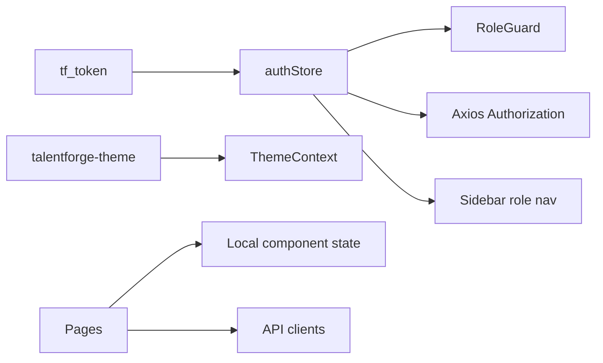
```mermaid
flowchart LR
  token[tf_token]-->auth[authStore]
  auth-->guard[RoleGuard]
  auth-->axios[Axios Authorization]
  auth-->nav[Sidebar role nav]
  themeKey[talentforge-theme]-->theme[ThemeContext]
  pages[Pages]-->local[Local component state]
  pages-->clients[API clients]
```

### API Client Layer
| Module | File | Purpose | Exports | Endpoints Consumed | Authentication | Status |
| --- | --- | --- | --- | --- | --- | --- |
| admin | frontend/src/api/admin.js | admin backend client | getAdminUsers, updateAdminUser, getAdminPolicies, createAdminPolicy, updateAdminPolicy, deleteAdminPolicy, reindexAdminPolicy, getAdminKnowledge, createAdminKnowledge, updateAdminKnowledge, deleteAdminKnowledge, reindexAdminKnowledge | GET /api/admin/users<br>PUT /api/admin/users/${userId}<br>GET /api/admin/policies<br>POST /api/admin/policies<br>PUT /api/admin/policies/${filename}<br>DELETE /api/admin/policies/${filename}<br>POST /api/admin/policies/${filename}/reindex<br>GET /api/admin/knowledge<br>POST /api/admin/knowledge<br>PUT /api/admin/knowledge/${category}/${filename}<br>DELETE /api/admin/knowledge/${category}/${filename}<br>POST /api/admin/knowledge/${category}/${filename}/reindex | Bearer via axios | Active |
| applications | frontend/src/api/applications.js | applications backend client | applyToJob, getMyApplications, listApplications, reanalyzeApplication, hireCandidate, getJobRankings, getApplicationCredibility | POST /api/applications/apply<br>GET /api/applications/me<br>GET /api/applications<br>POST /api/applications/${applicationId}/analyze<br>POST /api/applications/${applicationId}/hire<br>GET /api/applications/rankings/${jobId}<br>GET /api/applications/${applicationId}/credibility | Bearer via axios | Active |
| auth | frontend/src/api/auth.js | auth backend client | login, register | POST /api/auth/login<br>POST /api/auth/register | Bearer via axios | Active |
| axios | frontend/src/api/axios.js | Shared axios instance, JWT interceptor, 30s GET cache, 401 logout | default/barrel | No direct call | Attaches Bearer token | Active |
| candidates | frontend/src/api/candidates.js | candidates backend client | listCandidates, getCandidate | GET /api/candidates<br>GET /api/candidates/${candidateId} | Bearer via axios | Active |
| dashboard | frontend/src/api/dashboard.js | dashboard backend client | getHRDashboardData, getCandidateDashboardData, getHRReviews | GET /api/dashboard/hr<br>GET /api/dashboard/candidate<br>GET /api/dashboard/hr/reviews | Bearer via axios | Active |
| departments | frontend/src/api/departments.js | departments backend client | listDepartments, createDepartment, updateDepartment, deactivateDepartment | GET /api/departments<br>POST /api/departments<br>PUT /api/departments/${id}<br>DELETE /api/departments/${id} | Bearer via axios | Active |
| designations | frontend/src/api/designations.js | designations backend client | listDesignations, createDesignation, updateDesignation, archiveDesignation | GET /api/designations<br>POST /api/designations<br>PUT /api/designations/${id}<br>DELETE /api/designations/${id} | Bearer via axios | Active |
| employees | frontend/src/api/employees.js | employees backend client | listEmployees, getEmployee, getMyEmployeeProfile, getEmployeeDashboard, checkIn, checkOut, getAttendanceHistory, submitLeave, getMyLeaves, listLeaveRequests, decideLeaveRequest, getMySkillGap, analyzeSkillGap, askHRAssistant, listEmployeeDirectory, getEmployeeProfile, updateEmployeeProfile | GET /api/employees<br>GET /api/employees/${employeeId}<br>GET /api/employees/me<br>GET /api/employees/dashboard<br>POST /api/employees/attendance/check-in<br>POST /api/employees/attendance/check-out<br>GET /api/employees/attendance<br>POST /api/employees/leave<br>GET /api/employees/leave/me<br>GET /api/employees/leave<br>POST /api/employees/leave/${leaveId}/decision<br>GET /api/employees/skill-gap/me<br>POST /api/employees/skill-gap/me/analyze<br>POST /api/employees/assistant<br>GET /api/employees/directory<br>GET /api/employees/${employeeId}/profile<br>PUT /api/employees/${employeeId}/profile | Bearer via axios | Active |
| index | frontend/src/api/index.js | Barrel exports API clients | default/barrel | No direct call | Bearer via axios | Active |
| interview | frontend/src/api/interview.js | interview backend client | startInterview, startInterviewFromResume, submitAnswer, getInterviewModes, getCoachMemory, getDailyPlan, listSessions, getSession, deleteSession, abandonSession, completeSession, getCredibilityReport, getIntelligenceLeaderboard, getCandidateIntelligenceReport, compareCandidates, getTopCandidates, getFollowupQuestions, advanceCandidate, rejectCandidate, transcribeAudio, startInterviewForApplication, recordProctoringViolation | POST /api/interview/start<br>POST /api/interview/start-from-resume<br>POST /api/interview/answer<br>GET /api/interview/modes<br>GET /api/interview/coach-memory<br>GET /api/interview/daily-plan<br>GET /api/interview/sessions<br>GET /api/interview/sessions/${sessionId}<br>DELETE /api/interview/sessions/${sessionId}<br>POST /api/interview/${sessionId}/abandon<br>POST /api/interview/${sessionId}/complete<br>POST /api/interview/${sessionId}/credibility<br>GET /api/interview/intelligence/leaderboard<br>GET /api/interview/intelligence/report/${candidateId}<br>POST /api/interview/intelligence/compare<br>GET /api/interview/intelligence/top-candidates<br>GET /api/interview/intelligence/followup-questions/${sessionId}<br>POST /api/interview/intelligence/${sessionId}/advance<br>POST /api/interview/intelligence/${sessionId}/reject<br>POST /api/interview/transcribe<br>POST /api/interview/start-for-application<br>POST /api/interview/${sessionId}/violation | Bearer via axios | Active |
| jobs | frontend/src/api/jobs.js | jobs backend client | listJobs, getJob, createJob, updateJob, deleteJob, closeJob, archiveJob | GET /api/jobs<br>GET /api/jobs/${jobId}<br>POST /api/jobs<br>PUT /api/jobs/${jobId}<br>DELETE /api/jobs/${jobId}<br>POST /api/jobs/${jobId}/close<br>POST /api/jobs/${jobId}/archive | Bearer via axios | Active |
| lifecycle | frontend/src/api/lifecycle.js | lifecycle backend client | getLifecycle, addLifecycleEvent | GET /api/lifecycle/employee/${employeeId}<br>POST /api/lifecycle/employee/${employeeId} | Bearer via axios | Active |
| mock_interview | frontend/src/api/mock_interview.js | mock_interview backend client | startMockInterview, submitMockAnswer, completeMockInterview, listMockSessions | POST /api/mock-interview/start<br>POST /api/mock-interview/answer<br>POST /api/mock-interview/${sessionId}/complete<br>GET /api/mock-interview/sessions | Bearer via axios | Active |
| notifications | frontend/src/api/notifications.js | notifications backend client | listNotifications, markRead, markAllRead | GET /api/notifications<br>PUT /api/notifications/${id}/read<br>PUT /api/notifications/read-all | Bearer via axios | Active |
| onboarding | frontend/src/api/onboarding.js | onboarding backend client | default/barrel | GET /api/onboarding/templates<br>POST /api/onboarding/templates<br>PUT /api/onboarding/templates/${id}<br>DELETE /api/onboarding/templates/${id}<br>POST /api/onboarding/templates/${templateId}/tasks<br>PUT /api/onboarding/tasks/${taskId}<br>DELETE /api/onboarding/tasks/${taskId}<br>POST /api/onboarding/assign<br>GET /api/onboarding/employee/${employeeId}<br>GET /api/onboarding/my<br>PUT /api/onboarding/plan/${planId}/task/${taskId}<br>GET /api/onboarding/summary | Bearer via axios | Active |
| profile | frontend/src/api/profile.js | profile backend client | default/barrel | GET /api/profile/me<br>PUT /api/profile/candidate<br>PUT /api/profile/employee<br>POST /api/profile/documents<br>GET /api/profile/documents/review<br>PUT /api/profile/documents/${kind}/${documentId}/decision | Bearer via axios | Active |
| promotions | frontend/src/api/promotions.js | promotions backend client | getPromotions, addPromotion, getRecentPromotions | GET /api/promotions/employee/${employeeId}<br>POST /api/promotions/employee/${employeeId}<br>GET /api/promotions/recent | Bearer via axios | Active |
| rag | frontend/src/api/rag.js | rag backend client | sendRagChatMessage | POST /api/rag/chat | Bearer via axios | Active |
| resume | frontend/src/api/resume.js | resume backend client | uploadResume, getMyResume | POST /api/resume/upload<br>GET /api/resume/me | Bearer via axios | Active |
| salary | frontend/src/api/salary.js | salary backend client | getSalaryHistory, addSalaryRevision | GET /api/salary/employee/${employeeId}<br>POST /api/salary/employee/${employeeId} | Bearer via axios | Active |
| tickets | frontend/src/api/tickets.js | tickets backend client | createTicket, listTickets, assignTicket, updateTicketStatus, listResolvers | POST /api/tickets<br>GET /api/tickets<br>PUT /api/tickets/${id}/assign<br>PUT /api/tickets/${id}/status<br>GET /api/tickets/resolvers | Bearer via axios | Active |
| training | frontend/src/api/training.js | training backend client | default/barrel | GET /api/training/programs<br>POST /api/training/programs<br>PUT /api/training/programs/${id}<br>DELETE /api/training/programs/${id}<br>POST /api/training/assign<br>GET /api/training/assignments<br>GET /api/training/assignments/my<br>GET /api/training/assignments<br>PUT /api/training/assignments/${assignmentId}/progress<br>GET /api/training/summary | Bearer via axios | Active |

### AI Architecture
| Feature | Purpose | Services | CrewAI Usage | LLM Usage | Status |
| --- | --- | --- | --- | --- | --- |
| Resume Parsing | Parse sections/skills/experience/projects | src/resume_lab.py | No CrewAI | No LLM | Active |
| Resume Analysis | Score and diagnose resumes | crew.py, tasks/resume_task.py | resume optimizer agent/tasks | Groq via get_llm | Active |
| Resume Optimization | Suggestions and rewritten bullets | crew.py | resume optimizer/re-writer | Groq via get_llm | Active |
| Resume Repair | Repair PDF/text extraction artifacts | src/resume_lab.py | None | No LLM | Active |
| Recruitment AI | Analyze applications against jobs | src/services/recruitment_ai.py | recruitment_analyst task | Groq with fallback | Active |
| Candidate Ranking | Rank candidates/jobs from analysis | recruitment_ai.py, hiring_intelligence.py | Indirect | Stored AI/deterministic | Active |
| Hiring Intelligence | Reports, leaderboard, comparisons | hiring_intelligence.py | None direct | Deterministic analytics | Active |
| Interview Question Generation | Adaptive start/follow-up questions | crew.py, interview_core.py | interviewer/followup | Groq with fallback | Active |
| Interview Evaluation | Answer scoring and difficulty adaptation | crew.py | optional evaluator/followup | Deterministic default; env-gated LLM | Active |
| Mock Interview | Practice interview workflow | mock_interview.py, interview_core.py | Interview agents reused | Groq/fallback | Active |
| Transcription | Audio-to-text answers | transcription_service.py | None | Groq Whisper large-v3 + turbo fallback | Active |
| Employee AI | Skill gap and HR assistant | employee_ai.py | None detected | Groq/fallback | Active |
| Knowledge Search | Role-filtered RAG retrieval | rag/retrieval_service.py, query_router.py | None | Hash/OpenAI embeddings | Active |
| HR Assistant | HR copilot over knowledge/database context | rag/chat_service.py | None | LLM if configured | Active |
| Candidate Assistant | Candidate career assistant | rag/chat_service.py, access_control.py | None | LLM if configured | Active |
| Summarization | Summary fields in analysis/report payloads | recruitment_ai.py, hiring_intelligence.py | Some CrewAI paths | Groq/fallback mix | Partially Implemented |
| LLM Routing | Central CrewAI LLM/key routing | llm_router.py | Agents call get_llm | Groq active; NVIDIA NIM Not Implemented | Active |

### CrewAI Documentation
CrewAI execution is implemented through `crew.py` and `src/services/recruitment_ai.py`. Agents are factories under `agents/`; tasks are factories under `tasks/`; LLM construction and Groq key rotation live in `src/services/llm_router.py`. `crew.py` is active legacy Jobify-compatible orchestration.

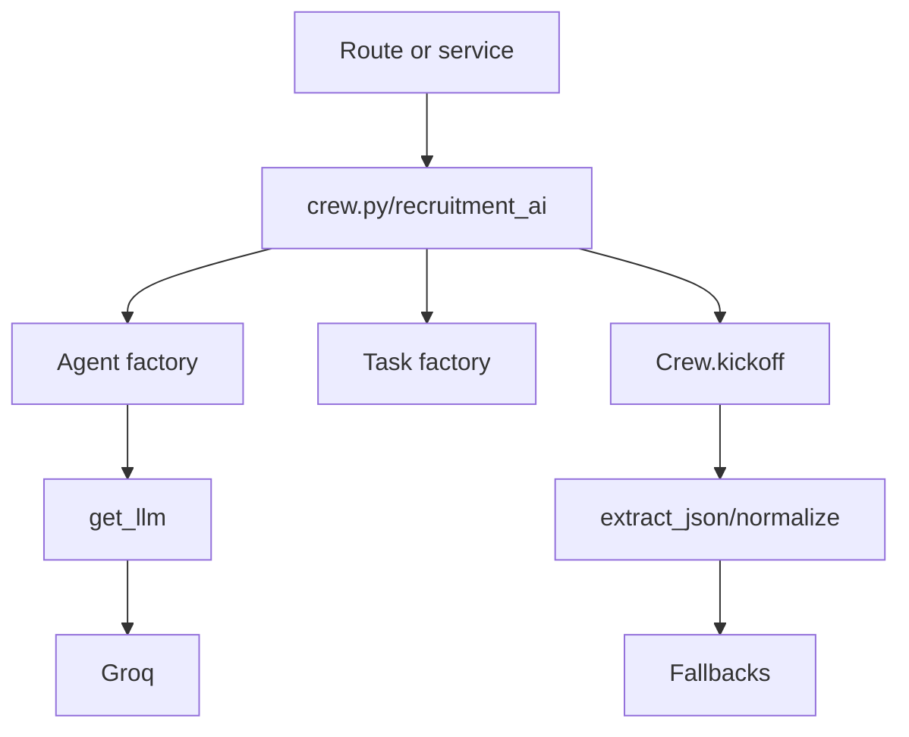
```mermaid
flowchart TD
  route[Route or service]-->crew[crew.py/recruitment_ai]
  crew-->agent[Agent factory]
  crew-->task[Task factory]
  agent-->llm[get_llm]
  llm-->groq[Groq]
  crew-->kickoff[Crew.kickoff]
  kickoff-->json[extract_json/normalize]
  json-->fallback[Fallbacks]
```

### Agent Documentation
| Name | File | Role | Goal | Backstory | Tools | LLM Used | Input | Output | Where Invoked | Status |
| --- | --- | --- | --- | --- | --- | --- | --- | --- | --- | --- |
| create_interviewer | agents/interview_coach.py | Interviewer | Ask precisely ONE challenging but realistic interview question tailored to the candidate's resume and target role, considering the | You are an elite technical interviewer at a top-tier tech company. You test candidates on problem-solving, system design, and beha | None declared | get_llm(...) | Factory args | CrewAI Agent | crew.py/services | Active |
| create_evaluator | agents/interview_coach.py | Evaluator | Evaluate the user's interview answer and provide a strict score and constructive feedback. | You are a strict but fair interview panelist who looks for depth, clarity, and structural soundness in a candidate's answer. | None declared | get_llm(...) | Factory args | CrewAI Agent | crew.py/services | Active |
| create_followup_coach | agents/interview_coach.py | Follow-up Interviewer | Generate a deeper, specific follow-up question based on the user's previous answer. | You dig deep into a candidate's stated knowledge to test the edges of their understanding. You don't accept superficial answers. | None declared | get_llm(...) | Factory args | CrewAI Agent | crew.py/services | Active |
| create_interview_coach | agents/interview_coach.py | Interview Coach | Generate challenging but realistic technical and behavioral interview questions tailored to the candidate's core skills. | You are an elite technical interviewer at a top-tier tech company. You test candidates not just on syntax, but on problem-solving, | None declared | get_llm(...) | Factory args | CrewAI Agent | crew.py/services | Active |
| create_job_finder | agents/job_finder.py | Job Finder and Career Strategist | Accurately identify the best entry-level job roles for the candidate and format real, pre-fetched job search results into a clean, | You are an expert technical recruiter. You analyze resumes to identify the candidate's strongest skills and best-fit job roles. Yo | None declared | get_llm(...) | Factory args | CrewAI Agent | crew.py/services | Active |
| create_recruitment_analyst | agents/recruitment_analyst.py | Recruitment Intelligence Analyst | Evaluate candidate-job fit using only the supplied resume and job posting, then produce recruiter-friendly hiring recommendations  | You are a senior technical recruiter. You are careful, evidence-based, and concise. You never invent candidate skills or experienc | None declared | get_llm(...) | Factory args | CrewAI Agent | crew.py/services | Active |
| create_resume_optimizer | agents/resume_optimizer.py | Resume Analyzer | Analyze the candidate's resume and provide precise, actionable improvements to make it stand out to ATS systems and human recruite | You are a seasoned technical recruiter and expert resume writer. You know exactly what hiring managers look for: impact, evidence, | None declared | get_llm(...) | Factory args | CrewAI Agent | crew.py/services | Active |
| create_resume_rewriter | agents/resume_optimizer.py | Resume Rewriter | Rewrite weak resume bullet points to improve impact, clarity, and ATS compatibility. | You are a professional resume writer who improves weak, passive bullet points without changing the truth. You preserve the origina | None declared | get_llm(...) | Factory args | CrewAI Agent | crew.py/services | Active |
| skill_matcher | agents/skill_matcher.py | No Agent factory detected | N/A | N/A | None | Unknown | N/A | N/A | No active invocation found | Unused or legacy |

### Task Documentation
| Name | File | Purpose | Assigned Agent | Inputs | Expected Result | Where Invoked | Dependencies | Status |
| --- | --- | --- | --- | --- | --- | --- | --- | --- |
| create_interview_task | tasks/interview_task.py | description | agent argument | agent, resume_content | Valid JSON containing exactly 4 interview questions with tips. | crew.py/recruitment_ai | CrewAI Task | Active |
| create_interview_start_task | tasks/interview_task.py | description | agent argument | agent, role, difficulty, weak_areas, resume_context, section_scores, focus_mode, training_mode, interviewer_persona, coach_memory, domain_focus, phase_name, phase_goal, phase_focus | Valid JSON with a single realistic interview opening turn. | crew.py/recruitment_ai | CrewAI Task | Active |
| create_evaluator_task | tasks/interview_task.py | description | agent argument | agent, question, answer, conversation_history, focus_area, interviewer_persona, resume_context | Valid JSON with a strict interview evaluation. | crew.py/recruitment_ai | CrewAI Task | Active |
| create_followup_task | tasks/interview_task.py | description | agent argument | agent, role, question, answer, difficulty, weak_areas, resume_context, section_scores, focus_mode, training_mode, interviewer_persona, coach_memory, domain_focus, conversation_history, last_score, current_focus_area, phase_name, phase_goal, phase_focus | Valid JSON with a single realistic follow-up interviewer turn. | crew.py/recruitment_ai | CrewAI Task | Active |
| create_role_inference_task | tasks/job_task.py | description | agent argument | agent, resume_content, profile_context | JSON: {"roles": ["role1", "role2", "role3", "role4", "role5"]} | crew.py/recruitment_ai | CrewAI Task | Active |
| create_job_ranking_task | tasks/job_task.py | description | agent argument | agent, resume_content, real_jobs, profile_context | Valid JSON with suggested_roles and up to 5 jobs. Each job has role, company, link, location, why_match, gap_summary, improvement_plan, matc | crew.py/recruitment_ai | CrewAI Task | Active |
| match_task | tasks/match_task.py | No Task factory detected | N/A | N/A | N/A | No active invocation found | N/A | Unused or legacy |
| create_application_analysis_task | tasks/recruitment_task.py | description | agent argument | agent, resume_text, job, parsed_resume | Strict JSON with fit score, recommendation, explainability, and interview prep. | crew.py/recruitment_ai | CrewAI Task | Active |
| create_resume_task | tasks/resume_task.py | description | agent argument | agent, resume_content | Valid JSON containing exactly 4 resume improvements. | crew.py/recruitment_ai | CrewAI Task | Active |
| create_resume_analysis_task | tasks/resume_task.py | description | agent argument | agent, resume_content, target_role | Valid JSON matching Jobify Resume Lab schema with grounded issues and replacements. | crew.py/recruitment_ai | CrewAI Task | Active |
| create_bullet_rewriting_task | tasks/resume_task.py | description | agent argument | agent, resume_content | Valid JSON containing original and improved rewritten bullet points. | crew.py/recruitment_ai | CrewAI Task | Active |

### RAG Documentation
The RAG subsystem exists under `src/services/rag` with Chroma persistence, hash/OpenAI embeddings, ingestion, company docs ingestion, retrieval, access control, query routing, chat answer assembly, and database synchronization. Separate BM25 hybrid search and streaming answers were not detected.

| Capability | Implementation | Status |
| --- | --- | --- |
| Ingestion | IngestionService chunks/embeds/upserts documents | Active |
| Company Documents | CompanyDocsIngestionService maps docs to collections | Active |
| Embedding | HashEmbeddingProvider default; OpenAI optional | Active |
| Vector Store | ChromaService persistent collections: company_policies, employee_knowledge | Active |
| Retrieval | RetrievalService queries selected collections | Active |
| Access Control | Role filtering in access_control.py | Active |
| Query Routing | QueryRouter chooses RAG/database decision context | Active |
| Hybrid Search | Database context plus RAG route; no BM25 detected | Partially Implemented |
| Prompt Assembly | chat_service builds answer context/sources | Active |
| Database Sync | RAGSyncService upserts/deletes HRMS entities | Active |
| Streaming | No streaming backend API detected | Not Implemented |

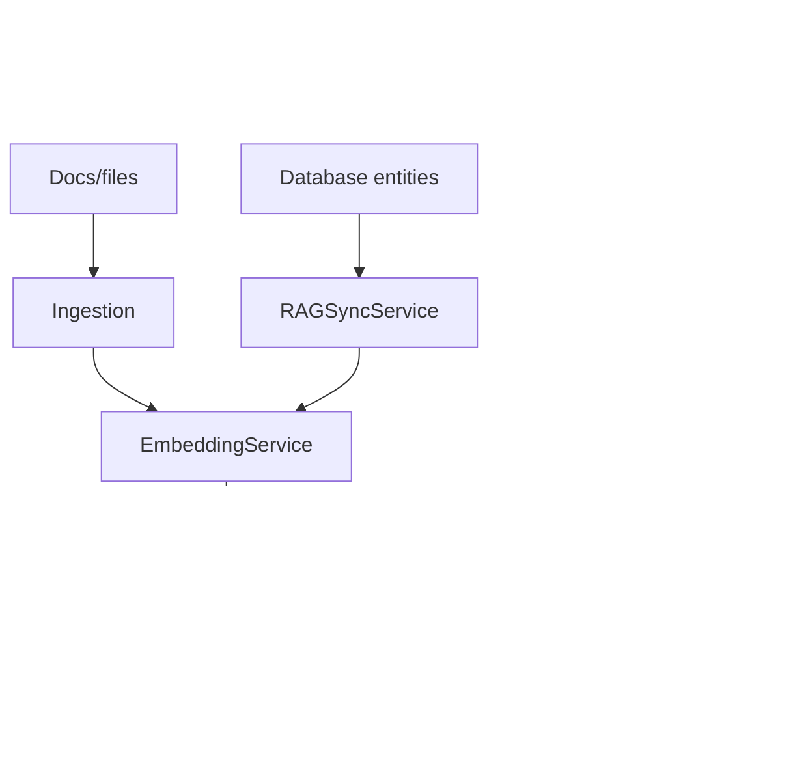
```mermaid
flowchart TD
  docs[Docs/files]-->ingest[Ingestion]
  db[Database entities]-->sync[RAGSyncService]
  ingest-->embed[EmbeddingService]
  sync-->embed
  embed-->chroma[Chroma collections]
  user[Query+role]-->router[QueryRouter]
  router-->access[Access control]
  access-->retrieval[RetrievalService]
  retrieval-->chroma
  retrieval-->chat[ChatService]
  chat-->ui[Assistant UI]
```

### RAG Service Files
| Service | File | Kind | Classes | Functions | Status |
| --- | --- | --- | --- | --- | --- |
| access_control | src/services/rag/access_control.py | RAG Service | RAGAccessPlan, RAGAccessControl | None | Active |
| chat_service | src/services/rag/chat_service.py | RAG Service | RAGChatService | None | Active |
| chroma_service | src/services/rag/chroma_service.py | RAG Service | ChromaService | None | Active |
| company_docs_ingestion | src/services/rag/company_docs_ingestion.py | RAG Service | CompanyDocsIngestionSummary, CompanyDocsIngestionService | None | Active |
| embedding_service | src/services/rag/embedding_service.py | RAG Service | EmbeddingProvider, HashEmbeddingProvider, OpenAIEmbeddingProvider, EmbeddingService | build_embedding_provider | Active |
| ingestion_service | src/services/rag/ingestion_service.py | RAG Service | IngestionResult, IngestionService | None | Active |
| query_router | src/services/rag/query_router.py | RAG Service | QueryRoute, QueryRouter | None | Active |
| retrieval_service | src/services/rag/retrieval_service.py | RAG Service | RetrievalService | None | Active |
| sync_service | src/services/rag/sync_service.py | RAG Service | RAGSyncService | _iso, _json_text | Active |

### AI and Business Service Files
| Service | File | Kind | Classes | Functions | Status |
| --- | --- | --- | --- | --- | --- |
| employee_ai | src/services/employee_ai.py | AI/Business Service | None | analyze_skill_gap, answer_hr_question, _run_ai_skill_gap, _normalize_skill_gap, _fallback_skill_gap, _term_set, _string_list | Active |
| hiring_intelligence | src/services/hiring_intelligence.py | AI/Business Service | None | _estimate_tokens, _utc_iso, _log_perf, count_filler_words, _extract_json, compile_hiring_intelligence, generate_interview_summary, run_fallback_generation, calc | Active |
| interview_consistency | src/services/interview_consistency.py | AI/Business Service | None | analyze_credibility, credibility_payload, _run_ai_credibility, _extract_claims, _extract_qa_pairs, _summarize_scores, _normalize_credibility, _fallback_credibil | Active |
| interview_core | src/services/interview_core.py | AI/Business Service | StartReq, StartFromResumeReq, StartForApplicationReq, ViolationReq, AnswerReq, CompareReq | _latest_candidate_resume_text, _safe_json_load, _normalize_training_mode, _normalize_persona, _question_mix_for_mode, _phase_meta, _phase_index, _should_end_int | Active |
| interview_status | src/services/interview_status.py | AI/Business Service | None | normalize_interview_status, is_successful_interview_status, is_visible_interview_status, phase_turn_requirements, completed_turns_by_phase, has_completed_requir | Active |
| llm_router | src/services/llm_router.py | AI/Business Service | APIKeyManager | _routed_completion, get_llm | Active |
| mock_interview_summary | src/services/mock_interview_summary.py | AI/Business Service | None | generate_mock_interview_summary | Active |
| recruitment_ai | src/services/recruitment_ai.py | AI/Business Service | None | analyze_application, get_analysis_for_application, rank_applications_for_job, application_payload, analysis_payload, _run_crewai_analysis, _normalize_ai_payload | Active |
| transcription_service | src/services/transcription_service.py | AI/Business Service | None | _safe_raw_response, _get_healthy_client, _metadata_from_response, _validate_transcript, transcribe_audio_metadata, transcribe_audio | Active |

### Business Modules
| Module | Purpose | Frontend Pages | Backend Routers | Database Tables | AI Components | CrewAI Components | Workflow Summary | Current Status | Known Limitations | Related Modules |
| --- | --- | --- | --- | --- | --- | --- | --- | --- | --- | --- |
| Authentication | Implemented HRMS business capability | See page/API/service tables | See Phase 2 routers | See model table | See AI table where applicable | See CrewAI table where applicable | Workflow implemented through documented frontend/backend files | Active | Limitations documented in related sections | Related HRMS modules |
| Dashboard | Implemented HRMS business capability | See page/API/service tables | See Phase 2 routers | See model table | See AI table where applicable | See CrewAI table where applicable | Workflow implemented through documented frontend/backend files | Active | Limitations documented in related sections | Related HRMS modules |
| Recruitment | Implemented HRMS business capability | See page/API/service tables | See Phase 2 routers | See model table | See AI table where applicable | See CrewAI table where applicable | Workflow implemented through documented frontend/backend files | Active | Limitations documented in related sections | Related HRMS modules |
| Jobs | Implemented HRMS business capability | See page/API/service tables | See Phase 2 routers | See model table | See AI table where applicable | See CrewAI table where applicable | Workflow implemented through documented frontend/backend files | Active | Limitations documented in related sections | Related HRMS modules |
| Applications | Implemented HRMS business capability | See page/API/service tables | See Phase 2 routers | See model table | See AI table where applicable | See CrewAI table where applicable | Workflow implemented through documented frontend/backend files | Active | Limitations documented in related sections | Related HRMS modules |
| Resume Lab | Implemented HRMS business capability | See page/API/service tables | See Phase 2 routers | See model table | See AI table where applicable | See CrewAI table where applicable | Workflow implemented through documented frontend/backend files | Active | Limitations documented in related sections | Related HRMS modules |
| Interview | Implemented HRMS business capability | See page/API/service tables | See Phase 2 routers | See model table | See AI table where applicable | See CrewAI table where applicable | Workflow implemented through documented frontend/backend files | Active | Limitations documented in related sections | Related HRMS modules |
| Mock Interview | Implemented HRMS business capability | See page/API/service tables | See Phase 2 routers | See model table | See AI table where applicable | See CrewAI table where applicable | Workflow implemented through documented frontend/backend files | Active | Limitations documented in related sections | Related HRMS modules |
| Employee Management | Implemented HRMS business capability | See page/API/service tables | See Phase 2 routers | See model table | See AI table where applicable | See CrewAI table where applicable | Workflow implemented through documented frontend/backend files | Active | Limitations documented in related sections | Related HRMS modules |
| Departments | Implemented HRMS business capability | See page/API/service tables | See Phase 2 routers | See model table | See AI table where applicable | See CrewAI table where applicable | Workflow implemented through documented frontend/backend files | Active | Limitations documented in related sections | Related HRMS modules |
| Designations | Implemented HRMS business capability | See page/API/service tables | See Phase 2 routers | See model table | See AI table where applicable | See CrewAI table where applicable | Workflow implemented through documented frontend/backend files | Active | Limitations documented in related sections | Related HRMS modules |
| Onboarding | Implemented HRMS business capability | See page/API/service tables | See Phase 2 routers | See model table | See AI table where applicable | See CrewAI table where applicable | Workflow implemented through documented frontend/backend files | Active | Limitations documented in related sections | Related HRMS modules |
| Training | Implemented HRMS business capability | See page/API/service tables | See Phase 2 routers | See model table | See AI table where applicable | See CrewAI table where applicable | Workflow implemented through documented frontend/backend files | Active | Limitations documented in related sections | Related HRMS modules |
| Promotions | Implemented HRMS business capability | See page/API/service tables | See Phase 2 routers | See model table | See AI table where applicable | See CrewAI table where applicable | Workflow implemented through documented frontend/backend files | Active | Limitations documented in related sections | Related HRMS modules |
| Salary | Implemented HRMS business capability | See page/API/service tables | See Phase 2 routers | See model table | See AI table where applicable | See CrewAI table where applicable | Workflow implemented through documented frontend/backend files | Partially Implemented | Limitations documented in related sections | Related HRMS modules |
| Attendance | Implemented HRMS business capability | See page/API/service tables | See Phase 2 routers | See model table | See AI table where applicable | See CrewAI table where applicable | Workflow implemented through documented frontend/backend files | Active | Limitations documented in related sections | Related HRMS modules |
| Leave Management | Implemented HRMS business capability | See page/API/service tables | See Phase 2 routers | See model table | See AI table where applicable | See CrewAI table where applicable | Workflow implemented through documented frontend/backend files | Active | Limitations documented in related sections | Related HRMS modules |
| Notifications | Implemented HRMS business capability | See page/API/service tables | See Phase 2 routers | See model table | See AI table where applicable | See CrewAI table where applicable | Workflow implemented through documented frontend/backend files | Active | Limitations documented in related sections | Related HRMS modules |
| Profile | Implemented HRMS business capability | See page/API/service tables | See Phase 2 routers | See model table | See AI table where applicable | See CrewAI table where applicable | Workflow implemented through documented frontend/backend files | Active | Limitations documented in related sections | Related HRMS modules |
| Knowledge Base | Implemented HRMS business capability | See page/API/service tables | See Phase 2 routers | See model table | See AI table where applicable | See CrewAI table where applicable | Workflow implemented through documented frontend/backend files | Active | Limitations documented in related sections | Related HRMS modules |
| RAG Assistant | Implemented HRMS business capability | See page/API/service tables | See Phase 2 routers | See model table | See AI table where applicable | See CrewAI table where applicable | Workflow implemented through documented frontend/backend files | Active | Limitations documented in related sections | Related HRMS modules |
| Administration | Implemented HRMS business capability | See page/API/service tables | See Phase 2 routers | See model table | See AI table where applicable | See CrewAI table where applicable | Workflow implemented through documented frontend/backend files | Active | Limitations documented in related sections | Related HRMS modules |
| Tickets | Implemented HRMS business capability | See page/API/service tables | See Phase 2 routers | See model table | See AI table where applicable | See CrewAI table where applicable | Workflow implemented through documented frontend/backend files | Active | Limitations documented in related sections | Related HRMS modules |
| Lifecycle | Implemented HRMS business capability | See page/API/service tables | See Phase 2 routers | See model table | See AI table where applicable | See CrewAI table where applicable | Workflow implemented through documented frontend/backend files | Active | Limitations documented in related sections | Related HRMS modules |
| Reports | Implemented HRMS business capability | See page/API/service tables | See Phase 2 routers | See model table | See AI table where applicable | See CrewAI table where applicable | Workflow implemented through documented frontend/backend files | Active | Limitations documented in related sections | Related HRMS modules |
| Analytics | Implemented HRMS business capability | See page/API/service tables | See Phase 2 routers | See model table | See AI table where applicable | See CrewAI table where applicable | Workflow implemented through documented frontend/backend files | Active | Limitations documented in related sections | Related HRMS modules |

### Feature Inventory
| Feature Name | Description | Frontend | Backend | Database | AI | CrewAI | APIs | Status | Completion Level | Dependencies |
| --- | --- | --- | --- | --- | --- | --- | --- | --- | --- | --- |
| Authentication | Business module feature | See pages | See backend | See DB | See AI | See CrewAI | See Phase 2 API matrix | Active | High | Related modules |
| Dashboard | Business module feature | See pages | See backend | See DB | See AI | See CrewAI | See Phase 2 API matrix | Active | High | Related modules |
| Recruitment | Business module feature | See pages | See backend | See DB | See AI | See CrewAI | See Phase 2 API matrix | Active | High | Related modules |
| Jobs | Business module feature | See pages | See backend | See DB | See AI | See CrewAI | See Phase 2 API matrix | Active | High | Related modules |
| Applications | Business module feature | See pages | See backend | See DB | See AI | See CrewAI | See Phase 2 API matrix | Active | High | Related modules |
| Resume Lab | Business module feature | See pages | See backend | See DB | See AI | See CrewAI | See Phase 2 API matrix | Active | High | Related modules |
| Interview | Business module feature | See pages | See backend | See DB | See AI | See CrewAI | See Phase 2 API matrix | Active | High | Related modules |
| Mock Interview | Business module feature | See pages | See backend | See DB | See AI | See CrewAI | See Phase 2 API matrix | Active | High | Related modules |
| Employee Management | Business module feature | See pages | See backend | See DB | See AI | See CrewAI | See Phase 2 API matrix | Active | High | Related modules |
| Departments | Business module feature | See pages | See backend | See DB | See AI | See CrewAI | See Phase 2 API matrix | Active | High | Related modules |
| Designations | Business module feature | See pages | See backend | See DB | See AI | See CrewAI | See Phase 2 API matrix | Active | High | Related modules |
| Onboarding | Business module feature | See pages | See backend | See DB | See AI | See CrewAI | See Phase 2 API matrix | Active | High | Related modules |
| Training | Business module feature | See pages | See backend | See DB | See AI | See CrewAI | See Phase 2 API matrix | Active | High | Related modules |
| Promotions | Business module feature | See pages | See backend | See DB | See AI | See CrewAI | See Phase 2 API matrix | Active | High | Related modules |
| Salary | Business module feature | See pages | See backend | See DB | See AI | See CrewAI | See Phase 2 API matrix | Partially Implemented | Medium | Related modules |
| Attendance | Business module feature | See pages | See backend | See DB | See AI | See CrewAI | See Phase 2 API matrix | Active | High | Related modules |
| Leave Management | Business module feature | See pages | See backend | See DB | See AI | See CrewAI | See Phase 2 API matrix | Active | High | Related modules |
| Notifications | Business module feature | See pages | See backend | See DB | See AI | See CrewAI | See Phase 2 API matrix | Active | High | Related modules |
| Profile | Business module feature | See pages | See backend | See DB | See AI | See CrewAI | See Phase 2 API matrix | Active | High | Related modules |
| Knowledge Base | Business module feature | See pages | See backend | See DB | See AI | See CrewAI | See Phase 2 API matrix | Active | High | Related modules |
| RAG Assistant | Business module feature | See pages | See backend | See DB | See AI | See CrewAI | See Phase 2 API matrix | Active | High | Related modules |
| Administration | Business module feature | See pages | See backend | See DB | See AI | See CrewAI | See Phase 2 API matrix | Active | High | Related modules |
| Tickets | Business module feature | See pages | See backend | See DB | See AI | See CrewAI | See Phase 2 API matrix | Active | High | Related modules |
| Lifecycle | Business module feature | See pages | See backend | See DB | See AI | See CrewAI | See Phase 2 API matrix | Active | High | Related modules |
| Reports | Business module feature | See pages | See backend | See DB | See AI | See CrewAI | See Phase 2 API matrix | Active | High | Related modules |
| Analytics | Business module feature | See pages | See backend | See DB | See AI | See CrewAI | See Phase 2 API matrix | Active | High | Related modules |
| Resume Parsing | Parse sections/skills/experience/projects | See frontend usage | See services | src/resume_lab.py | No LLM | No CrewAI | See Phase 2 API matrix | Active | High | src/resume_lab.py |
| Resume Analysis | Score and diagnose resumes | See frontend usage | See services | crew.py, tasks/resume_task.py | Groq via get_llm | resume optimizer agent/tasks | See Phase 2 API matrix | Active | High | crew.py, tasks/resume_task.py |
| Resume Optimization | Suggestions and rewritten bullets | See frontend usage | See services | crew.py | Groq via get_llm | resume optimizer/re-writer | See Phase 2 API matrix | Active | High | crew.py |
| Resume Repair | Repair PDF/text extraction artifacts | See frontend usage | See services | src/resume_lab.py | No LLM | None | See Phase 2 API matrix | Active | High | src/resume_lab.py |
| Recruitment AI | Analyze applications against jobs | See frontend usage | See services | src/services/recruitment_ai.py | Groq with fallback | recruitment_analyst task | See Phase 2 API matrix | Active | High | src/services/recruitment_ai.py |
| Candidate Ranking | Rank candidates/jobs from analysis | See frontend usage | See services | recruitment_ai.py, hiring_intelligence.py | Stored AI/deterministic | Indirect | See Phase 2 API matrix | Active | High | recruitment_ai.py, hiring_intelligence.py |
| Hiring Intelligence | Reports, leaderboard, comparisons | See frontend usage | See services | hiring_intelligence.py | Deterministic analytics | None direct | See Phase 2 API matrix | Active | High | hiring_intelligence.py |
| Interview Question Generation | Adaptive start/follow-up questions | See frontend usage | See services | crew.py, interview_core.py | Groq with fallback | interviewer/followup | See Phase 2 API matrix | Active | High | crew.py, interview_core.py |
| Interview Evaluation | Answer scoring and difficulty adaptation | See frontend usage | See services | crew.py | Deterministic default; env-gated LLM | optional evaluator/followup | See Phase 2 API matrix | Active | High | crew.py |
| Mock Interview | Practice interview workflow | See frontend usage | See services | mock_interview.py, interview_core.py | Groq/fallback | Interview agents reused | See Phase 2 API matrix | Active | High | mock_interview.py, interview_core.py |
| Transcription | Audio-to-text answers | See frontend usage | See services | transcription_service.py | Groq Whisper large-v3 + turbo fallback | None | See Phase 2 API matrix | Active | High | transcription_service.py |
| Employee AI | Skill gap and HR assistant | See frontend usage | See services | employee_ai.py | Groq/fallback | None detected | See Phase 2 API matrix | Active | High | employee_ai.py |
| Knowledge Search | Role-filtered RAG retrieval | See frontend usage | See services | rag/retrieval_service.py, query_router.py | Hash/OpenAI embeddings | None | See Phase 2 API matrix | Active | High | rag/retrieval_service.py, query_router.py |
| HR Assistant | HR copilot over knowledge/database context | See frontend usage | See services | rag/chat_service.py | LLM if configured | None | See Phase 2 API matrix | Active | High | rag/chat_service.py |
| Candidate Assistant | Candidate career assistant | See frontend usage | See services | rag/chat_service.py, access_control.py | LLM if configured | None | See Phase 2 API matrix | Active | High | rag/chat_service.py, access_control.py |
| Summarization | Summary fields in analysis/report payloads | See frontend usage | See services | recruitment_ai.py, hiring_intelligence.py | Groq/fallback mix | Some CrewAI paths | See Phase 2 API matrix | Partially Implemented | Medium | recruitment_ai.py, hiring_intelligence.py |
| LLM Routing | Central CrewAI LLM/key routing | See frontend usage | See services | llm_router.py | Groq active; NVIDIA NIM Not Implemented | Agents call get_llm | See Phase 2 API matrix | Active | High | llm_router.py |

### Frontend Statistics
| Metric | Count / Value |
| --- | --- |
| Pages | 19 |
| Routes | 29 |
| Query/tab states | 9 |
| Components | 38 |
| Layout Components | 3 |
| UI Components | 5 |
| Modals | 7 |
| Drawers | 4 |
| Charts | 3 |
| Hooks | 2 |
| Stores | 2 |
| Contexts | 1 |
| Utilities | 1 |
| API Clients | 23 |
| Business Modules | 26 |

### AI Statistics
| Metric | Count / Value |
| --- | --- |
| Agents | 9 |
| Tasks | 11 |
| Crews | 1 legacy orchestration module plus service-level Crew usage |
| LLM integrations | Groq CrewAI LLM; Groq Whisper; optional OpenAI embeddings; NVIDIA NIM placeholder |
| AI Services | 9 |
| Prompt Templates | 11 |
| Embedding Providers | HashEmbeddingProvider, OpenAIEmbeddingProvider |
| RAG Services | 10 |
| Vector Collections | 2 |

### Cross Verification
| Check | Result |
| --- | --- |
| Pages | Verified 19 files under frontend/src/pages |
| Components | Verified 38 files under frontend/src/components |
| Hooks | Verified 2 files under frontend/src/hooks |
| Stores | Verified 2 files under frontend/src/store |
| Contexts | Verified 1 files under frontend/src/context |
| API clients | Verified 23 files under frontend/src/api |
| AI services | Verified 18 service files under src/services |
| Agents | Verified 5 files under agents |
| Tasks | Verified 5 files under tasks |
| Business modules | Mapped to frontend/backend/AI inventories or marked partially implemented |
| Previous corrections | SQLModel count remains 34 including OnboardingRequiredDocument |

---

# Phase 4 - System Architecture, Workflows, and Deployment

## Overall System Architecture

TalentForge AI is a full-stack HRMS in one repository. The running system is a FastAPI backend at `src.main:app`, a React/Vite single-page application, SQLModel persistence, local runtime storage under `data/`, CrewAI/Groq-backed AI services, and a ChromaDB-backed RAG layer. The frontend can run through Vite during development or be built into `static/`, which the backend serves with SPA fallback behavior.

| Layer | Implementation | Runtime Role | Status |
| --- | --- | --- | --- |
| Frontend | React 19, Vite, React Router, Zustand, Axios | Browser SPA, role dashboards, interview workspace, HR operations, assistant pages | Active |
| Backend | FastAPI in `src/main.py` | API routing, auth, validation, workflow orchestration, static SPA serving | Active |
| Database | SQLModel engine in `src/database/connection.py` | Relational state for users, jobs, applications, interviews, employees, HR operations, profiles, reports | Active |
| Storage | Local `data/` folder | Temporary uploads, Chroma persistence, CrewAI local storage, company docs | Active |
| Authentication | bcrypt, JWT HS256, FastAPI dependencies | Login, role claims, protected route access, role-based authorization | Active |
| AI Layer | `resume_lab.py`, `recruitment_ai.py`, `employee_ai.py`, `hiring_intelligence.py`, transcription service | Resume scoring, candidate screening, interview intelligence, assistant responses, transcription | Active with fallbacks |
| CrewAI Layer | `agents/`, `tasks/`, `crew.py`, service-level `Crew(...).kickoff()` calls | Agent/task orchestration for recruitment, resume, job matching, and interview helpers | Active; `crew.py` also contains legacy orchestration |
| RAG Layer | `src/services/rag/*`, `/api/rag/chat`, admin policy/knowledge endpoints | Chroma collections, ingestion, sync from HRMS entities, role-filtered retrieval, LLM/extractive answers | Active |
| Deployment | `Dockerfile`, `render.yaml`, `vercel.json`, `docker-compose.yml`, Vite build config | Docker backend/static deployment, Render web service, Vercel static build support, local PostgreSQL | Active; Vercel is static frontend only |

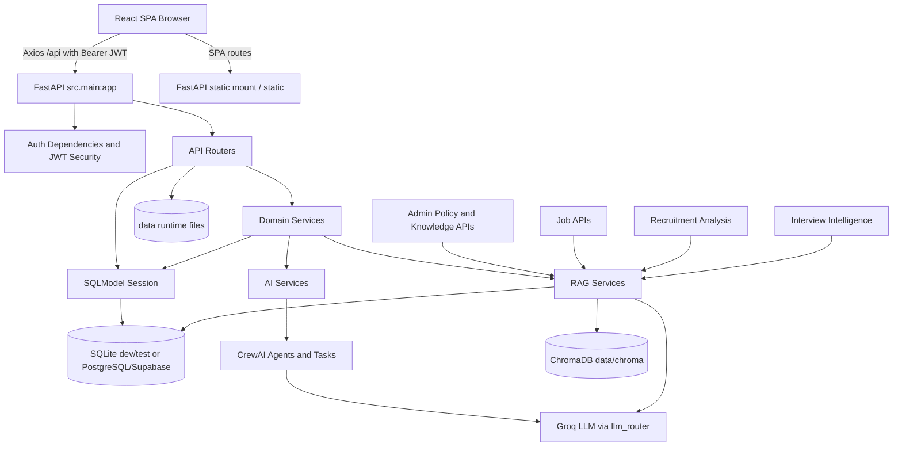
```mermaid
flowchart TB
    Browser[React SPA Browser] -->|Axios /api with Bearer JWT| FastAPI[FastAPI src.main:app]
    Browser -->|SPA routes| Static[FastAPI static mount / static]
    FastAPI --> Auth[Auth Dependencies and JWT Security]
    FastAPI --> Routers[API Routers]
    Routers --> Services[Domain Services]
    Routers --> Session[SQLModel Session]
    Services --> Session
    Session --> DB[(SQLite dev/test or PostgreSQL/Supabase)]
    Routers --> FileStore[(data runtime files)]
    Services --> AI[AI Services]
    AI --> CrewAI[CrewAI Agents and Tasks]
    CrewAI --> Groq[Groq LLM via llm_router]
    Services --> RAG[RAG Services]
    RAG --> Chroma[(ChromaDB data/chroma)]
    RAG --> DB
    RAG --> Groq
    Admin[Admin Policy and Knowledge APIs] --> RAG
    Jobs[Job APIs] --> RAG
    Recruitment[Recruitment Analysis] --> RAG
    Intelligence[Interview Intelligence] --> RAG
```

## End-to-End System Workflows

### Authentication Workflow

| Step | System Behavior | Implementation | Status |
| --- | --- | --- | --- |
| Register | Public registration creates a `User` with role `candidate`, hashes the password with bcrypt, commits the row, and returns a JWT. | `src/api/routes/auth.py`, `src/core/security.py` | Active |
| Login | Username is loaded, bcrypt verifies the password, resume existence is checked, and a JWT is returned with `sub`, `username`, `role`, and `exp`. | `auth.py`, `security.py` | Active |
| Frontend storage | Frontend auth state stores token and role; Axios attaches `Authorization: Bearer <token>`. | `frontend/src/store/authStore.js`, `frontend/src/api/axios.js` | Active |
| Protected frontend routes | `RoleGuard` redirects unauthenticated users to `/login` and sends unauthorized roles back to their default dashboards. | `frontend/src/App.jsx` | Active |
| Backend validation | `get_current_user` decodes JWT, loads the user, verifies active status, and ensures token role still matches database role. | `src/api/dependencies.py` | Active |
| Authorization | `require_roles()` enforces role access; `admin` bypasses role checks. | `dependencies.py` | Active |
| Logout | Frontend logout clears auth state; Axios also logs out automatically on HTTP 401 and redirects to `/login`. | `axios.js`, auth store | Active |
| Error handling | Invalid credentials return 401, duplicate registration returns 409, invalid/expired tokens return 401, insufficient roles return 403. | `auth.py`, `dependencies.py` | Active |

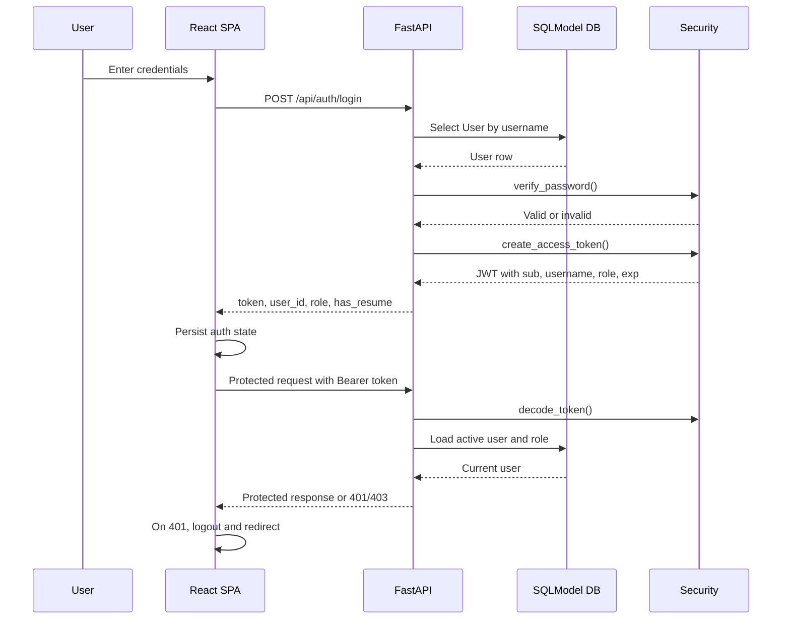
```mermaid
sequenceDiagram
    participant U as User
    participant SPA as React SPA
    participant API as FastAPI
    participant DB as SQLModel DB
    participant SEC as Security
    U->>SPA: Enter credentials
    SPA->>API: POST /api/auth/login
    API->>DB: Select User by username
    DB-->>API: User row
    API->>SEC: verify_password()
    SEC-->>API: Valid or invalid
    API->>SEC: create_access_token()
    SEC-->>API: JWT with sub, username, role, exp
    API-->>SPA: token, user_id, role, has_resume
    SPA->>SPA: Persist auth state
    SPA->>API: Protected request with Bearer token
    API->>SEC: decode_token()
    API->>DB: Load active user and role
    DB-->>API: Current user
    API-->>SPA: Protected response or 401/403
    SPA->>SPA: On 401, logout and redirect
```

### Recruitment Workflow

| Step | System Behavior | Implementation | Status |
| --- | --- | --- | --- |
| HR creates job | HR-only route creates `JobPosting` with status `OPEN`, creator id, and timestamp. | `src/api/routes/jobs.py` | Active |
| Job publishing | `OPEN` jobs are visible to candidates; archived jobs are hidden from candidates. Closed jobs remain visible but reject applications. | `jobs.py`, `applications.py` | Active |
| RAG job sync | Job create/update/close/archive upserts into `job_descriptions`; delete removes from RAG only when application history does not block deletion. | `RAGSyncService.sync_job`, `delete_job` | Active |
| Candidate application | Candidate submits a PDF to an open job. Duplicate candidate/job applications are rejected. | `applications.py` | Active |
| Resume upload in application | PDF is saved temporarily under `data/`, limited to 5 MB, parsed to text, then removed. | `applications._extract_resume_text` | Active |
| Application persistence | `CandidateApplication` stores candidate id, job id, resume text, timestamp, and status `Applied`. | `candidate_applications` | Active |
| AI screening | A FastAPI `BackgroundTasks` job runs `analyze_application` after the HTTP response. | `applications.py`, `recruitment_ai.py` | Active |
| CrewAI screening | Recruitment analyst agent and task run through `Crew(...).kickoff()` and must return JSON. | `agents/recruitment_analyst.py`, `tasks/recruitment_task.py` | Active |
| Fallback screening | If AI fails or returns invalid JSON, deterministic skill/experience scoring creates a completed fallback analysis. | `recruitment_ai._fallback_analysis` | Active |
| Candidate ranking | HR/manager ranking reads or generates analyses and sorts by fit score and recommendation rank. | `rank_applications_for_job` | Active |
| Interview execution | Candidate starts an interview from an application; one active or terminal interview per application is enforced. | `interview.py` | Active |
| Evaluation and reports | Answers are evaluated and persisted; completion enqueues hiring intelligence report generation. | `interview.py`, `hiring_intelligence.py` | Active |
| Hiring | HR changes candidate role to `employee`, creates/updates `Employee`, records lifecycle events, migrates documents, optionally assigns onboarding, and sends notifications. | `applications.hire_application` | Active |

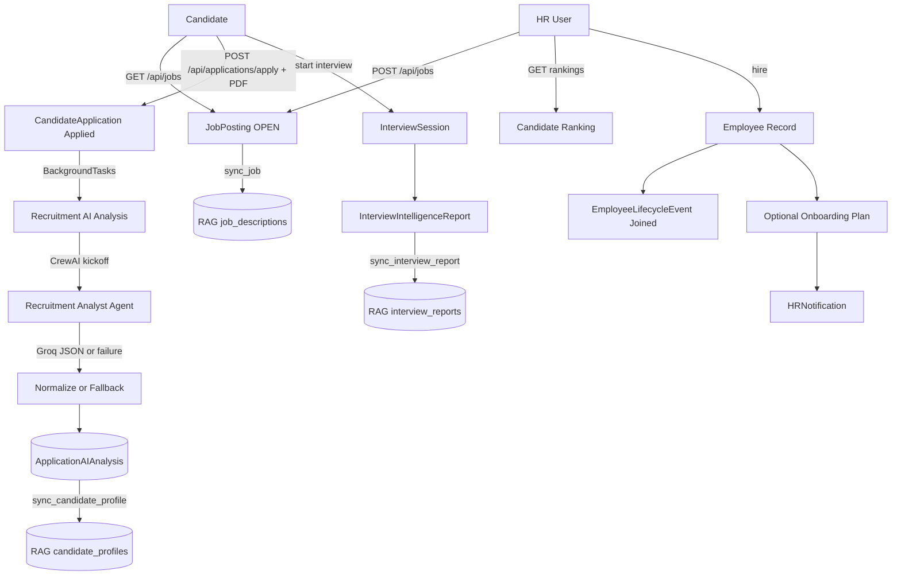
```mermaid
flowchart TD
    HR[HR User] -->|POST /api/jobs| Job[JobPosting OPEN]
    Job -->|sync_job| JobRAG[(RAG job_descriptions)]
    Candidate[Candidate] -->|GET /api/jobs| Job
    Candidate -->|POST /api/applications/apply + PDF| App[CandidateApplication Applied]
    App -->|BackgroundTasks| Analyze[Recruitment AI Analysis]
    Analyze -->|CrewAI kickoff| Analyst[Recruitment Analyst Agent]
    Analyst -->|Groq JSON or failure| Normalize[Normalize or Fallback]
    Normalize --> Analysis[(ApplicationAIAnalysis)]
    Analysis -->|sync_candidate_profile| CandidateRAG[(RAG candidate_profiles)]
    HR -->|GET rankings| Ranking[Candidate Ranking]
    Candidate -->|start interview| Interview[InterviewSession]
    Interview --> Report[InterviewIntelligenceReport]
    Report -->|sync_interview_report| ReportRAG[(RAG interview_reports)]
    HR -->|hire| Employee[Employee Record]
    Employee --> Lifecycle[EmployeeLifecycleEvent Joined]
    Employee --> Onboarding[Optional Onboarding Plan]
    Onboarding --> Notify[HRNotification]
```

### Resume Processing Workflow

| Step | System Behavior | Implementation | Status |
| --- | --- | --- | --- |
| Upload | Candidate uploads a PDF through `/api/resume/upload`. | `src/api/routes/resume.py` | Active |
| Validation | Only `.pdf` files are accepted; file size is limited to 5 MB; extracted text must contain at least 50 characters. | `resume.py`, `applications.py` | Active |
| Storage | Raw PDF is temporary in `data/`; persistent record stores extracted text, parsed JSON, analysis JSON, and applied-fix metadata. | `Resume` model | Active |
| Parsing | `parse_resume()` repairs extraction artifacts, identifies sections, and extracts skills, education, experience, projects, and summary. | `src/resume_lab.py` | Active |
| Cleaning and repair | Resume lab repairs spacing, bullets, dates, casing, and common PDF extraction issues. | `resume_lab.py` | Active |
| Analysis | `analyze_resume()` validates LLM output when available and otherwise produces deterministic fallback scoring and suggestions. | `resume_lab.py` | Active |
| Optimization | Resume optimization and bullet rewriting are implemented through CrewAI helpers in `crew.py` and tasks/agents. | `crew.py`, `agents/resume_optimizer.py`, `tasks/resume_task.py` | Active |
| Ranking | Application ranking uses application resume text plus job requirements through recruitment analysis. | `recruitment_ai.py` | Active |
| Database updates | Upload replaces or creates a single candidate resume row and resets stale analysis fields. | `resume.py` | Active |
| RAG synchronization | Standalone `/api/resume/upload` does not sync directly to RAG; application analysis syncs application resume and analysis into `candidate_profiles`. | `resume.py`, `RAGSyncService.sync_candidate_profile` | Partially Implemented |

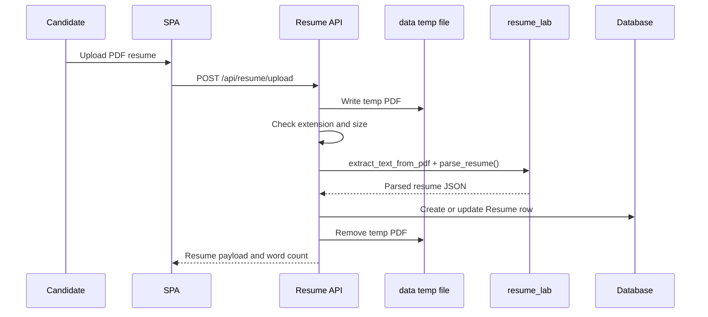
```mermaid
sequenceDiagram
    participant C as Candidate
    participant SPA as SPA
    participant API as Resume API
    participant FS as data temp file
    participant Parser as resume_lab
    participant DB as Database
    C->>SPA: Upload PDF resume
    SPA->>API: POST /api/resume/upload
    API->>FS: Write temp PDF
    API->>API: Check extension and size
    API->>Parser: extract_text_from_pdf + parse_resume()
    Parser-->>API: Parsed resume JSON
    API->>DB: Create or update Resume row
    API->>FS: Remove temp PDF
    API-->>SPA: Resume payload and word count
```

### Interview Workflow

| Step | System Behavior | Implementation | Status |
| --- | --- | --- | --- |
| Interview creation | Candidate starts an interview with an application id or resume context. Existing active sessions are resumed; completed application sessions block repeats. | `interview.start_interview` | Active |
| Question generation | First question is deterministic. Later questions use phase-aware deterministic safeguards and optional CrewAI/fallback helpers in interview core/legacy crew paths. | `interview.py`, `interview_core.py`, `crew.py` | Active |
| Session creation | `InterviewSession` stores token, role, difficulty, status, messages, personalization context, and application id when present. | `interview_sessions` | Active |
| Claim verification | Resume claims are extracted and tracked in personalization context; follow-up depth is limited before a claim is marked verified. | `interview.py`, `interview_consistency.py` | Active |
| Follow-up generation | Next questions are selected based on phase, previous answers, weak areas, duplicate checks, training mode, and fallback progressions. | `interview.py`, `interview_core.py` | Active |
| Scoring | Answer evaluation updates scores, average score, phase metadata, and feedback entries hidden from candidates. | `interview.py` | Active |
| Proctoring | `/api/interview/{session_id}/violation` records violations; three violations cancel the session and notify HR. | `interview.py` | Active |
| Transcription | `/api/interview/transcribe` writes audio temporarily, calls Groq Whisper, retries turbo fallback, caches by content hash, and returns metadata. | `transcription_service.py` | Active |
| Completion | Required deterministic phase turns must be complete before explicit completion; automatic completion enqueues hiring intelligence. | `interview.py` | Active |
| Summary/report generation | `compile_hiring_intelligence()` creates `InterviewIntelligenceReport`, stores summary fields, and syncs report to RAG. | `hiring_intelligence.py` | Active |
| Persistence | Live state is mirrored in memory and persisted back to `InterviewSession`; terminal intelligence persists in a separate report table. | `interview.py`, `interview_core.py` | Active |

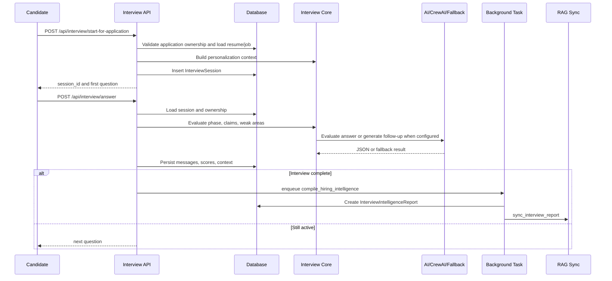
```mermaid
sequenceDiagram
    participant C as Candidate
    participant API as Interview API
    participant DB as Database
    participant Core as Interview Core
    participant AI as AI/CrewAI/Fallback
    participant BG as Background Task
    participant RAG as RAG Sync
    C->>API: POST /api/interview/start-for-application
    API->>DB: Validate application ownership and load resume/job
    API->>Core: Build personalization context
    API->>DB: Insert InterviewSession
    API-->>C: session_id and first question
    C->>API: POST /api/interview/answer
    API->>DB: Load session and ownership
    API->>Core: Evaluate phase, claims, weak areas
    Core->>AI: Evaluate answer or generate follow-up when configured
    AI-->>Core: JSON or fallback result
    API->>DB: Persist messages, scores, context
    alt Interview complete
        API->>BG: enqueue compile_hiring_intelligence
        BG->>DB: Create InterviewIntelligenceReport
        BG->>RAG: sync_interview_report
    else Still active
        API-->>C: next question
    end
```

### Employee Lifecycle

| Process | System Behavior | Implementation | Status |
| --- | --- | --- | --- |
| Hiring | HR hire converts a candidate user to `employee`, creates or updates `Employee`, and marks application `Hired`. | `applications.hire_application` | Active |
| Onboarding | HR manages templates/tasks/required documents and assigns onboarding plans; hiring can auto-assign a matching active template by department. | `onboarding.py`, `applications.py` | Active |
| Department assignment | Employee records can hold department/designation strings and ids; department APIs manage active department records. | `employees.py`, `departments.py` | Active |
| Training | HR creates programs, assigns training, employees update progress, completion creates notifications/events. | `training.py` | Active |
| Attendance | Employees check in/out once per day and list attendance history. | `employees.py` | Active |
| Salary | HR can add salary revisions and retrieve employee salary history. Full payroll generation is not present. | `salary.py` | Partially Implemented |
| Promotion | HR records promotion history and recent promotion lists. | `promotions.py` | Active |
| Profile | Candidate and employee profiles, documents, downloads, and HR review decisions are implemented. | `profile.py` | Active |
| Notifications | User notifications list, mark-one-read, and mark-all-read are implemented. | `notifications.py` | Active |
| Termination | No termination endpoint or state transition was found. Lifecycle events can record arbitrary event types, but termination workflow is not implemented. | `lifecycle.py` | Not Implemented |

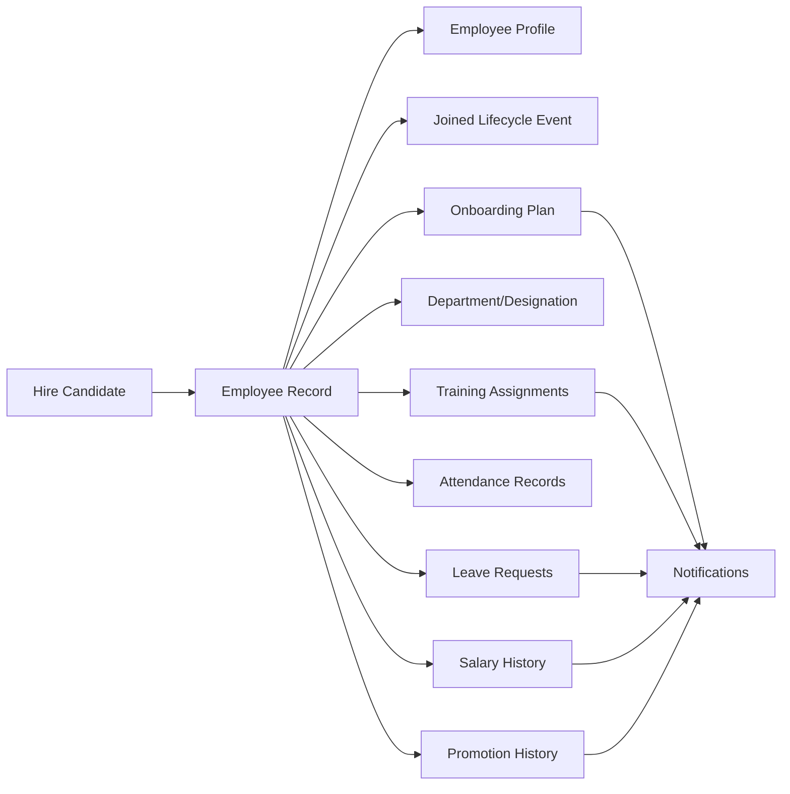
```mermaid
flowchart LR
    Hire[Hire Candidate] --> Emp[Employee Record]
    Emp --> Profile[Employee Profile]
    Emp --> Lifecycle[Joined Lifecycle Event]
    Emp --> Onboard[Onboarding Plan]
    Emp --> Dept[Department/Designation]
    Emp --> Training[Training Assignments]
    Emp --> Attendance[Attendance Records]
    Emp --> Leave[Leave Requests]
    Emp --> Salary[Salary History]
    Emp --> Promotion[Promotion History]
    Onboard --> Notify[Notifications]
    Training --> Notify
    Leave --> Notify
    Salary --> Notify
    Promotion --> Notify
```

### HR Operations Workflow

| Operation | System Behavior | Status |
| --- | --- | --- |
| Employee management | HR/admin list employees, view details, update profiles, and access directory records. | Active |
| Department management | HR creates, updates, and deactivates departments. | Active |
| Designation management | HR creates, updates, and archives designations. | Active |
| Leave management | Employees submit leave; HR/manager/admin list and decide leave requests. | Active |
| Payroll | Salary revision history exists; payroll runs, payslips, and payment processing are absent. | Partially Implemented |
| Salary revisions | HR creates salary history entries and HR notifications. | Active |
| Ticket management | Employees create tickets; HR/manager/admin list, assign, and update status. | Active |
| Knowledge management | Admin creates, updates, deletes, and reindexes policy and categorized knowledge files. | Active |
| Administration | Admin lists/updates users and manages RAG-backed policy/knowledge content. | Active |

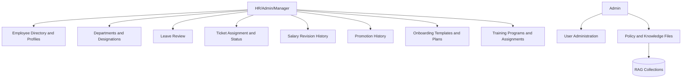
```mermaid
flowchart TD
    HR[HR/Admin/Manager] --> Employees[Employee Directory and Profiles]
    HR --> Org[Departments and Designations]
    HR --> Leave[Leave Review]
    HR --> Tickets[Ticket Assignment and Status]
    HR --> Salary[Salary Revision History]
    HR --> Promotions[Promotion History]
    HR --> Onboarding[Onboarding Templates and Plans]
    HR --> Training[Training Programs and Assignments]
    Admin[Admin] --> Users[User Administration]
    Admin --> Knowledge[Policy and Knowledge Files]
    Knowledge --> RAG[(RAG Collections)]
```

### RAG Workflow

RAG is implemented. It combines manually ingested company documents, automatic synchronization from HRMS business entities, role-filtered retrieval, database-aware query routing, and answer generation.

| Step | System Behavior | Implementation | Status |
| --- | --- | --- | --- |
| Knowledge ingestion | Files are extracted from `.txt`, `.pdf`, and `.docx`; company docs ingestion scans `.txt` and `.md` under `data/company_docs`. | `IngestionService`, `CompanyDocsIngestionService` | Active |
| Company documents | `policies` sync to `company_policies`; `onboarding` and `training` sync to `employee_knowledge`. | `company_docs_ingestion.py` | Active |
| Policies/knowledge admin | Admin writes policy and knowledge markdown/text files and reindexes them through RAG services. | `admin.py` | Active |
| Chunking | Text is normalized into overlapping chunks using configurable chunk size and overlap. | `ingestion_service.py` | Active |
| Embedding | Default provider is deterministic hash embeddings; OpenAI embeddings are used only when `RAG_EMBEDDING_PROVIDER=openai` and `OPENAI_API_KEY` exists. | `embedding_service.py` | Active |
| Storage | ChromaDB persistent client stores collections under `RAG_CHROMA_PATH` or `data/chroma`. | `chroma_service.py` | Active |
| Retrieval | Query embeddings search selected collections, merge matches, sort by distance, and return top context and sources. | `retrieval_service.py` | Active |
| Access filtering | Candidates can access open jobs and their own candidate/interview records; employees get policies and employee knowledge; HR/admin/manager get all default collections. | `access_control.py` | Active |
| Prompt assembly | Chat service trims combined database and retrieved context to `RAG_MAX_CONTEXT_CHARS`. | `chat_service.py` | Active |
| Response generation | Groq/LiteLLM answer generation runs when configured; otherwise extractive answer selection is used. | `chat_service.py` | Active |
| Synchronization | Jobs, candidate application analyses, and interview intelligence reports sync into RAG. | `sync_service.py` | Active |
| Administration | RAG admin operations exist for policy and knowledge documents. There is no separate vector dashboard UI beyond current admin endpoints/pages. | `admin.py`, frontend admin page | Partially Implemented |

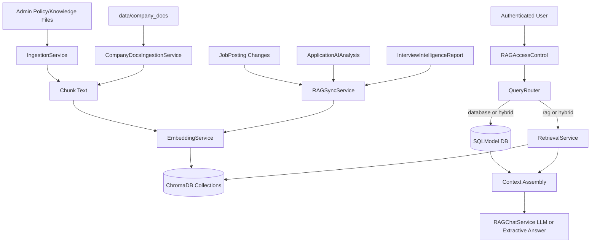
```mermaid
flowchart TB
    AdminDocs[Admin Policy/Knowledge Files] --> Ingest[IngestionService]
    CompanyDocs[data/company_docs] --> CompanyIngest[CompanyDocsIngestionService]
    Jobs[JobPosting Changes] --> Sync[RAGSyncService]
    Analyses[ApplicationAIAnalysis] --> Sync
    Reports[InterviewIntelligenceReport] --> Sync
    Ingest --> Chunk[Chunk Text]
    CompanyIngest --> Chunk
    Chunk --> Embed[EmbeddingService]
    Sync --> Embed
    Embed --> Chroma[(ChromaDB Collections)]
    User[Authenticated User] --> Access[RAGAccessControl]
    Access --> Router[QueryRouter]
    Router -->|database or hybrid| DB[(SQLModel DB)]
    Router -->|rag or hybrid| Retrieval[RetrievalService]
    Retrieval --> Chroma
    DB --> Context[Context Assembly]
    Retrieval --> Context
    Context --> Answer[RAGChatService LLM or Extractive Answer]
```

### CrewAI Execution Flow

| Stage | System Behavior | Status |
| --- | --- | --- |
| Agent creation | Agent factory modules call `get_llm()` and create role-specific CrewAI agents. | Active |
| Task creation | Task factory modules build prompts for recruitment analysis, resume optimization, job matching, and interview helpers. | Active |
| Crew execution | Services construct `Crew(agents=[...], tasks=[...], verbose=False)` and call `kickoff()`. | Active |
| Prompt flow | Domain data is serialized into task context; JSON is expected for structured workflows. | Active |
| LLM calls | `llm_router.get_llm()` configures Groq-backed CrewAI LLM routing. | Active |
| Result processing | Raw results are parsed, validated, normalized, clamped, and persisted. | Active |
| Fallback logic | Recruitment, resume analysis, hiring intelligence, interview follow-up, and RAG answering all have fallback behavior when LLM output is unavailable or invalid. | Active |

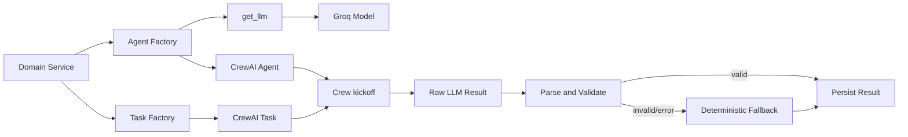
```mermaid
flowchart LR
    Service[Domain Service] --> AgentFactory[Agent Factory]
    Service --> TaskFactory[Task Factory]
    AgentFactory --> Router[get_llm]
    Router --> Groq[Groq Model]
    AgentFactory --> Agent[CrewAI Agent]
    TaskFactory --> Task[CrewAI Task]
    Agent --> Crew[Crew kickoff]
    Task --> Crew
    Crew --> Raw[Raw LLM Result]
    Raw --> Parse[Parse and Validate]
    Parse -->|valid| Persist[Persist Result]
    Parse -->|invalid/error| Fallback[Deterministic Fallback]
    Fallback --> Persist
```

## Data Flow Architecture

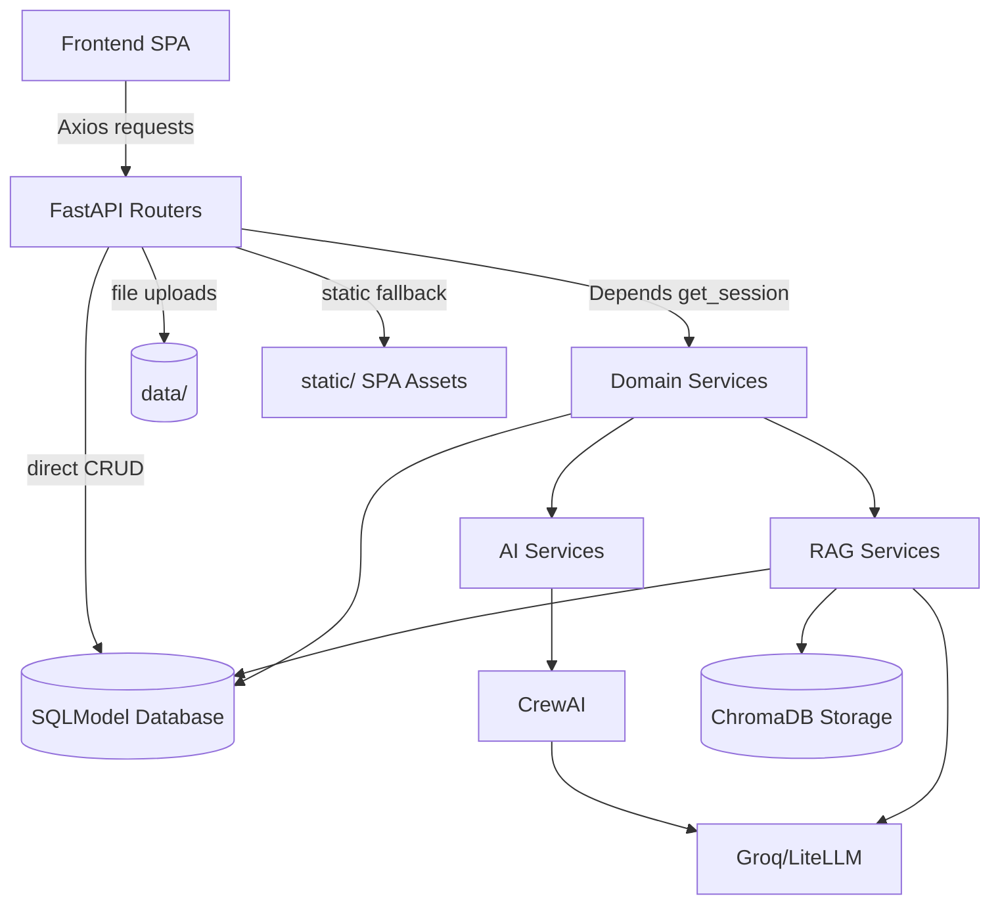
```mermaid
flowchart TD
    Frontend[Frontend SPA] -->|Axios requests| Backend[FastAPI Routers]
    Backend -->|Depends get_session| Services[Domain Services]
    Backend -->|direct CRUD| Database[(SQLModel Database)]
    Services --> Database
    Backend -->|file uploads| Storage[(data/)]
    Services --> AI[AI Services]
    AI --> CrewAI[CrewAI]
    CrewAI --> LLM[Groq/LiteLLM]
    Services --> RAG[RAG Services]
    RAG --> Chroma[(ChromaDB Storage)]
    RAG --> Database
    RAG --> LLM
    Backend -->|static fallback| Static[static/ SPA Assets]
```

| Interaction | Data Passed | Notes |
| --- | --- | --- |
| Frontend -> Backend | JSON, multipart PDFs/audio, Bearer JWT | Axios timeout is 60 seconds; GET cache is 30 seconds except interview polling. |
| Backend -> Database | SQLModel sessions and model rows | Sessions are dependency-scoped except background tasks that create a new session. |
| Backend -> Storage | Temporary PDFs/audio, Chroma files, CrewAI storage | Uploaded PDFs/audio are removed after extraction/transcription paths complete. |
| Backend -> AI | Resume text, job data, interview messages, employee context | AI calls are normalized and wrapped in fallback behavior. |
| AI -> CrewAI | Agent/task prompts and model routing | CrewAI storage is isolated under `data/.crewai_storage`. |
| Services -> RAG | Entity text, metadata, embeddings | Jobs, applications, and reports sync after state changes. |
| RAG -> Database | Live metrics and role-specific personal context | `QueryRouter` can use database-only or hybrid context. |

## Component Interaction Diagrams

### Frontend <-> Backend

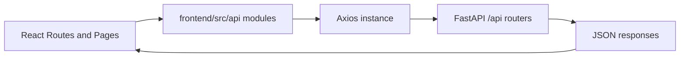
```mermaid
flowchart LR
    SPA[React Routes and Pages] --> APIClients[frontend/src/api modules]
    APIClients --> Axios[Axios instance]
    Axios --> FastAPI[FastAPI /api routers]
    FastAPI --> JSON[JSON responses]
    JSON --> SPA
```

### Backend <-> Database

```mermaid
flowchart LR
    Router[FastAPI Router] --> Session[get_session dependency]
    Session --> Engine[SQLModel Engine]
    Engine --> DB[(SQLite or PostgreSQL)]
    Startup[FastAPI lifespan] --> Migrations[create_db_and_tables + _ensure_*]
    Migrations --> Engine
```

### Backend <-> AI and CrewAI

```mermaid
flowchart LR
    Route[API Route] --> Service[AI Service]
    Service --> Agent[Agent Factory]
    Service --> Task[Task Factory]
    Agent --> Crew[CrewAI Crew]
    Task --> Crew
    Crew --> LLM[Groq via llm_router]
    Service --> Fallback[Fallback Scoring/Generation]
```

### Backend <-> RAG and Database <-> RAG

```mermaid
flowchart LR
    JobAPI[Jobs API] --> Sync[RAGSyncService]
    RecruitAI[Recruitment AI] --> Sync
    HiringIntel[Hiring Intelligence] --> Sync
    Sync --> Chroma[(Chroma Collections)]
    ChatAPI[/api/rag/chat] --> Access[RAGAccessControl]
    Access --> QueryRouter[QueryRouter]
    QueryRouter --> DB[(Database)]
    QueryRouter --> Retrieval[RetrievalService]
    Retrieval --> Chroma
```

### Frontend <-> Authentication, Interview, Resume, and HR Dashboard

```mermaid
flowchart TD
    Login[LoginPage] --> AuthAPI[auth.js]
    AuthAPI --> AuthRouter[/api/auth]
    Candidate[CandidateDashboard] --> ResumeAPI[resume.js]
    ResumeAPI --> ResumeRouter[/api/resume]
    InterviewPage[InterviewPage] --> InterviewAPI[interview.js]
    InterviewAPI --> InterviewRouter[/api/interview]
    HRDashboard[HRDashboard] --> HRClients[jobs/applications/employees/etc.]
    HRClients --> HRRouters[HR and Operations Routers]
```

## Deployment Architecture

| Area | Implementation | Status |
| --- | --- | --- |
| Frontend deployment | `frontend/npm run build` emits assets into `../static` through Vite `outDir`. FastAPI serves `static/` at `/`. | Active |
| Frontend dev server | `npm run dev` runs Vite on port 5173 and proxies `/api` to `http://127.0.0.1:8000`. | Active |
| Backend deployment | Uvicorn serves `src.main:app`; Docker command binds `0.0.0.0` and uses `${PORT:-8000}` with `${WEB_CONCURRENCY:-2}`. | Active |
| Database | `DATABASE_URL` is required. SQLite is supported for dev/test; PostgreSQL/Supabase is expected for production. | Active |
| Supabase | Environment variables are defined for Supabase URL, anon key, service role, and PostgreSQL connection. | Active |
| SQLite compatibility | Engine uses `check_same_thread=False`, timeout, and startup schema creation/migrations. Tests override `DATABASE_URL` to isolated SQLite files. | Active |
| Storage | Docker creates `/app/data`; local runtime writes `data/` for temporary uploads, Chroma, and CrewAI storage. | Active |
| ChromaDB | Persistent local client uses `RAG_CHROMA_PATH` or `data/chroma`. | Active |
| CrewAI | Storage and telemetry/tracking are configured at import/startup; appdirs points to `data/.crewai_storage`. | Active |
| Environment variables | `SECRET_KEY`, `DATABASE_URL`, `GROQ_API_KEY`, `MODEL_NAME`, RAG settings, DB pool settings, CORS and debug settings are read through Pydantic settings or services. | Active |
| Docker | Multi-stage Python 3.10 image installs dependencies into a venv, copies backend/source/static, runs as non-root `talentforge_user`. | Active |
| Render | `render.yaml` deploys the Docker web service and defines health check `/api/health`. | Active |
| Vercel | `vercel.json` serves existing `static/` files as a static SPA. API routes still require a separate backend deployment. | Partially Implemented |
| Ports | Backend defaults to 8000; Vite dev uses 5173; docker-compose PostgreSQL exposes 5432. | Active |
| Build commands | Frontend build: `cd frontend && npm run build`. Backend container build: `docker build`. | Active |
| Runtime commands | Local backend: `uvicorn src.main:app --reload --host 127.0.0.1 --port 8000`; Docker CMD uses Uvicorn workers. | Active |
| Static assets | Static SPA fallback returns `index.html` for non-API, non-docs 404 paths. | Active |

```mermaid
flowchart TB
    DevBrowser[Developer Browser] -->|5173 dev| Vite[Vite Dev Server]
    Vite -->|proxy /api| LocalAPI[Uvicorn 127.0.0.1:8000]
    LocalAPI --> LocalDB[(SQLite or local PostgreSQL)]
    LocalAPI --> LocalData[(data/)]
    UserBrowser[Production Browser] --> Render[Render Docker Web Service]
    Render --> Uvicorn[Uvicorn src.main:app]
    Uvicorn --> Static[static/ built SPA]
    Uvicorn --> Supabase[(Supabase/PostgreSQL DATABASE_URL)]
    Uvicorn --> Data[(Container /app/data)]
    Data --> Chroma[(data/chroma)]
    Uvicorn --> Groq[Groq API]
    Vercel[Vercel Static Hosting] --> StaticOnly[static/ SPA only]
    StaticOnly -. requires separate API .-> Render
```

## Scalability Analysis

| Topic | Current Architecture | Status / Limitation |
| --- | --- | --- |
| Horizontal scalability | Docker/Uvicorn can run multiple workers in one container and platform replicas can be added externally. | Partially Implemented; in-memory interview `_sessions` are process-local and not shared across workers. |
| Vertical scalability | DB pool settings and Uvicorn workers are configurable. | Active |
| Database scalability | PostgreSQL/Supabase supported with pool size, max overflow, timeout, pre-ping, and recycle. | Active; startup schema mutation is best suited to controlled deployments. |
| AI scalability | AI work is synchronous inside services except selected FastAPI background tasks. | Partially Implemented; no durable queue or rate limiter is implemented. |
| CrewAI scalability | CrewAI calls run per request/background task and use local storage isolation. | Partially Implemented; no distributed job queue. |
| RAG scalability | Chroma is persistent local storage. | Partially Implemented; local Chroma is not a shared managed vector service. |
| File storage scalability | Uploads use local temp files and local `data/`. | Partially Implemented; no object storage backend. |
| Deployment limitations | Render Docker supports backend and static SPA together; Vercel config serves frontend only. | Active limitation |
| Single points of failure | Database, local Chroma path, Groq API availability, and local container storage are single points in current implementation. | Active limitation |
| Bottlenecks | LLM latency, transcription latency, Chroma local I/O, database startup migrations, and process-local interview state are the main bottlenecks. | Active limitation |

## Performance Architecture

| Area | Implementation | Status |
| --- | --- | --- |
| Frontend caching | Axios caches GET responses for 30 seconds, excluding interview session polling. | Active |
| Frontend lazy loading | Route pages are loaded with `React.lazy` and `Suspense`; Vite manual chunks split major vendors. | Active |
| Static assets | FastAPI uses GZip middleware for responses >= 512 bytes and serves built hashed assets. | Active |
| Database access | SQLModel sessions are short-lived; PostgreSQL pool settings use conservative defaults and pre-ping. | Active |
| Connection pooling | `DB_POOL_SIZE`, `DB_MAX_OVERFLOW`, and `DB_POOL_TIMEOUT` are configurable. | Active |
| AI latency | Recruitment application analysis and interview intelligence report generation are queued as FastAPI background tasks in key flows. | Active |
| RAG latency | Retrieval is top-k over selected Chroma collections; context is trimmed before answer generation. | Active |
| Transcription latency | Transcription logs performance metrics and retries with a fallback Whisper model. | Active |
| Potential bottlenecks | Long-running LLM calls, local vector store, no durable background queue, in-memory interview state, and repeated report compilation under load. | Active limitation |

## Error Handling Architecture

| Area | Implementation | Status |
| --- | --- | --- |
| Frontend errors | Axios rejects API errors, auto-logs out on 401, and redirects to `/login`; pages use toast notifications where implemented. | Active |
| Backend HTTP errors | Routes raise `HTTPException` for validation, not found, conflict, unauthorized, and forbidden states. | Active |
| Global exception handlers | `src.main` registers handlers for Starlette HTTP exceptions and request validation errors. | Active |
| Validation | Pydantic request models enforce lengths, field constraints, and forbidden extras where defined. | Active |
| AI failures | Recruitment, resume analysis, hiring intelligence, interview question/evaluation, and RAG answers fall back to deterministic or extractive behavior. | Active |
| CrewAI failures | CrewAI exceptions are caught in service layers and converted to fallback payloads or warnings. | Active |
| Database failures | Some transactional flows rollback and return conflict errors; startup migrations log warnings if best-effort steps fail. | Partially Implemented |
| RAG failures | RAG chat returns database context if available, otherwise a temporary-unavailable answer; sync failures log warnings and do not block primary job/application operations. | Active |
| Recovery strategies | Retrying analysis endpoints, reindexing policy/knowledge files, app restart for process-local interview state, and rerunning startup migrations are available operational recovery paths. | Partially Implemented |

## Operational Architecture

| Stage | Behavior | Implementation |
| --- | --- | --- |
| Import-time setup | Console encoding is set to UTF-8 where possible; known broken local proxy variables are removed. | `src/main.py` |
| Configuration loading | Pydantic settings read `.env`, allow extra variables, validate production `SECRET_KEY`, and normalize debug values. | `src/config.py` |
| CrewAI initialization | CrewAI storage env vars are set and `appdirs.user_data_dir` is redirected to `data/.crewai_storage`. | `src/main.py` |
| App creation | FastAPI app defines docs at `/api/docs`, Redoc at `/api/redoc`, middleware, exception handlers, health check, routers, and static mount. | `src/main.py` |
| Startup sequence | Lifespan logs startup and calls `create_db_and_tables()`. | `src/main.py` |
| Database initialization | SQLModel metadata creates tables when enabled; idempotent `_ensure_*` functions add columns/tables/indexes and bootstrap default admin. | `connection.py` |
| Service initialization | RAG, AI, and other services are mostly instantiated per request or helper call. Chroma initializes collections when service instances are created. | `src/services/*` |
| Runtime lifecycle | Requests pass through CORS/GZip, dependency auth/session injection, router logic, services, DB/RAG/AI, and response serialization. | `src/main.py`, routers |
| Shutdown | Lifespan logs shutdown; no custom draining, queue shutdown, or connection close hook is implemented. | Partially Implemented |

## Integration Matrix

| Business Module | Frontend Modules | Backend Routers | Services | Database Tables | AI Services | CrewAI Agents / Tasks | Status |
| --- | --- | --- | --- | --- | --- | --- | --- |
| Authentication | `LoginPage`, auth store, Axios | `auth.py`, dependencies | `security.py` | `users` | None | None | Active |
| Jobs | HR/candidate dashboards, jobs API | `jobs.py` | `RAGSyncService` | `job_postings`, `candidate_applications` | None | Job matching helpers in legacy `crew.py` | Active |
| Applications | Candidate/HR dashboards, applications API | `applications.py` | `recruitment_ai.py`, resume parser, RAG sync | `candidate_applications`, `application_ai_analyses`, `employees`, profiles/docs/onboarding tables | Recruitment AI | `recruitment_analyst`, `recruitment_task` | Active |
| Resume Lab | Candidate dashboard, resume API | `resume.py` | `resume_lab.py`, `utils/resume_parser.py` | `resumes` | Resume analysis fallback/LLM validation | `resume_optimizer`, `resume_task`, `crew.py` | Active |
| Interview | `InterviewPage`, interview components/hooks/API | `interview.py` | `interview_core.py`, `interview_consistency.py`, `transcription_service.py`, `hiring_intelligence.py` | `interview_sessions`, `candidate_credibility_reports`, `interview_intelligence_reports`, `career_coach_memory` | Interview evaluation, transcription, intelligence | `interview_coach`, `interview_task`, `crew.py` | Active |
| Mock Interview | `MockInterviewPage`, mock components/API | `mock_interview.py` | `mock_interview_summary.py`, interview core helpers | `mock_interview_sessions` | Mock interview AI/fallback | Interview agents reused indirectly | Active |
| Employees | Employee/HR/manager dashboards, employee API | `employees.py` | `employee_ai.py`, RAG chat service | `employees`, `attendance_records`, `leave_requests`, `skill_gap_analyses` | Skill gap, HR assistant | None detected | Active |
| Departments | HR dashboard department tab/API | `departments.py` | None direct | `departments`, employee references | None | None | Active |
| Designations | HR dashboard designation tab/API | `designations.py` | None direct | `designations`, employee references | None | None | Active |
| Lifecycle | HR employee views/API | `lifecycle.py` | Notification helpers | `employee_lifecycle_events`, `hr_notifications` | None | None | Active |
| Tickets | Ticket modal/dashboard/API | `tickets.py` | Notification helpers | `employee_tickets`, `hr_notifications` | None | None | Active |
| Salary | Salary modal/API | `salary.py` | Notification helpers | `salary_history`, `employees`, `hr_notifications` | None | None | Partially Implemented |
| Promotions | Promotion dashboard/modal/API | `promotions.py` | Notification helpers | `promotion_history`, `employees`, `hr_notifications` | None | None | Active |
| Notifications | Notification drawer/API | `notifications.py` | None direct | `hr_notifications` | None | None | Active |
| Onboarding | Onboarding hub/API | `onboarding.py` | Notification helpers | `onboarding_templates`, `onboarding_tasks`, `employee_onboarding`, `employee_onboarding_tasks`, `onboarding_required_documents` | None | None | Active |
| Training | Training hub/API | `training.py` | Notification helpers | `training_programs`, `training_assignments`, `hr_notifications` | None | None | Active |
| Profiles/Documents | Profile widgets, document modal/API | `profile.py` | File storage helpers | `candidate_profiles`, `employee_profiles`, `candidate_documents`, `employee_documents` | None | None | Active |
| RAG Assistant | `AssistantPage`, rag API | `rag.py`, `admin.py` | RAG access, retrieval, ingestion, sync, chat, query router | Live DB tables plus Chroma collections | LLM answer generation with extractive fallback | None | Active |
| Administration | Admin dashboard/API | `admin.py` | RAG ingestion/reindex helpers | `users`; filesystem policy/knowledge docs; Chroma | RAG answer path only | None | Active |
| Dashboard/Analytics | Role dashboards, charts | `dashboard.py`, multiple module routers | Hiring intelligence and aggregate queries | Cross-module tables | Stored AI analyses/reports | None direct | Active |

## Architecture Statistics

| Metric | Count / Value |
| --- | --- |
| Architecture diagrams created in Phase 4 | 1 overall architecture diagram |
| Workflow diagrams created in Phase 4 | 5 flowcharts for recruitment, employee lifecycle, HR operations, RAG, and CrewAI execution |
| Sequence diagrams created in Phase 4 | 3 sequence diagrams for authentication, resume processing, and interview |
| Data flow diagrams created in Phase 4 | 1 primary data flow diagram |
| Deployment diagrams created in Phase 4 | 1 deployment architecture diagram |
| Interaction diagrams created in Phase 4 | 5 component interaction diagrams |
| Business workflows documented | Authentication, recruitment, resume processing, interview, employee lifecycle, HR operations, RAG, CrewAI |
| Subsystems documented | Frontend, backend, database, storage, auth, AI, CrewAI, RAG, deployment, scalability, performance, error handling, operations |

## Cross Verification

| Verification Item | Result |
| --- | --- |
| Authentication workflow | Verified against `auth.py`, `dependencies.py`, `security.py`, `axios.js`, and `App.jsx`. |
| Recruitment workflow | Verified against `jobs.py`, `applications.py`, `recruitment_ai.py`, RAG sync service, and models. |
| Resume workflow | Verified against `resume.py`, `resume_lab.py`, and `utils/resume_parser.py`; standalone resume RAG sync marked partially implemented. |
| Interview workflow | Verified against `interview.py`, `interview_core.py`, `interview_consistency.py`, `transcription_service.py`, and `hiring_intelligence.py`. |
| Employee lifecycle | Verified against hiring code in `applications.py` and lifecycle/onboarding/training/salary/promotions/profile routers. Termination marked not implemented. |
| HR operations | Verified against employees, departments, designations, leave, tickets, salary, promotions, onboarding, training, profile, notifications, and admin routers. |
| RAG architecture | Verified against `src/services/rag/*`, `/api/rag/chat`, `admin.py`, `jobs.py`, `recruitment_ai.py`, and `hiring_intelligence.py`. |
| CrewAI architecture | Verified against `agents/`, `tasks/`, `src/services/recruitment_ai.py`, `src/services/llm_router.py`, and `crew.py`. |
| Deployment | Verified against `Dockerfile`, `render.yaml`, `vercel.json`, `docker-compose.yml`, `frontend/vite.config.js`, and `src/main.py`. |
| Earlier phase correction | Phase 1 described default CORS as allowing only localhost/127.0.0.1 on port 8000; verified in `src/config.py`. Vite dev proxy on port 5173 works through same-origin Vite proxy, not direct CORS. |
| Planned features | No planned-only workflow is documented as implemented. Payroll breadth, termination, static-only Vercel hosting, and standalone resume RAG sync are explicitly marked with limited statuses. |


---

# Phase 5 - Final Verification, Security Audit, and Documentation Certification

## Final Verification Summary

| Verification Area | Result | Evidence |
| --- | --- | --- |
| Repository structure | Verified against current file tree. | `rg --files`, `frontend/src`, `src`, `agents`, `tasks`, `tests`, `scripts` |
| Mounted backend routers | 21 mounted routers verified. | `src/main.py` includes `auth` through `admin` routers. |
| Router endpoints | 134 router-decorated endpoints plus hidden `/api/health`. | `rg "^@router\." src/api/routes` and `src/main.py` |
| Database tables | 34 SQLModel table classes verified. | `src/models/__init__.py` |
| Frontend pages | 19 page files verified. | `frontend/src/pages/**/*.jsx` |
| Frontend routes | 29 React `<Route path=...>` entries verified. | `frontend/src/App.jsx` |
| Frontend components | 38 component files verified. | `frontend/src/components/**/*.jsx` |
| Hooks, stores, contexts | 2 hooks, 2 stores, 1 context verified. | `frontend/src/hooks`, `frontend/src/store`, `frontend/src/context` |
| API clients | 23 frontend API files verified. | `frontend/src/api` |
| AI/CrewAI assets | 5 agent files, 5 task files, 8 agent factory functions, 11 task factory functions verified. | `agents/*.py`, `tasks/*.py` |
| Service modules | 18 non-`__init__` service files verified. | `src/services/**/*.py` |
| Deployment assets | Dockerfile, Render config, Vercel static config, Docker Compose, Vite build config verified. | Root deployment files and `frontend/vite.config.js` |
| Documentation corrections applied | Cover metadata updated, auth endpoint rows corrected to Public, `decode_access_token` corrected to `decode_token`. | `PROJECT_DOCUMENTATION.md` |

## Security Audit

| Security Area | Implemented Protections | Potential Weaknesses / Known Limitations | Status |
| --- | --- | --- | --- |
| Authentication | bcrypt password hashing; JWT HS256 creation and decode; 7-day token expiry; frontend expiration check on stored token. | Tokens are stored in `localStorage`, so browser-side XSS would expose them. No refresh-token rotation is implemented. | Partially Implemented |
| Authorization / RBAC | `HTTPBearer`, `get_current_user`, `require_roles`, active-user check, token role/database role match, admin role bypass. | Some endpoints use broad `get_current_user` and perform object access checks locally; continued review is needed when adding endpoints. | Active |
| Password handling | Registration hashes passwords; login verifies bcrypt hash and handles malformed hashes. | Startup migration bootstraps or resets default `admin/admin123` in `create_db_and_tables()`, including non-debug deployments unless code is changed or the user already exists. | Weakness Identified |
| JWT handling | JWT contains `sub`, `username`, `role`, and `exp`; production settings reject weak `SECRET_KEY` for non-sqlite/non-test modes. | No token revocation list; role changes invalidate old tokens only because token role must match database role. | Partially Implemented |
| Input validation | Pydantic models enforce many string length and enum-like constraints; route-level guards return explicit HTTP errors. | Several admin filename path parameters are not re-sanitized on update/delete/reindex; create paths use `_safe_filename`. | Partially Implemented |
| SQL injection | Query construction uses SQLModel/select for runtime CRUD; migration SQL is static or uses fixed column/table names. | No user-controlled raw SQL path was found in routers/services reviewed. | Active |
| IDOR | Candidate application interview start verifies application ownership; document download checks owner or HR/admin; RAG candidate filters apply `user_id`. | Employee profile endpoints using generic `get_current_user` rely on local checks and should be reviewed when expanded. | Active with Review Needed |
| Prompt injection | RAG answer prompt instructs the model to answer only from provided context; RAG access control limits collections. | No prompt-injection sanitizer or policy classifier was found for user queries or ingested admin knowledge. | Known Limitation |
| XSS | React renders normal text content by default; no dangerous HTML rendering was found in inspected paths. | Admin-created policy/knowledge content is returned to the frontend; rendering safety depends on frontend display behavior. | Active with Review Needed |
| CSRF | Auth uses Bearer tokens attached by Axios, not cookie-based ambient authentication. | No CSRF middleware is implemented. This is acceptable for current bearer-token design but should be revisited if cookies are added. | Not Implemented |
| CORS | CORS origins are configured through settings; default is localhost/127.0.0.1 on port 8000. | Defaults do not include Vite port 5173; development works through Vite proxy rather than direct browser CORS. | Active |
| Rate limiting | None found in FastAPI middleware or routes. | Login, registration, AI, upload, transcription, and RAG endpoints have no built-in rate limiting. | Not Implemented |
| File uploads | Resume/application PDFs enforce `.pdf`, 5 MB limit, extraction minimum; profile docs enforce extension allow-list and 8 MB limit; temp resume PDFs are removed. | MIME sniffing, antivirus scanning, content disarm, and malware scanning are not implemented. | Partially Implemented |
| Secrets / environment | Production secret validation exists; Render generates `SECRET_KEY`; `.env` is settings-driven. | Default admin password bootstrap is a production risk; local compose password is sample-only. | Partially Implemented |
| Sensitive data exposure | Candidate-visible interview responses strip feedback/evaluation artifacts; RAG candidate filters limit private collections. | Resume text, applications, and interview reports are stored in database/RAG collections and require operational data protection. | Active with Operational Risk |
| RAG access control | Candidates get open jobs and their own candidate/interview records; employees get policies/employee knowledge; HR/admin/manager get default collections. | Prompt injection and poisoned admin-authored content are not separately mitigated. | Active |
| Interview security | Session ownership checks, proctoring violations, three-violation cancellation, and HR notification are implemented. | In-memory live interview state is process-local; no distributed session store exists. | Partially Implemented |
| Administration endpoints | Admin router is protected by `require_roles("admin")`; self-demotion/deactivation is blocked. | File update/delete/reindex endpoints should normalize and confine filename paths defensively. | Active with Hardening Needed |

## Code Quality Audit

| Area | Observation | Evidence / Impact | Recommendation |
| --- | --- | --- | --- |
| Legacy modules | `crew.py` is documented and still contains active helper orchestration, but repository notes mark it legacy. | Large mixed orchestration module with resume/job/interview helpers. | Keep documented as legacy-active; gradually move live paths into focused services. |
| Large modules | `src/api/routes/interview.py`, `src/resume_lab.py`, `src/models/__init__.py`, and large dashboard pages carry high complexity. | Interview route exceeds 1,800 lines; resume lab and model module centralize many concerns. | Refactor only with tests; split by domain when behavior stabilizes. |
| Duplicate logic | Resume PDF extraction exists in both resume upload and application apply routes; notifications helpers repeat across HR modules. | `resume.py`, `applications.py`, tickets/salary/promotions/lifecycle/onboarding/training routes. | Consolidate shared upload and notification helpers. |
| Data access pattern | No repository/DAO layer; routers and services use direct SQLModel sessions. | Documented as current architecture. | Accept for current size; add service/repository boundaries for high-change modules. |
| Background jobs | FastAPI `BackgroundTasks` is used for AI analysis/report generation. | Recruitment and interview intelligence workflows. | Use a durable queue before scaling horizontally. |
| Process-local state | Live interview `_sessions` state is in memory. | `interview_core.py` and `interview.py`. | Move live state to database/Redis for multi-worker deployments. |
| Test configuration drift | `tests/conftest.py` forces PostgreSQL `talentforge_test`; older AGENTS guidance says isolated SQLite. | Test runs fail without local PostgreSQL. | Update developer setup notes or restore isolated SQLite behavior. |
| Generated assets | `static/assets/*` is built output and should not be hand edited. | Vite build output. | Continue treating as generated. |
| Naming consistency | Most route modules follow domain names; `mock_interview.py` uses `/api/mock-interview` while file name uses underscore. | Intentional API naming style. | Keep documented to avoid confusion. |

## Documentation Quality Audit

| Area | Result | Action Taken |
| --- | --- | --- |
| Heading hierarchy | Main document includes phase-level sections; Phase 4 and Certification use top-level headings as requested by phase prompts. | Preserved. |
| Formatting consistency | Tables and Mermaid diagrams are consistently fenced and readable. | Verified by heading and Mermaid searches. |
| Technical accuracy | Corrected stale cover scope, auth endpoint protection status, and security helper function name. | Updated in place. |
| Duplicate explanations | Earlier phase sections intentionally retain structural/API/frontend detail; Phase 4 and Phase 5 avoid restating endpoint matrices. | No large rewrite performed. |
| Terminology | Roles, router names, RAG collection names, and deployment terms now match source names. | Verified against source. |
| Table of contents | The original TOC remains phase-foundation oriented and does not enumerate every later subsection. | Known documentation limitation; content headings are searchable and preserved. |

## Statistics Verification

| Metric | Verified Value | Source |
| --- | --- | --- |
| Mounted routers | 21 | `src/main.py` |
| Router-decorated endpoints | 134 | `src/api/routes` decorators |
| Hidden health endpoint | 1 | `src/main.py` `/api/health` |
| SQLModel table classes | 34 | `src/models/__init__.py` |
| Frontend pages | 19 | `frontend/src/pages` |
| React route entries | 29 | `frontend/src/App.jsx` |
| Frontend components | 38 | `frontend/src/components` |
| Frontend hooks | 2 | `frontend/src/hooks` |
| Frontend stores | 2 | `frontend/src/store` |
| Frontend contexts | 1 | `frontend/src/context` |
| Frontend API files | 23 | `frontend/src/api` |
| Agent files | 5 | `agents` |
| Agent factory functions | 8 | `agents` |
| Task files | 5 | `tasks` |
| Task factory functions | 11 | `tasks` |
| Backend service files | 18 | `src/services` excluding `__init__.py` |
| Deployment assets | 5 primary assets | `Dockerfile`, `render.yaml`, `vercel.json`, `docker-compose.yml`, `frontend/vite.config.js` |

## Verification Runs

| Command | Result | Notes |
| --- | --- | --- |
| `graphify query "security audit authentication authorization RAG access control deployment documentation verification" --budget 2500` | Completed | Used for codebase orientation. |
| Source/file counting commands | Completed | Verified current counts above. |
| `pytest tests/ -q` | Failed during collection | `tests/conftest.py` sets PostgreSQL test DB at localhost:5432; no local PostgreSQL server was running. |
| `DATABASE_URL=sqlite:///data/final_audit_tests.db pytest tests/ -q` via PowerShell env override | Failed during collection | `tests/conftest.py` overwrites the environment with PostgreSQL before imports, so SQLite override is not honored. |

## Known Limitations Confirmed

| Limitation | Status |
| --- | --- |
| No rate limiting middleware or per-route throttling was found. | Confirmed |
| No CSRF middleware is present; current auth design uses bearer tokens instead of cookies. | Confirmed |
| Default admin bootstrap uses `admin/admin123`. | Confirmed |
| No Alembic migrations are present; startup migration helpers perform schema changes. | Confirmed |
| RAG uses local persistent Chroma by default, not a shared managed vector store. | Confirmed |
| Live interview state is process-local. | Confirmed |
| Full payroll generation and termination workflows are not implemented. | Confirmed |
| Test suite currently requires local PostgreSQL despite older SQLite-oriented notes. | Confirmed |

# Documentation Certification

| Field | Value |
| --- | --- |
| Documentation Version | v1.0 - Final Verified Specification |
| Completion Status | Complete for current repository state, with known limitations documented. |
| Repository Coverage | Backend, frontend, database, API, AI, CrewAI, RAG, workflows, deployment, tests, security, and code quality. |
| Last Verified Date | 2026-07-07 |
| Verification Method | Direct source inspection, graphify-assisted orientation, repository-wide text/file searches, counted source artifacts, deployment file inspection, and attempted test execution. |
| Generation Method | Multi-phase documentation generated and then corrected through source-of-truth verification against implementation. |
| Document Scope | Official technical specification for the current TalentForge AI repository. It documents implemented behavior and explicitly marks partial, legacy, generated, and not-implemented areas. |
| Known Limitations | Rate limiting, CSRF middleware, durable background jobs, distributed interview state, managed vector storage, payroll, termination, default admin bootstrap hardening, and PostgreSQL-dependent tests. |
| Future Maintenance Notes | Update this document whenever routers, models, frontend routes, AI/CrewAI flows, RAG collections, deployment assets, or security controls change. Re-run the statistics and endpoint verification before publishing future versions. |
| Certification Statement | This document has been generated through direct analysis of the source repository and verified against the implementation. It is intended to serve as the official technical specification of the project. |
