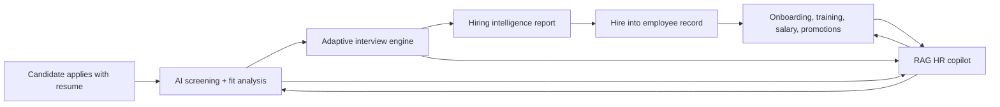
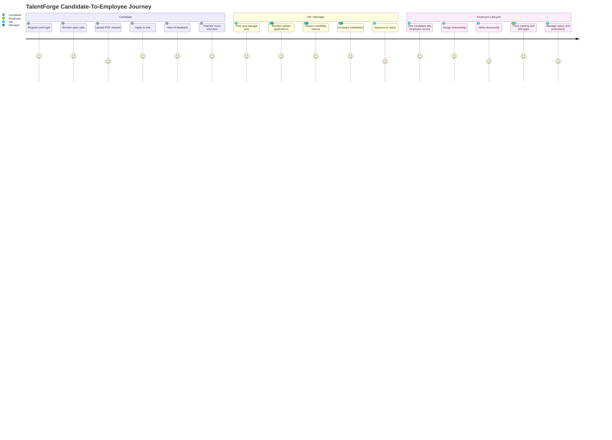
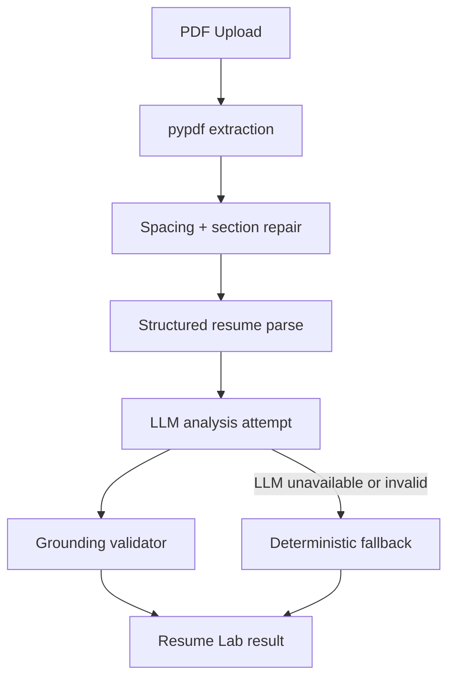
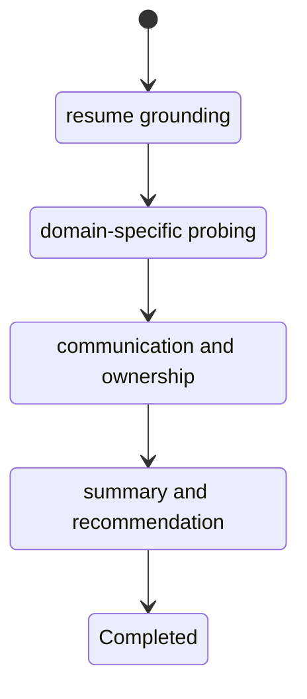
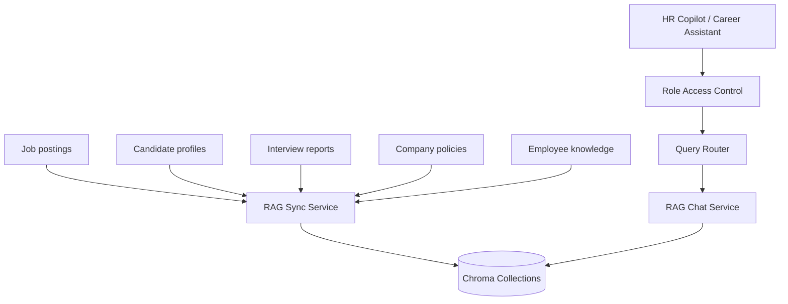
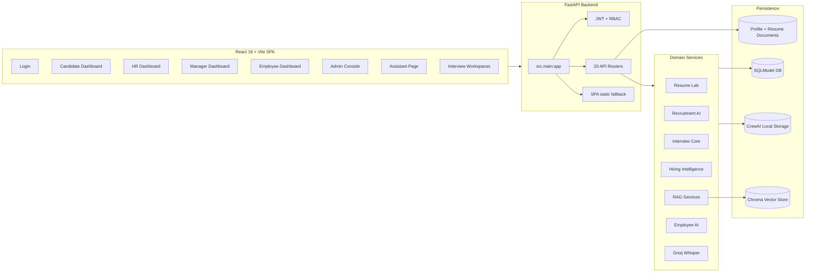
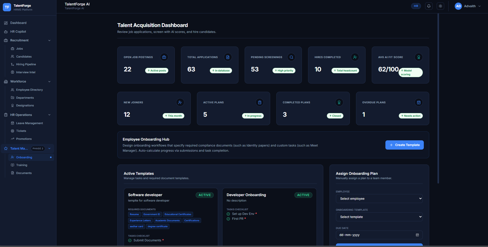
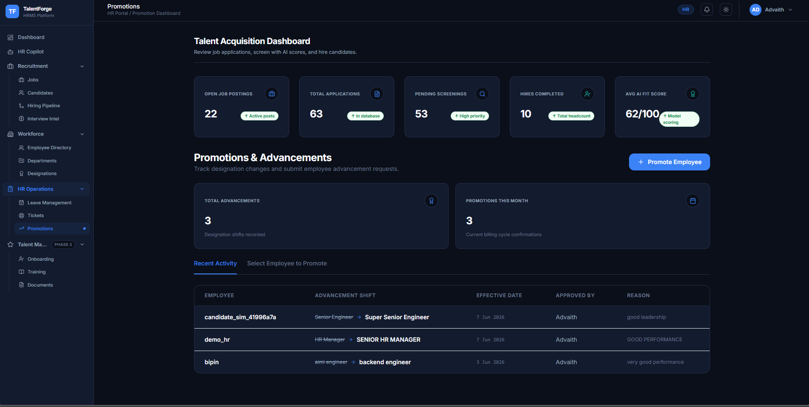

# TalentForge AI

**An AI-powered talent lifecycle platform that connects hiring, interviews, employee growth, HR operations, and company knowledge into one working system.**

TalentForge is not a resume parser bolted onto an HR dashboard. It is a full-stack talent operating system where every stage of the workforce journey feeds the next one:



A candidate can upload a resume, apply to a job, receive AI-powered analysis, practice in a mock interview, complete a structured proctored interview, and become an employee. HR can post jobs, review ranked applicants, compare interview intelligence, verify documents, assign onboarding, manage training, answer policy questions through a RAG assistant, and track the employee journey after hiring.

This repository contains the working product: FastAPI backend, React SPA, SQLModel data layer, CrewAI/Groq orchestration, Chroma-backed RAG, role-based dashboards, test coverage, Docker deployment, and production-oriented persistence.

---

## The Product In One Sentence

**TalentForge turns HR from a set of disconnected forms into an AI-assisted decision system for recruiting, interviewing, onboarding, and growing people.**

---

## Product Preview

### Login & Role Routing


### Candidate Portal


### HR Dashboard


### Mock Interview


### Admin Operations Console


---

## What Makes TalentForge Different?

Most HRMS projects stop at CRUD.

TalentForge goes further: it connects hiring signals, interview behavior, resume evidence, role requirements, employee lifecycle data, and company knowledge into a single loop.

| Traditional HRMS | TalentForge |
| --- | --- |
| Stores applications | Scores, explains, ranks, and prepares candidates |
| Tracks interviews | Runs adaptive interviews with phase control and proctoring |
| Has employee records | Converts hires into employees with onboarding and lifecycle history |
| Has static policies | Indexes policies and HR knowledge into RAG collections |
| Shows dashboards | Provides decision surfaces for HR, managers, candidates, employees, and admins |
| AI as decoration | AI with deterministic fallback paths when LLMs are unavailable |

---

## Core Experience



---

## Platform Surfaces

TalentForge ships multiple first-class portals, not a single dashboard pretending to serve everyone.

### Candidate

- Register and authenticate as a candidate
- Browse open jobs
- Apply with PDF resume upload
- View application history
- Use Resume Lab analysis
- Start interviews from resume or application context
- Use a career assistant scoped to candidate-accessible knowledge
- Complete profile and upload documents


### HR

- Post, update, close, archive, and delete jobs
- Review applicants and AI analysis
- Rank candidates per job
- Review hiring intelligence reports
- Compare candidates
- Advance or reject candidates
- Manage departments and designations
- Assign onboarding templates
- Verify candidate and employee documents
- Track leave, tickets, promotions, salary history, and training
- Use HR Copilot for grounded answers across company and hiring knowledge


### Manager

- Review candidate pipelines
- View team training
- Participate in evaluation workflows
- Access manager-specific dashboard views


### Employee

- View employee dashboard
- Check in and check out
- Request leave
- Track onboarding tasks
- Upload required documents
- View skill gap analysis
- Track training assignments
- Submit tickets
- View career timeline, salary revisions, and promotions


### Admin

- Manage users
- Edit company policies
- Manage knowledge documents
- Re-index policy and knowledge content into RAG collections


---

## AI Systems

TalentForge uses AI where it changes the workflow, not where it merely adds sparkle.

### 1. Resume Lab

Implemented in `src/resume_lab.py`.

Resume Lab parses PDF-derived text, repairs common extraction issues, identifies sections, validates LLM output, rejects unsupported invented claims, and falls back to grounded deterministic guidance when AI is unavailable.

It supports:

- Resume parsing
- PDF text cleanup
- Section detection
- Resume scoring
- Issue generation
- Fix suggestions
- Manual guidance when edits would invent facts
- Safe application of fixes



### 2. Recruitment Intelligence

Implemented in `src/services/recruitment_ai.py`, `agents/recruitment_analyst.py`, and `tasks/recruitment_task.py`.

For each application, TalentForge can produce:

- Fit score
- Recommendation
- Strengths
- Weaknesses
- Missing skills
- Observations
- Interview preparation questions
- Per-job ranking

If CrewAI or Groq fails, applications are still saved and scored through deterministic fallback logic.

### 3. Adaptive Interview Engine

Implemented across `src/api/routes/interview.py`, `src/services/interview_core.py`, `src/services/interview_status.py`, `src/services/hiring_intelligence.py`, `src/services/interview_consistency.py`, and `crew.py`.

The interview system supports:

- Start from resume
- Start from application
- Mock interview mode
- Phase-aware interviews
- Adaptive difficulty
- Training modes
- Interviewer personas
- Proctoring violations
- Auto-cancellation after violation threshold
- Resume claim verification
- Candidate-visible response sanitization
- Hiring intelligence reports
- Candidate comparison
- Follow-up question generation
- Leaderboards and top-candidate views

The live interview flow combines deterministic state control with AI-generated evaluation.



### 4. Hiring Intelligence

TalentForge does not treat an interview score as a black box. It produces decision context.

The hiring intelligence layer calculates and stores:

- Resume score
- Interview score
- Credibility score
- Composite hiring score
- Recommendation label
- Competency breakdown
- Communication metrics
- Filler word counts
- Timeline replay
- Risks and follow-up topics
- Candidate benchmarking

The composite score is intentionally transparent:

```text
Hiring score = 35% resume + 40% interview + 25% credibility
```

### 5. RAG Copilot

Implemented in `src/services/rag/**` and exposed through `/api/rag/chat`.

TalentForge indexes and retrieves from separate knowledge collections:

- `company_policies`
- `job_descriptions`
- `candidate_profiles`
- `interview_reports`
- `employee_knowledge`

It supports:

- Chroma vector storage
- Hash embeddings by default
- Optional OpenAI embeddings
- Role-aware access control
- Candidate-private retrieval filters
- HR-wide hiring context
- Employee policy and training knowledge
- Hybrid database + RAG answers
- Graceful fallback when vector retrieval is unavailable



---

## Architecture



---

## Backend

The backend is a FastAPI application at:

```text
src.main:app
```

It registers routers for:

- Auth
- Resume
- Jobs
- Applications
- Candidates
- Employees
- Dashboard
- Interview
- Mock interview
- Departments
- Designations
- Lifecycle
- Tickets
- Salary
- Promotions
- Notifications
- Onboarding
- Training
- Profile
- RAG
- Admin

The backend also serves the built frontend from `static/` with SPA fallback behavior.

### Data Layer

TalentForge uses SQLModel and supports SQLite for development and PostgreSQL for production.

The schema includes models for:

- Users and roles
- Resumes
- Job postings
- Candidate applications
- AI application analysis
- Interview sessions
- Mock interview sessions
- Career coach memory
- Candidate credibility reports
- Interview intelligence reports
- Employees
- Attendance
- Leave
- Departments
- Designations
- Lifecycle events
- Tickets
- Salary history
- Promotions
- Notifications
- Candidate and employee profiles
- Candidate and employee documents
- Onboarding templates and tasks
- Training programs and assignments

Database tables are created at startup, with idempotent migration helpers for evolving SQLite/PostgreSQL schemas.

---

## Frontend

The frontend is a React 19 + Vite SPA in `frontend/`.

It uses:

- React Router 7 for role-based routing
- Zustand for auth/layout state
- Axios with request caching and auth handling
- Framer Motion for motion
- Recharts for dashboards
- Lucide React for icons
- TailwindCSS 4

The frontend builds into:

```text
static/
```

FastAPI serves that build at `/`.

---

## Screenshots

| Area | Preview |
| --- | --- |
| HR Copilot |  |
| HR Documents |  |
| HR Interview Intelligence |  |
| HR Onboarding |  |
| HR Promotions |  |
| Team Training |  |
| Employee Training |  |
| Employee Chatbot |  |
| Career Timeline |  |

---

## Tech Stack

| Layer | Implementation |
| --- | --- |
| Frontend | React 19, Vite, React Router, Zustand, Axios, TailwindCSS, Framer Motion, Recharts, Lucide |
| Backend | FastAPI, Uvicorn |
| Database | SQLModel, SQLite, PostgreSQL |
| Auth | JWT, bcrypt, role-based dependencies |
| AI Orchestration | CrewAI |
| LLM | Groq `llama-3.1-8b-instant` |
| Transcription | Groq Whisper |
| Resume Parsing | pypdf |
| RAG | ChromaDB, hash embeddings by default, optional OpenAI embeddings |
| Deployment | Docker, Render, Vercel static build support |
| Tests | pytest, FastAPI TestClient, Playwright config for frontend e2e |

---

## Run Locally

### 1. Backend

```powershell
cd D:\GitHub\HRMS

python -m venv .venv
.\.venv\Scripts\activate

pip install -r requirements.txt

copy .env.example .env
uvicorn src.main:app --reload --host 127.0.0.1 --port 8000
```

Backend:

```text
http://127.0.0.1:8000
```

API docs:

```text
http://127.0.0.1:8000/api/docs
```

Health check:

```text
http://127.0.0.1:8000/api/health
```

### 2. Frontend

Open a second terminal:

```powershell
cd D:\GitHub\HRMS\frontend

npm install
npm run dev
```

Frontend:

```text
http://localhost:5173
```

The Vite dev server proxies API calls to the backend on port `8000`.

### 3. Create An Admin User

```powershell
cd D:\GitHub\HRMS
.\.venv\Scripts\activate

python -m scripts.bootstrap_user --username admin --password "CHANGE_ME" --role admin
```

Public registration creates candidate accounts. Use the bootstrap script for privileged roles.

---

## Environment

Minimum local environment:

```env
DATABASE_URL=sqlite:///./data/app.db
GROQ_API_KEY=your_groq_key
MODEL_NAME=llama-3.1-8b-instant
SECRET_KEY=replace-with-a-random-32-plus-character-secret
DEBUG=false
```

Optional RAG configuration:

```env
RAG_CHROMA_PATH=data/chroma
RAG_EMBEDDING_PROVIDER=hash
RAG_ANSWER_PROVIDER=llm
RAG_ANSWER_MODEL=llama-3.1-8b-instant
RAG_MAX_CONTEXT_CHARS=6000
```

Optional production/PostgreSQL configuration:

```env
DATABASE_URL=postgresql://...
PGSSLMODE=require
DATABASE_CONNECT_TIMEOUT=10
AUTO_CREATE_DB_SCHEMA=true
SUPABASE_URL=https://YOUR_PROJECT_REF.supabase.co
SUPABASE_ANON_KEY=your_supabase_anon_key
SUPABASE_SERVICE_ROLE_KEY=your_service_role_key
```

Optional job API configuration:

```env
JOOBLE_API_KEY=your_jooble_key
RAPIDAPI_KEY=your_rapidapi_key
```

---

## Build The Frontend For FastAPI

```powershell
cd frontend
npm run build
```

Vite outputs the production SPA to:

```text
../static/
```

The backend then serves the application from:

```text
http://127.0.0.1:8000
```

---

## Docker

Build and run the app:

```bash
docker build -t talentforge-ai .
docker run --env-file .env -p 8000:8000 talentforge-ai
```

The Docker image runs:

```text
uvicorn src.main:app --host 0.0.0.0 --port ${PORT:-8000}
```

A PostgreSQL-only local service is available through Docker Compose:

```bash
docker compose up postgres
```

---

## Render Deployment

`render.yaml` defines a Docker web service with:

- `/api/health` health check
- generated `SECRET_KEY`
- PostgreSQL SSL mode
- configurable `DATABASE_URL`
- configurable Supabase keys
- configurable `GROQ_API_KEY`
- `MODEL_NAME=llama-3.1-8b-instant`

---

## Vercel Static Deployment

`vercel.json` serves the built `static/` directory as a static SPA.

That mode is appropriate for frontend-only static hosting. The API still needs a backend deployment.

---

## Testing

Run backend tests:

```powershell
.\.venv\Scripts\python.exe -m pytest tests -v
```

Targeted examples:

```powershell
.\.venv\Scripts\python.exe -m pytest tests/test_api.py -v
.\.venv\Scripts\python.exe -m pytest tests/test_resume_lab.py -v
.\.venv\Scripts\python.exe -m pytest tests/test_rag_query_router.py -v
.\.venv\Scripts\python.exe -m pytest tests/test_proctoring.py -v
```

Frontend lint:

```powershell
cd frontend
npm run lint
```

Frontend build:

```powershell
cd frontend
npm run build
```

The test suite covers authentication, RBAC, application flow, resume analysis, interview state, proctoring, hiring intelligence, onboarding/training, job lifecycle rules, RAG sync, RAG access control, and RAG query routing.

---

## Repository Map

```text
src/
  main.py                       FastAPI app, router registration, startup, static serving
  config.py                     Settings and environment validation
  resume_lab.py                 Resume parsing, repair, analysis validation, safe fixes
  database/connection.py        SQLModel engine, startup schema creation, idempotent migrations
  models/__init__.py            Core database models
  api/routes/                   REST API routers
  services/
    recruitment_ai.py           Application analysis and ranking
    interview_core.py           Interview state, phase, persona, training logic
    interview_status.py         Interview phase/turn requirements
    hiring_intelligence.py      Final interview intelligence reports
    interview_consistency.py    Resume claim vs interview credibility analysis
    employee_ai.py              Skill gap analysis and HR assistant behavior
    rag/                        Chroma, embeddings, retrieval, sync, query routing
agents/                         CrewAI agent definitions
tasks/                          CrewAI task definitions
utils/                          PDF parsing, job search, scoring helpers
frontend/                       React 19 + Vite SPA
static/                         Built frontend and screenshots
scripts/                        Operational scripts
tests/                          Backend test suite
Dockerfile                      Production container
render.yaml                     Render deployment
vercel.json                     Static SPA deployment
```

---

## License

TalentForge AI is released under the Apache License 2.0. See [LICENSE](LICENSE.txt) for details.
