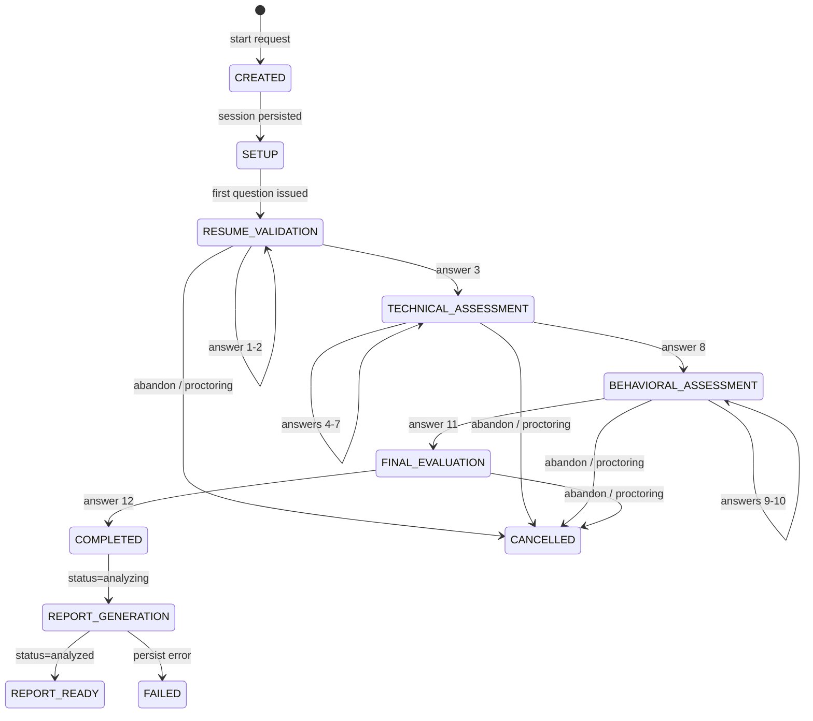
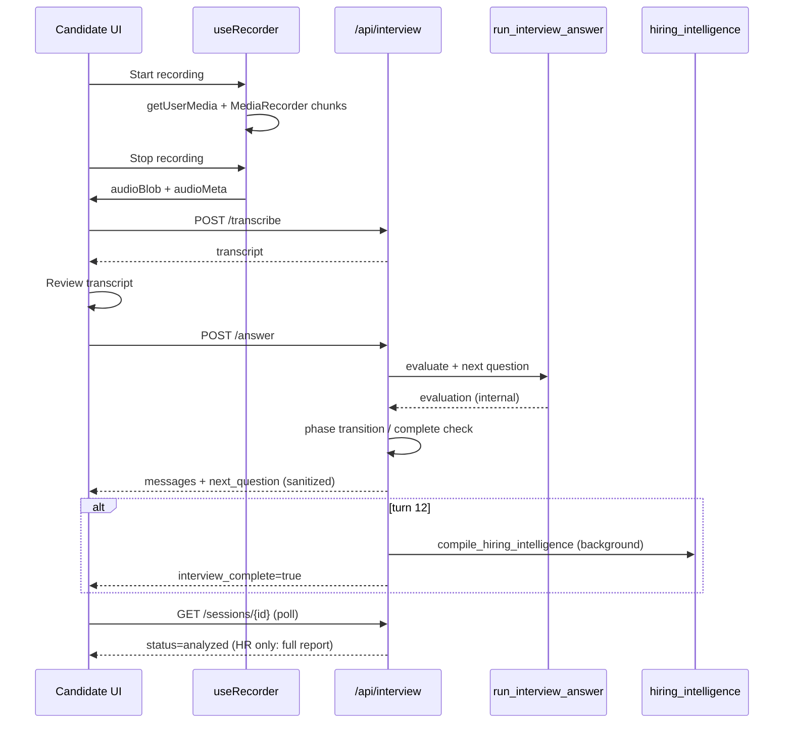

# Interview Module Stabilization Sprint — Deliverables

## 1. Root Cause Report

| Symptom | Root Cause | Fix |
|---------|------------|-----|
| 500 on `POST /answer` | Unhandled exceptions on corrupt/missing session keys; DB persist failures | `_ensure_live_state()`, top-level try/except, payload validation |
| Interview complete then another question | Frontend dual-path append + `next_question` set after complete; backend could append AI message with stale `current_question` | Mutual exclusivity guard (`not interview_complete and next_q`); frontend uses `messages` only |
| Duplicate answers/messages | Fallback append branch + feedback rows rendered as conversation items | Single source of truth via `data.messages`; feedback hidden from candidate view |
| Stale report polling | 30s axios GET cache on `/api/interview/sessions/{id}` | Exclude interview sessions from cache + `invalidateCache` before poll |
| Visible evaluation during interview | `feedback` role rendered in shell; API returned scores/verdict | `_candidate_visible_messages`, `_sanitize_candidate_response`, HR-only summary |
| Full HR report shown to candidates | `InterviewSummary` rendered hiring intelligence for all users | Candidate-safe completion screen; HR report gated by role |
| Transcription stale overwrite | In-flight transcribe completing after cancel/re-record | Transcription generation counter |
| `/transcribe` unauthenticated | Missing `Depends(get_current_user)` | Auth required |
| Claim verification misses resume claims | Only `summary + skills` used | Full `raw_text` when available |

## 2. State Machine



### Phase Turn Budget (Deterministic)

| Phase | Questions |
|-------|-----------|
| Resume Validation | 3 |
| Technical Assessment | 5 |
| Behavioral Assessment | 3 |
| Final Evaluation | 1 |
| **Total** | **12** |

### Forbidden Transitions (Violations Found & Fixed)

- `COMPLETED → question_generate` — was possible via frontend append; now blocked backend + frontend
- `analyzing → active` — idempotent replay returns terminal state without new questions
- AI early exit via `_should_end_interview_early` — dead code in official path (never called)

## 3. Pipeline Flow



## 4. Bug List (Pre-Fix)

1. Shared `_sessions` between official and mock interviews
2. `completed` status never set on official sessions (uses `analyzing → analyzed`)
3. GET cache stale during intelligence polling
4. Feedback/scores visible to candidates
5. Duplicate conversation append fallback
6. Transcription race on re-record
7. `/transcribe` no auth
8. `submit_answer` potential KeyError on corrupt state
9. `get_session_history` leaked scores to candidates
10. Mock interview missing `messages` in answer response (unchanged — separate module)

## 5. Fix List (Implemented)

- `src/services/interview_core.py`: `_ensure_live_state()`
- `src/api/routes/interview.py`: sanitization, completion guards, auth on transcribe, safe submit wrapper
- `frontend/.../InterviewWorkspaceShell.jsx`: single source of truth, transcription generation guard
- `frontend/.../InterviewSummary.jsx`: candidate-safe completion view
- `frontend/src/api/axios.js`: no cache for interview sessions
- `tests/test_interview_stabilization.py`: unit coverage for state machine + sanitization

## 6. Performance Report

| Step | Typical Latency | Notes |
|------|-----------------|-------|
| Answer submit (deterministic) | < 500ms | No LLM by default |
| Transcription | 1–5s | Groq Whisper, retries + fallback model |
| Report generation | 3–15s | Background task; polling 3–12s backoff |
| GET session (post-fix) | Live | Cache bypassed for sessions |

## 7. Remaining Risks

| Risk | Severity | Mitigation |
|------|----------|------------|
| Shared `_sessions` with mock interviews | Medium | Namespace by prefix in future sprint |
| PostgreSQL required for integration tests | Low | Unit tests added without DB |
| LLM mode (`INTERVIEW_USE_LLM_ANSWER_EVAL=1`) non-deterministic | Medium | Off by default |
| Resume-only sessions skip intelligence report row | Low | Documented |
| Proctoring "camera active" not true face detection | Low | Label fixed to "Camera Active" |

## 8. Before / After

| Behavior | Before | After |
|----------|--------|-------|
| Candidate sees per-turn feedback | Yes | No |
| Candidate sees hiring intelligence report | Yes | No (HR only) |
| Duplicate messages on submit | Possible (fallback path) | No (`messages` only) |
| Question after complete | Possible | Blocked |
| Session poll stale up to 30s | Yes | No |
| Answer 500 on corrupt state | Possible | Validated + safe defaults |
| Transcribe without login | Yes | No |

## 9. Validation

Run unit tests (no Docker required):

```bash
python -m pytest tests/test_interview_stabilization.py -q
```

Run full integration suite (requires PostgreSQL):

```bash
docker compose up -d
python -m pytest tests/test_proctoring.py -q
```
